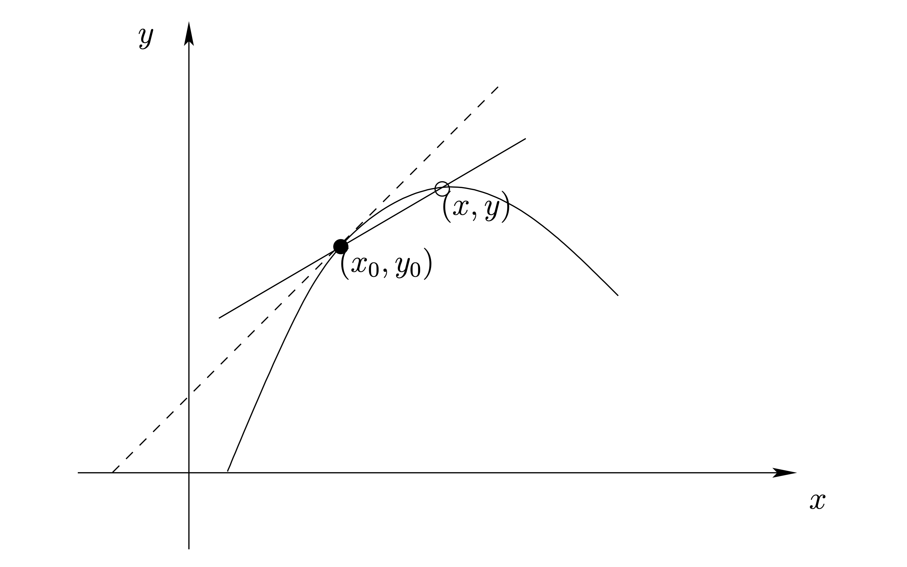
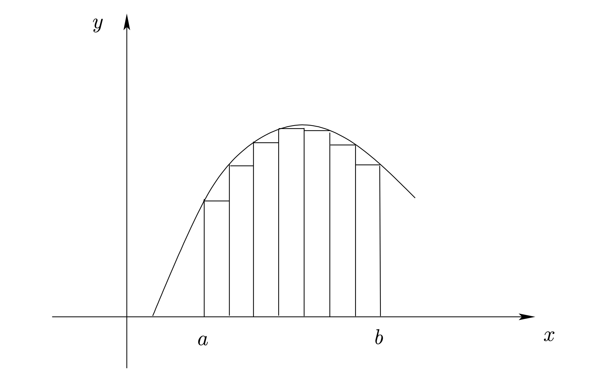
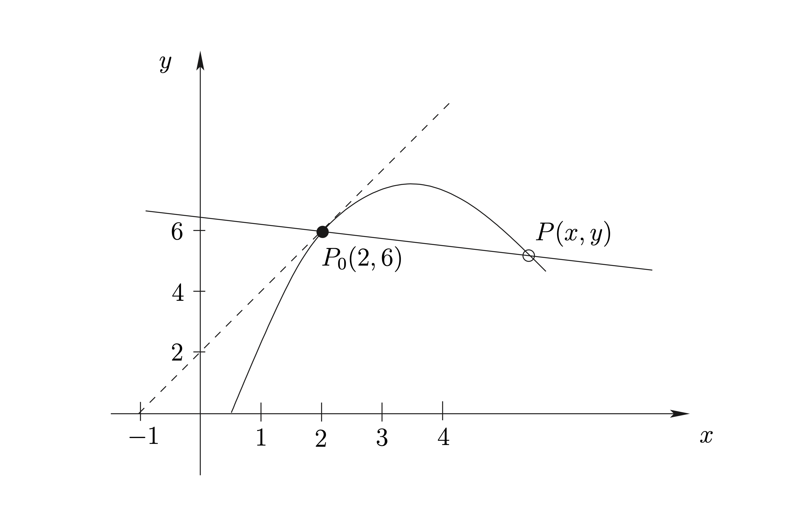
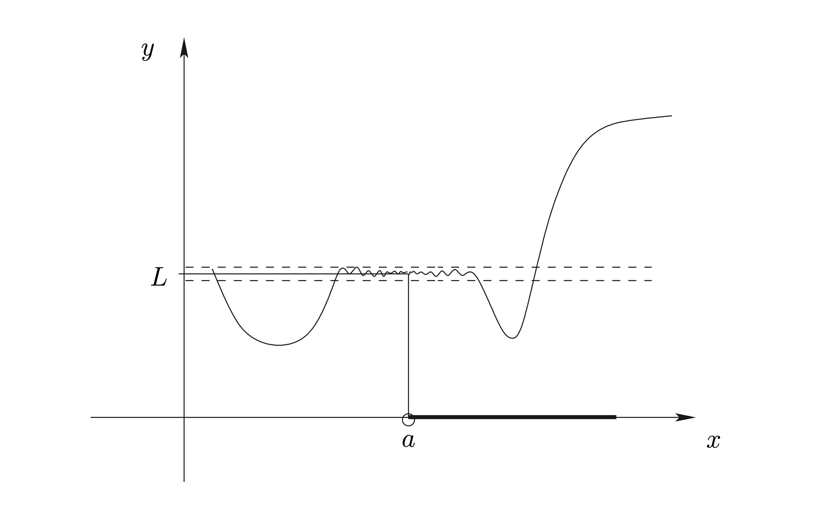
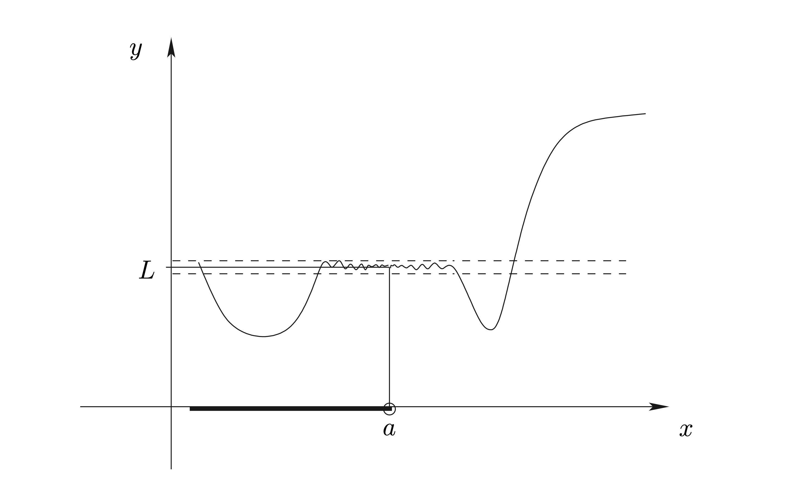
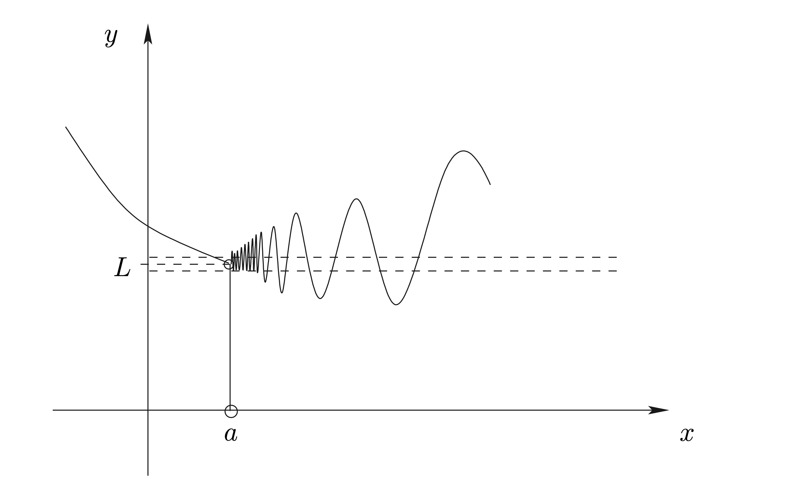
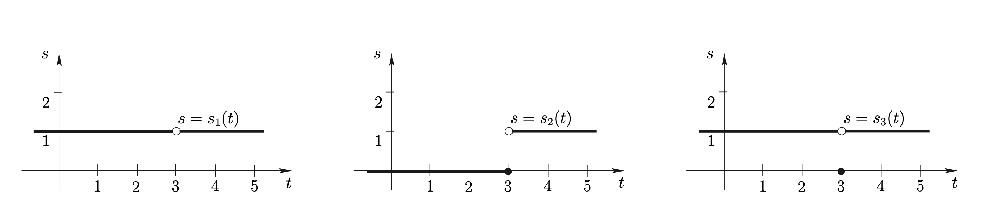
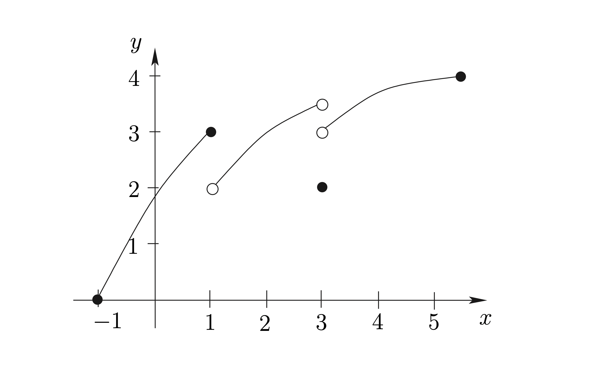

# ลิมิต (Limits)

อาจกล่าวได้ว่า วิชาแคลคูลัส
ถือกำเนิดขึ้นมาจากความพยายามในการแก้ปัญหาทางเรขาคณิตบนระนาบ 2 ปัญหาหลักๆ คือ

-   การหาเส้นตรงที่สัมผัสเส้นโค้งที่กำหนดให้

    ::: boxit
    กำหนดฟังก์ชัน (function) $f$ และกำหนดจุด $P(x_{0},y_{0})$ บนกราฟ
    $y = f(x)$ จงหาสมการของเส้นตรงที่สัมผัสกราฟ $y = f(x)$ ที่จุด $P$
    :::

-   การหาพื้นที่ของบริเวณที่กำหนดให้

    ::: boxit
    กำหนด function $f$ และช่วง $[a,b]$ ในโดเมนของ $f$
    จงหาพื้นที่ที่ถูกปิดล้อมด้วยแกน $X$ และกราฟ $y = f(x)$ สำหรับ $x \in [a,b]$
    :::

แนวความคิดในการแก้ปัญหาทั้งสอง นำไปสู่การศึกษาเรื่อง ลิมิต (Limits)
ซึ่งเป็นพื้นฐานของวิชาแคลคูลัสนั่นเอง

แต่ในปัจจุบันเราพบว่าวิชาแคลคูลัสมีประโยชน์ในการช่วยแก้ปัญหาในสาขาวิชาต่าง ๆ มากมาย เช่น
เราจะพบในการศึกษาวิชานี้ว่า แคลคูลัสมีบทบาทในการแก้ปัญหาต่อไปนี้

-   โดยทั่วไป ยาชนิดฉีดจะต้องใช้เวลาระยะหนึ่งหลังจากฉีดเข้าสู่ร่างกาย
    ในการที่จะไหลเวียนในกระแสโลหิต จนกระทั่งมีความเข้มข้นสูงสุด สมมุติว่า
    ยาฉีดชนิดหนึ่งหลังจากฉีดเข้าสู่ร่างกายนาน $t$ ชั่วโมง จะมีความเข้มข้นเป็น
    $C(t) = 0.15(e^{-0.18t}-e^{-1.2t})$ มิลลิกรัมต่อมิลลิลิตร จงหาว่า
    นานเท่าใดหลังจากฉีดยา จึงจะมีความเข้มข้นของยา ในกระแสโลหิตสูงที่สุด

-   เราอาจประมาณได้อย่างมีเหตุผลว่า artery มีรูปร่างที่เป็นผลมาจากการหมุนรอบแกน
    ของเส้นโค้งในระนาบ โดยในสภาวะนิ่ง รัศมีของ artery มีค่าคงที่เท่ากับ 1 หน่วย
    (รูปทรงกระบอก) แต่ในขณะที่หัวใจสูบฉีดโลหิตผ่าน artery artery จะพองตัวออก
    ทำให้รัศมีเปลี่ยนไปตามสมการ $R(x) = 1+0.4x-0.04x^{2}$ หน่วย เมื่อ
    $0 \leq x\leq 10$ เป็นตำแหน่งบนแนวยาวของ artery จงหาว่า ปริมาณโลหิตที่อยู่ใน
    artery ขณะที่หัวใจสูบฉีดโลหิตผ่านเข้ามาเป็นกี่เท่าของความจุโลหิตในสภาวะนิ่ง

-   ความก้าวหน้าในทางการแพทย์ และเทคโนโลยีปัจจุบัน
    ทำให้มีการประดิษฐ์อุปกรณ์ช่วยในการรักษาโรคเบาหวานชิ้นหนึ่งขึ้น
    อุปกรณ์นี้มีลักษณะเป็นแคปซูล ซึ่งเมื่อฝังอุปกรณ์นี้ภายในร่างกายแล้ว
    มันจะหลั่งสารอินซูลินที่บรรจุอยู่ภายใน ออกสู่กระแสโลหิต โดยมีอัตราการหลั่งเป็น
    $f\left( t\right) =0.5te^{-0.09t}$ ลูกบาศก์เซนติเมตรต่อวัน เมื่อ t คือ
    เวลาเป็นวัน นับจากอุปกรณ์เริ่มทำงาน จงหาว่า
    แพทย์จะต้องสั่งให้บรรจุอินซูลินในแคปซูลเป็นปริมาณเท่าใด
    เพื่อให้อุปกรณ์นี้สามารถให้อินซูลินแก่ผู้ป่วยได้นาน 3 เดือน

-   การหาเส้นตรงที่สัมผัสเส้นโค้ง $y = f(x)$ ณ จุด $P_{0}(x_{0},y_{0})$

```{r fig-tangent-line, echo = FALSE,  fig.cap="การหาเส้นตรงที่สัมผัสเส้นโค้ง", out.width="50%", fig.align="center"}


```

ขั้นตอนสรุปการหาเส้นตรงที่สัมผัสเส้นโค้ง \@ref(fig:fig-tangent-line)

1.  เลือกจุดอื่นบนกราฟ เรียกจุดนี้ว่า $P(x,y)$

2.  ลากเส้นผ่าน $PP_{0}$

3.  ทำซ้ำโดยเลือกจุด P ให้ใกล้ $P_{0}$ มากขึ้น

4.  เส้น $PP_{0}$ ที่ได้จะ "เข้าใกล้" เส้นสัมผัสมากขึ้นทุกที

-   การหาพื้นที่ "ใต้กราฟ" ระหว่าง x = a กับ x = b

```{r fig-area-under-curve, echo = FALSE,  fig.cap="การหาพื้นที่ใต้กราฟ", out.width="50%", fig.align="center"}


```

ขั้นตอนเบื้องต้นสำหรับการหาพื้นที่ใต้กราฟ

1.  แบ่ง $[a,b]$ เป็นช่วงเล็กๆ
2.  หาพื้นที่รวมของสี่เหลี่ยมผืนผ้าทั้งหมด
3.  ทำซ้ำๆ โดยแบ่งช่วงให้เล็กมากขึ้น
4.  พื้นที่ที่ได้จะ "เข้าใกล้" พื้นที่ที่ต้องการมากขึ้นทุกที

::: {#ex-limit-1 .example label="ex-limit-1"}
จงหาสมการของเส้นสัมผัสกราฟ $y=-x^{2}+6x-2$ ณ จุด $P_{0}(2,6)$
:::

**วิธีทำ**  เลือกจุด $P(x,y)$ โดยที่ $x \neq 2$ และลากเส้น $PP_{0}$ จะได้ว่า
ความชันของ $PP_{0}$ เท่ากับ 

\begin{equation}
  \begin{aligned}
    \frac{y-6}{x-2} &= \frac{-x^{2}+6x-8}{x-2} \\
                    &=-\frac{\left( x-2\right) \left( x-4\right) }{x-2} \\
                    &=4-x
  \end{aligned}
\end{equation}

ถ้า $P$ อยู่ใกล้ $P_{0}$ มากขึ้น ค่า x ย่อมเกือบเป็น 2 ดังนั้น ความชันของ $PP_{0}$
จึงเข้าใกล้ $4-2 = 2$ มากขึ้นเรื่อย ๆ เส้นสัมผัสจึงควรมีความชันเป็น 2 และสมการเส้นสัมผัส
คือ $y-6=2\left( x-2\right)$

```{r fig-tangent-line-2, echo = FALSE,  fig.cap = "การหาเส้นตรงที่สัมผัสเส้นโค้ง \\(y=-x^{2}+6x-2\\)", out.width="50%", fig.align="center"}


```

จะเห็นว่า ในตัวอย่าง \@ref(exm:ex-limit-1) นี้ เราสนใจพฤติกรรมของ function

$\frac{-x^{2}+6x-8}{x-2}$ เมื่อ $x \neq 2$ แต่มีค่าใกล้ 2 มาก ๆ นี่คือ ที่มาของเรื่อง

::: {#def-limit .definition label="def-limit"}
ให้ $f : D_{f}\rightarrow R$ โดยที่ $D_{f}\subseteq R$ และให้ $a \in R$
โดยที่มีช่วง $(a,b)$ บางช่วงที่
$\left( a,b\right) \subseteq D_{f}\left( b>a\right)$

เรากล่าวว่า "ลิมิต (limit) ของ $f(x)$ เมื่อ x เข้าใกล้ a ทางขวา
หาค่าได้และมีค่าเท่ากับจำนวนจริง L" ถ้า "ไม่ว่าเราจะกำหนดบริเวณรอบ ๆ $L$
ไว้แคบเพียงใด เมื่อเราพิจารณาค่าของ $f(x)$ สำหรับค่า $x$ ที่มากกว่า a โดยที่ให้ค่า ของ
$x$ ลดลงเรื่อย ๆ จนถีงจุดหนึ่ง ค่าของ $f(x)$ จะอยู่ในบริเวณรอบ ๆ $L$ ที่เรากำหนดไว้นั้น
และยังคงเป็นเช่นนี้สำหรับ $x$ อื่น ๆ ที่น้อยกว่านั้น (แต่มากกว่า $a$ ) ทั้งหมดด้วย"

ในทำนองเดียวกัน ถ้าเราพิจารณาพฤติกรรมของ function สำหรับ $x$ ที่น้อยกว่า $a$ จะได้
limit ทางซ้าย ดังนี้ ให้ $f : D_{f}\rightarrow R$ โดยที่ $D_{f}\subseteq R$
และให้ $a \in R$ โดยที่มีช่วง $(b,a)$ บางช่วงที่
$\left( b,a\right) \subseteq D_{f}\left( b<a\right)$

เรากล่าวว่า "limit ของ $f(x)$ เมื่อ $x$ เข้าใกล้ a ทางซ้าย หาค่าได้
และมีค่าเท่ากับจำนวนจริง $L$" ถ้า "ไม่ว่าเราจะกำหนดบริเวณรอบ ๆ $L$ ไว้แคบเพียงใด

เมื่อเราพิจารณาค่าของ $f(x)$ สำหรับค่า $x$ ที่น้อยกว่า $a$ โดยที่ให้ค่า ของ $x$
เพิ่มขึ้นเรื่อย ๆ จนถีงจุดหนึ่ง ค่าของ $f(x)$ จะอยู่ในบริเวณรอบ ๆ $L$ ที่เรากำหนดไว้นั้น
และยังคงเป็นเช่นนี้สำหรับ $x$ อื่น ๆ ที่มากกว่านั้น (แต่น้อยกว่า $a$ ) ทั้งหมดด้วย"
:::

```{r fig-right-limit, echo = FALSE,  fig.cap="ลิมิตทางขวา", out.width="50%", fig.align="center"}


```

```{r fig-left-limit, echo = FALSE,  fig.cap="ลิมิตทางซ้าย", out.width="50%", fig.align="center"}


```

เราใช้สัญลักษณ์ $\underset{x\rightarrow a^{+}}{\lim}f(x)$ แทนข้อความ "limit
ของ $f(x)$ เมื่อ $x$ เข้าใกล้ a ทางขวา" และใช้สัญลักษณ์
$\underset{x\rightarrow a^{-}}{\lim}f(x)$ แทนข้อความ "limit ของ $f(x)$
เมื่อ $x$ เข้าใกล้ a ทางซ้าย

::: {#def-limit-2 .definition label="def-limit-2"}
ในกรณีที่ทั้ง $\underset{x\rightarrow a^{+}}{\lim}f(x)$ และ
$\underset{x\rightarrow a^{-}}{\lim}f(x)$ หาค่าได้ และมีค่าเท่ากัน

เรากล่าวว่า $\underset{x\rightarrow a}{\lim}f(x)$ หาค่าได้ และมีค่าเท่ากับค่านั้น
:::

::: {#ex-limit-2 .example label="ex-limit-2"}
function $f$ ที่ $\underset{x\rightarrow a^{+}}{\lim}f(x)$ หาค่าไม่ได้ ดังนั้น

$\underset{x\rightarrow a}{\lim}f(x)$ จึงหาค่าไม่ได้ด้วย
:::

**วิธีทำ**  จากรูปต่อไปนี้

```{r fig-limit-1, echo = FALSE,  fig.cap="กราฟของฟังก์ชันที่หาลิมิตไม่ได้", out.width="50%", fig.align="center"}


```

ในกรณีนี้ จะเห็นว่า ไม่ว่าจะเลือก $L$ เป็นค่าใด ก็ไม่สามารถสรุปได้ว่า
$\underset{x\rightarrow 0^{+}}{\lim}f(x)=L$
เพราะไม่ใช่ทุกครั้งที่เรากำหนดบริเวณรอบ ๆ $L$ แล้ว function
จะสอดคล้องตามนิยามเสมอไป จึงสรุปว่า $\underset{x\rightarrow a}{\lim}f(x)=L$
หาค่าไม่ได้ด้วย

::: {#thm-limit-1 .theorem label="“thm-limit-1\""}
1.  $\underset{x\rightarrow c}{\lim}c=c$ ถ้า c เป็นจำนวนจริง

2.  $\underset{x\rightarrow a}{\lim}x=a$
:::

::: {#thm-limit-2 .theorem label="“thm-limit-2\""}
ถ้า $\underset{x\rightarrow a}{\lim}f(x)$ และ
$\underset{x\rightarrow a}{\lim}g(x)$ หาค่าได้แล้ว จะได้

1.  $\underset{x\rightarrow a}{\lim}(f+g)(x)=\underset{x\rightarrow a}{\lim}f(x)+\underset{x\rightarrow a}{\lim}g(x)$

2.  $\underset{x\rightarrow a}{\lim}(f-g)(x)=\underset{x\rightarrow a}{\lim}f(x)-\underset{x\rightarrow a}{\lim}g(x)$

3.  $\underset{x\rightarrow a}{\lim}(f\cdot g)(x)=\left( \underset{x\rightarrow a}{\lim}f(x)\right) \cdot \left( \underset{x\rightarrow a}{\lim}g(x)\right)$

4.  $\underset{x\rightarrow a}{\lim}\left( \frac{f}{g}\right) (x)=\frac{\underset{x\rightarrow a}{\lim}f(x)}{\underset{x\rightarrow a}{\lim}g(x)}$
    ถ้า $\underset{x\rightarrow a}{\lim}g(x)\neq 0$
:::

**หมายเหตุ** ทฤษฎีบททั้งสองนี้ยังคงเป็นจริงสำหรับ limit ทางซ้าย และ limit ทางขวาด้วย

::: {#thm-limit-3 .theorem label="“thm-limit-3\""}
ถ้า $\underset{x\rightarrow a}{\lim}f(x)$ หาค่าได้ และ
$\root{n}\of{f\left( x\right) }$ หาค่าได้ สำหรับทุก ๆ $x$ ในช่วงเปิดบางช่วงที่มี
$a$ อยู่ด้วย แล้ว
$\underset{x\rightarrow a}{\lim}\root{n}\of{f\left( x\right) }=\root{n}\of{\underset{x\rightarrow a}{\lim}f(x)}$
:::

**หมายเหตุ** ทฤษฎีบทนี้เป็นจริงสำหรับ limit ทางซ้าย และ limit ทางขวาด้วย
โดยเปลี่ยนเงื่อนไข "ทุก ๆ $x$" เป็น "ทุก ๆ $x < a$" และ "ทุก ๆ $x > a$" ตามลำดับ

::: {#thm-limit-4 .theorem label="“thm-limit-4\""}
ถ้า $f$ และ $g$ เป็น function ซึ่ง $f\left( x\right) =g\left( x\right)$
สำหรับทุก ๆ $x$ ยกเว้นบาง $x$ ซึ่งมีอยู่เพียงจำนวนจำกัด แล้ว
$\underset{x\rightarrow a}{\lim}f(x)=\underset{x\rightarrow a}{\lim}g(x)$
ถ้า limit อันใดอันหนึ่งหาค่าได้
:::

**หมายเหตุ** ทฤษฎีบทนี้ยังคงเป็นจริงสำหรับ limit ทางซ้าย และ limit ทางขวาด้วย

::: {#ex-limit-3 .example label="ex-limit-3"}
จงหาค่าของ $\underset{x\rightarrow 2}{\lim}\frac{-x^{2}+6x-8}{x-2}$
:::
**วิธีทำ** 

```{=tex}
\begin{equation}
  \begin{aligned}
    \lim_{x\rightarrow 2}\frac{-x^{2}+6x-8}{x-2}
    &= \lim_{x\rightarrow 2} -\frac{\left( x-2\right) \left( x-4\right) }{x-2}\\
    &= \lim_{x\rightarrow 2} -\left( x-4\right) \\ %ต่างกับ function เดิม ที่ค่าเดียของ x คือ x = 2
    &= \lim_{x\rightarrow 2}\left( 4-x\right) \\
    &= \lim_{x\rightarrow 2}4-\lim_{x\rightarrow 2}x\\
    &= 4-2 \\
    &= 2
  \end{aligned}
\end{equation}
```


::: {#ex-limit-4 .example label="ex-limit-4"}
จงหาค่าของ $\underset{x\rightarrow 3}{\lim}\frac{\sqrt{x}-\sqrt{3}}{x-3}$
**วิธีทำ** 

\begin{equation}
  \begin{aligned}
    \lim_{x\rightarrow 3}\frac{\sqrt{x}-\sqrt{3}}{x-3}
    &= \lim_{x\rightarrow 3}\frac{\sqrt{x}-\sqrt{3}}{x-3}\cdot \frac{\sqrt{x}+\sqrt{3}}{\sqrt{x}+\sqrt{3}} \\
    &= \lim_{x\rightarrow 3}\frac{x-3}{\left( x-3\right) \left( \sqrt{x}+\sqrt{3}\right) } \\
    &= \lim_{x\rightarrow 3}\frac{1}{\sqrt{x}+\sqrt{3}}\\
    &= \frac{\lim_{x\rightarrow 3}1}{\lim_{x\rightarrow 3} \sqrt{x} + \lim_{x\rightarrow 3} \sqrt{3}} \\
    &= \frac{\lim_{x\rightarrow 3}1}{\sqrt{\lim_{x\rightarrow 3}x}+\lim_{x\rightarrow 3}\sqrt{3}} \\
    &= \frac{1}{\sqrt{3}+\sqrt{3}} \\
    &= \frac{1}{2\sqrt{3}} \\
  \end{aligned}
\end{equation}
:::

::: {#ex-limit-5 .example label="ex-limit-5"}
จงหา limits ต่อไปนี้

1.  $\underset{x\rightarrow 0^{+}}{\lim}\frac{\sqrt{x}-\sqrt{3}}{x-3}$

2.  $\underset{x\rightarrow 0^{-}}{\lim}\frac{\sqrt{x}-\sqrt{3}}{x-3}$

3.  $\underset{x\rightarrow 0}{\lim}\frac{\sqrt{x}-\sqrt{3}}{x-3}$
:::

**วิธีทำ** 

1.  $\underset{x\rightarrow 0^{+}}{\lim}\frac{\sqrt{x}-\sqrt{3}}{x-3}$$=\frac{0-\sqrt{3}}{x-3}=\frac{\sqrt{3}}{3}$

2.  เนื่องจาก function $\frac{\sqrt{x}-\sqrt{3}}{x-3}$ ไม่ใช่ function
    ที่หาค่าได้บนช่วงเปิด $\left( b,0\right)$ ใด ๆ เลย ดังนั้น
    $\underset{x\rightarrow 0^{-}}{\lim}\frac{\sqrt{x}-\sqrt{3}}{x-3}$
    จึงหาค่าไม่ได้

3.  เนื่องจาก
    $\underset{x\rightarrow 0^{-}}{\lim}\frac{\sqrt{x}-\sqrt{3}}{x-3}$
    หาค่าไม่ได้ ดังนั้น
    $\underset{x\rightarrow 0}{\lim}\frac{\sqrt{x}-\sqrt{3}}{x-3}$
    จึงหาค่าไม่ได้

**ข้อสังเกต** ในกรณีที่ function ที่มีค่ามากขึ้นโดยไม่มีขอบเขต เมื่อตัวแปรต้นเข้าใกล้ $a$
(ทางซ้ายหรือขวา หรือทั้งสองทาง) บางตำรากล่าวว่า limit ของ function มีค่าเป็น
$+\infty$ และถ้า function มีค่าลดลงโดยไม่มีขอบเขต จะกล่าวว่า limit ของ function
มีค่าเป็น $-\infty$ ในวิชานี้เราจะถือตามนิยามที่ให้ไว้ ดังนั้นในกรณีข้างต้น จะกล่าวว่า limit
ดังกล่าวหาค่าไม่ได้ (เว้นแต่จะระบุให้พิจารณาค่า $\pm \infty$ ด้วย)

::: {#ex-limit-6 .example label="ex-limit-6"}
จงหา limit ของ function $f\left( x\right) =\frac{1}{x}$

1.  เมื่อ $x$ เข้าใกล้ 0 ทางซ้าย

2.  เมื่อ $x$ เข้าใกล้ 0 ทางขวา

3.  เมื่อ $x$ เข้าใกล้ 0
:::

**วิธีทำ** 

1.  $\underset{x\rightarrow 0^{-}}{\lim}\frac{1}{x}$ หาค่าไม่ได้ (หรือเท่ากับ
    $-\infty$)

2.  $\underset{x\rightarrow 0^{+}}{\lim}\frac{1}{x}$ หาค่าไม่ได้ (หรือเท่ากับ
    $+\infty$)

3.  $\underset{x\rightarrow 0}{\lim}\frac{1}{x}$ หาค่าไม่ได้

ในบางครั้ง เราสนใจพฤติกรรมของ function $f$ เมื่อค่าตัวแปรต้นมีค่ามากขึ้นโดยไม่มีขอบเขต
หรือน้อยลงโดยไม่มีขอบเขต ในกรณีเช่นนี้ เราใช้สัญลักษณ์
$\underset{x\rightarrow +\infty }{\lim}f\left( x\right)$ และ
$\underset{x\rightarrow -\infty }{\lim}f\left( x\right)$ ตามลำดับ
แทนที่จะใช้ $\underset{x\rightarrow \infty ^{-}}{\lim}f\left( x\right)$ และ
$\underset{x\rightarrow \infty ^{+}}{\lim}f\left( x\right)$
(โปรดอ่านนิยามในเอกสารอ้างอิง) ทฤษฎีบทเกี่ยวกับ limit ที่กล่าวมาข้างต้นทั้งหมด
เป็นจริงในกรณีนี้ด้ย นอกจากนี้ เรายังมี ทฤษฎีบทต่อไปนี้

::: {#thm-limit-5 .theorem label="“thm-limit-5\""}
1.  $\underset{x\rightarrow +\infty }{\lim}x=+\infty$

2.  $\underset{x\rightarrow -\infty }{\lim}x=-\infty$

3.  ถ้า $\underset{x\rightarrow a}{\lim}f\left( x\right) =\pm \infty$ แล้ว
    $\underset{x\rightarrow a}{\lim}f\left( x\right) =0$ ซึ่งเป็นจริงสำหรับ
    limit ทางซ้าย และ limit ทางขวาด้วย ในที่นี้ $a\in R$ หรือ a เป็น $+\infty$
    หรือ $-\infty$
:::

::: {#ex-limit-7 .example label="ex-limit-7"}
$\underset{x\rightarrow -\infty }{\lim}\frac{x^{2}+12}{x^{3}-5}=?$
:::

**วิธีทำ** 

\begin{equation}
  \begin{aligned}
    \underset{x\rightarrow -\infty }{\lim}\frac{x^{2}+12}{x^{3}-5}
        &=\underset{x\rightarrow -\infty }{\lim}\frac{\left( x^{2}+12\right) /x^{3}}{\left( x^{3}-5\right) /x^{3}} \\
        &=\underset{x\rightarrow -\infty }{\lim}\frac{\frac{1}{x}+\frac{12}{x^{3}}}{1-\frac{5}{x^{3}}}
    =\frac{0+0}{1-0}=0
  \end{aligned}
\end{equation}

::: {#ex-limit-8 .example label="ex-limit-8"}
$\underset{x\rightarrow +\infty }{\lim}x^{-\frac{2}{3}}=?$
:::

**วิธีทำ** 

\begin{equation}
  \begin{aligned}
    \underset{x\rightarrow +\infty }{\lim}x^{-\frac{2}{3}}
        &=\underset{x\rightarrow +\infty }{\lim}\root{3}\of{\left( \frac{1}{x}\right) ^{2}} \\
        &=\root{3}\of{\left( \underset{x\rightarrow +\infty }{\lim}\frac{1}{x}\right) ^{2}}
            =0
  \end{aligned}
\end{equation}

::: {#ex-limit-9 .example label="ex-limit-9"}
$\underset{x\rightarrow +\infty }{\lim}\frac{x^{\frac{1}{3}}+3x^{\frac{1}{5}}+5x^{\frac{1}{7}}}{3x^{\frac{1}{3}}+5x^{\frac{1}{5}}+7x^{\frac{1}{7}}}=?$
:::

**วิธีทำ** 

\begin{equation}
  \begin{aligned}
    \underset{x\rightarrow +\infty }{\lim}\frac{x^{\frac{1}{3}}+3x^{\frac{1}{5}}+5x^{\frac{1}{7}}}{3x^{\frac{1}{3}}+5x^{\frac{1}{5}}+7x^{\frac{1}{7}}}
        &=\underset{x\rightarrow +\infty }{\lim}\frac{x^{\frac{1}{3}}\left( 1+3x^{-\frac{2}{15}}+5x^{-\frac{4}{21}}\right) }{x^{\frac{1}{3}}\left( 3+5x^{-\frac{2}{15}}+7x^{-\frac{4}{21}}\right) } \\
        &=\underset{x\rightarrow +\infty }{\lim}\frac{1+3x^{-\frac{2}{15}}+5x^{-\frac{4}{21}}}{3+5x^{-\frac{2}{15}}+7x^{-\frac{4}{21}}}
=\frac{1}{3}
  \end{aligned}
\end{equation}

**ข้อสังเกต** ตัวแปร $x$ ในสัญลักษณ์
$\underset{x\rightarrow a}{\lim}f\left( x\right)$ เรียกว่า "ตัวแปรหุ่น"
(dummy variable) เพราะไม่ได้กล่าวถึงตัวแปร $x$
แต่เราใช้มันเพื่อเขียนสัญลักษณ์แทนจำนวนจริงจำนวนหนึ่งที่ค่าของ function $f$ ใกล้เข้าไปหา
ในยามที่ตัวแปรต้นของมันมีค่าใกล้ $a$ เข้าไปทุกที เราอาจเขียน
$\underset{t\rightarrow a}{\lim}f\left( t\right)$ แทนจำนวนจำนวนนี้ก็ได้
เป็นต้น ตัวอย่างของ dummy variable อื่น ๆ เช่น ตัวแปร $n$ ในสัญลักษณ์
$\underset{n=1}{\overset{4}{\sum }}n^{2}$ ซึ่งอาจเขียนใหม่เป็น
$\underset{k=1}{\overset{4}{\sum }}k^{2}$ ก็ได้ ทั้งสองสัญลักษณ์นี้แทนจำนวน
$1^{2}+2^{2}+3^{3}+4^{4}$

::: {#ex-limit-10 .example label="ex-limit-10"}
จงหา $\underset{x\rightarrow 3}{\lim}f\left( x\right)$ เมื่อ
$f\left( x\right) =x^{2}-5$ ถ้า $x\leq 3$ $=\sqrt{x+13}$ ถ้า $x>3$
:::

**วิธีทำ** 

\begin{equation}
  \begin{aligned}
    \underset{x\rightarrow 3^{-}}{\lim}f\left( x\right)
    &=\underset{x\rightarrow 3^{-}}{\lim}x^{2}-5 \leftarrow \boxed{  f(x) = x^{2}-5  \mbox{ เมื่อ $x$ อยู่ทางซ้ายของ 3}}\\
    &=4
  \end{aligned}
\end{equation}


\begin{equation}
  \begin{aligned}
    \underset{x\rightarrow 3^{+}}{\lim}f\left( x\right)
        &= \underset{x\rightarrow 3^{+}}{\lim}\sqrt{x+13} \leftarrow
        \boxed{ f(x)=\sqrt{x+13} \mbox{ เมื่อ $x$ อยู่ทางขวาของ 3}} \\
        &=4
  \end{aligned}
\end{equation}

เนื่องจาก
$\underset{x\rightarrow 3^{-}}{\lim}f\left( x\right) =$ $\underset{x\rightarrow 3^{+}}{\lim}f\left( x\right) =4$
ดังนั้น  $\underset{x\rightarrow 3}{\lim}f\left( x\right)$ หาค่าได้
และมีค่าเท่ากับ 4

::: {#ex-limit-11 .example label="ex-limit-11"}
จงหา $\underset{x\rightarrow 0}{\lim}f\left( x\right)$ เมื่อ
$$f(x) = \begin{cases}
            x^{2}-5 & \text{ ถ้า } x\leq 3 \\
            \sqrt{x+13}  & \text{ ถ้า } x>3
              \end{cases}$$
:::

**วิธีทำ** $\underset{x\rightarrow 0}{\lim}f(x)=\underset{x\rightarrow 0}{\lim}(x^{2}-5)=-5$

## ความต่อเนื่อง (Continuity)

ในวิชาฟิสิกส์ เราสามารถเขียนตำแหน่งของวัตถุที่กำลังเคลื่อนที่ในรูป function ของเวลาได้
(วัตถุย่อมอยู่ในที่ใดที่หนึ่งเพียงที่เดียว ณ เวลาหนึ่ง ๆ)

**คำถาม** : function ใด ๆ เป็น function
ที่แสดงตำแหน่งของวัตถุใดวัตถุหนึ่งได้เสมอหรือไม่

ลองอธิบายการเคลื่อนที่ของวัตถุ ถ้า function ที่แสดงตำแหน่งของมัน คือ

1.  $s_{1}(t)  = \begin{cases}
                1 & \text{ ถ้า } t<3 \\
                1  & \text{ ถ้า } t>3
                  \end{cases}$

2.  $s_{2}(t)  = \begin{cases}
                0 & \text{ ถ้า } t \le 3 \\
                1  & \text{ ถ้า } t>3
                  \end{cases}$

3.  $s_{3}(t)  = \begin{cases}
                1 & \text{ ถ้า } t \neq 3 \\
                0  & \text{ ถ้า } t=3
                  \end{cases}$

กราฟของ $s_1,s_2$ และ $s_3$ เป็นดังนี้

**ข้อสังเกต**:

1.  $s_1(3)$ หาค่าไม่ได้

2.  $s_2(3)$ หาค่าได้ แต่ $\underset{t \rightarrow 3}{\lim} s_2(t)$
    หาค่าไม่ได้

3.  $s_3(3)$ หาค่าได้ $\underset{t \rightarrow 3}{\lim} s_3(t)$ หาค่าได้ แต่
    $s_3(3) \neq \underset{t \rightarrow 3}{\lim} s_3(t)$

```{r fig-continuity-1, echo = FALSE, fig.cap="กราฟของฟังก์ชัน $s_1$, $s_2$ และ $s_3$", out.width="50%", fig.align="center"}


```


::: definition
ให้ $f:D_{f}\rightarrow R$ โดยที่ $D_{f}\subseteq R$ และ $a\in R$ เรากล่าวว่า
$f$ ต่อเนื่อง (cotinuous) ที่ $a$ ถ้า

1.  $f \left( a\right)$ หาค่าได้

2.  $\underset{x\rightarrow a}{\lim}f(x)$ หาค่าได้

3.  $f\left( a\right) =\underset{x\rightarrow a}{\lim}f(x)$
:::

::: definition
ให้ $f$ เป็น function และ $S$ เป็นเซต (set) เรากล่าวว่า $f$ ต่อเนื่องบน $S$
(continuous on $S$) ถ้า $f$ ต่อเนื่องที่ทุก ๆ สมาชิกของ $S$ เรียก function ที่
continuous on $R$ ว่า "ฟังก์ชันต่อเนื่อง (continuous function)"
:::

**ข้อสังเกต** จะเห็นว่า function ที่แสดงตำแหน่งของวัตถุต้องเป็น continuous function
บนช่วงที่สนใจ

::: {#thm-cont-1 .theorem label="“thm-cont-1\""}
ถ้า $f$ และ $g$ เป็น function ที่ต่อเนื่องที่ $a$ แล้ว

1.  $f+g$ ต่อเนื่องที่ $a$

2.  $f-g$ ต่อเนื่องที่ $a$

3.  $f\cdot g$ ต่อเนื่องที่ $a$

4.  $\frac{f}{g}$ ต่อเนื่องที่ $a$ ถ้า $g\left( a\right) \neq 0$
:::

::: {#ex-cont-1 .example label="ex-cont-1"}
function $f$ ซึ่งนิยามโดย $f\left( x\right) =\left| x\right|$
เป็นฟังก์ชันต่อเนื่องหรือไม่
:::

**วิธีทำ** ในที่นี้ $$f\left( x\right) =
             \begin{cases}
            x & \text{ ถ้า } x \ge 0 \\
            -x  & \text{ ถ้า } x>0
              \end{cases}$$ เราต้องพิจารณาว่า $f$ ต่อเนื่องที่ทุก ๆ $a\in R$
หรือไม่

-   ถ้า $a>0$ จะได้
    $\underset{x\rightarrow a}{\lim}f(x)=\underset{x\rightarrow a}{\lim}x=a=f(a)$

-   ถ้า $a<0$ จะได้
    $\underset{x\rightarrow a}{\lim}f(x)=\underset{x\rightarrow a}{\lim}(-x)=-a=f(a)$

-   ถ้า $a=0$จะได้
    $\underset{x\rightarrow 0^{-}}{\lim}f(x)=\underset{x\rightarrow 0^{-}}{\lim}(-x)=0=f(0)$\
    และ
    $\underset{x\rightarrow 0^{+}}{\lim}f(x)=\underset{x\rightarrow 0^{+}}{\lim}x=0=f(0)$\
    ดังนั้น $\underset{x\rightarrow 0}{\lim}f(x)=0=f(0)$

ดังนั้น $f$ ต่อเนื่องที่ทุก ๆ $a\in R$ จึงสรุปว่า $f$ เป็น continuous function

::: {#thm-cont-2 .theorem label="“thm-cont-2\""}
ฟังก์ชันตรรกยะ (rational function) เป็น function ที่ต่อเนื่องบน domain ของมัน
:::

**หมายเหตุ**: rational function คือ function ที่เป็นเศษส่วนของพหุนาม
(polynomial) domain ของ rational function
ได้แก่เซตของจำนวนจริงซึ่งไม่ทำให้ส่วนของมันเป็นศูนย์

::: {#thm-cont-3 .theorem label="“thm-cont-3\""}
ถ้า $f$ และ $g$ เป็น function และ $a\in R$ โดยที่
$\underset{x\rightarrow a}{\lim}g(x)=L$ และ $f$ ต่อเนื่องที่ $L$ แล้ว
$\underset{x\rightarrow a}{\lim}f(g(x))=f(\underset{x\rightarrow a}{\lim}g(x))=f(L)$
:::

::: {#ex-cont-2 .example label="ex-cont-2"}
$\underset{x\rightarrow 1}{\lim}\left| \frac{x^{4}-x^{2}+1}{x^{4}+x^{2}+1}\right| =?$
:::

**วิธีทำ** 

\begin{equation}
  \begin{aligned}
    \underset{x\rightarrow 1}{\lim}\left| \frac{x^{4}-x^{2}+1}{x^{4}+x^{2}+1}\right|
    &=\left| \ \underset{x\rightarrow 1}{\lim}\frac{x^{4}-x^{2}+1}{x^{4}+x^{2}+1}\right| \\
    &=\left| \frac{1^{4}-1^{2}+1}{1^{4}+1^{2}+1}\right| \\
    &=\left| \frac{1}{3}\right| =\frac{1}{3}
  \end{aligned}
\end{equation}

::: {#thm-cont-4 .theorem label="“thm-cont-4\""}
ถ้า $f$ ต่อเนื่องที่ $a$ และ $g$ ต่อเนื่องที่ $f(a)$ แล้ว $g\circ f$ ต่อเนื่องที่ $a$
:::

**จงพิสูจน์ทฤษฎีบทข้างต้น**

::: {#ex-cont-3 .example label="ex-cont-3"}
function f ซึ่งนิยามโดย
$\ f\left( x\right) =\left| \frac{x^{4}-x^{2}+1}{x^{4}+x^{2}+1}\right|$
เป็น continuous function หรือไม่
:::

**วิธีทำ** $f$ เป็น continuous function เพราะ $f =g\circ h$ โดยที่
$g\left( x\right) =\left| x\right|$ และ
$h\left( x\right) =\frac{x^{4}-x^{2}+1}{x^{4}+x^{2}+1}$ ซึ่งเป็น continuous
function ทั้งคู่

::: definition
เรานิยาม "ภาวะต่อเนื่องทางซ้าย" และ "ภาวะต่อเนื่องทางขวา" ได้โดยแทนที่
$\underset{x\rightarrow a}{\lim}$ ในเงื่อนไขของนิยาม ด้วย
$\underset{x\rightarrow a^{-}}{\lim}$ และ
$\underset{x\rightarrow a^{+}}{\lim}$ ตามลำดับ นั่นคือ

ให้ $f:D_{f}\rightarrow R$ โดยที่ $D_{f}\subseteq R$ และ $a\in R$ เรากล่าวว่า
$f$ "ต่อเนื่องทางซ้าย (left-continuous) ที่ $a$" ถ้า

1.  $f\left( a\right)$ หาค่าได้

2.  $\underset{x\rightarrow a^{-}}{\lim}f(x)$ หาค่าได้

3.  $f\left( a\right) =\underset{x\rightarrow a^{-}}{\lim}f(x)$

และกล่าวว่า $f$ "ต่อเนื่องทางขวา (right-continuous) ที่ $a$ " ถ้า

1.  f$\left( a\right)$ หาค่าได้

2.  $\underset{x\rightarrow a^{+}}{\lim}f(x)$ หาค่าได้

3.  f$\left( a\right) =\underset{x\rightarrow a^{+}}{\lim}f(x)$
:::

::: definition
ให้ $f : \left[ a,b\right] \rightarrow R$ เรากล่าวว่า $f$ ต่อเนื่องบน
$\left[ a,b\right]$ (continuous on $\left[ a,b\right]$) ถ้า

1.  $f$ ต่อเนื่องบน $(a,b)$

2.  $f$ ต่อเนื่องทางขวาที่ $a$

3.  $f$ ต่อเนื่องทางซ้ายที่ $b$
:::

::: {#ex-cont-4 .example label="ex-cont-4"}
function $f$ ที่นิยามโดย $f\left( x\right) =\sqrt{4-x^{2}}$ เป็น continuous
function บน $\left[ -2,2\right]$ หรือไม่
:::

**วิธีทำ** เราตรวจสอบได้ว่า $f$ เป็น continuous function บน
$\left[ -2,2\right]$ เพราะ\
1. $f$ เป็น continuous function บน $\left( -2,2\right)$\
2. $f$ ต่อเนื่องทางขวาที่ -2 เพราะ \$\$

```{=tex}
\begin{equation}
  \begin{aligned}
    \underset{x\rightarrow -2^{+}}{\lim}f(x)
        &=\underset{x\rightarrow -2^{+}}{\lim}\sqrt{4-x^{2}} \\
        &=0=f\left( -2\right)
  \end{aligned}
\end{equation}
```
3. $f$ ต่อเนื่องทางซ้าย ที่ 2 เพราะ 

```{=tex}
\begin{equation}
  \begin{aligned}
        \underset{x\rightarrow -2^{-}}{\lim}f(x)
        &=\underset{x\rightarrow -2^{-}}{\lim}\sqrt{4-x^{2}} \\
        &=0 =f\left( 2\right)
  \end{aligned}
\end{equation}
```


::: {#ex-cont-5 .example label="ex-cont-5"}
พิจารณา function f ซึ่งมีกราฟดังต่อไปนี้

```{r fig-continuity-2, echo = FALSE,  fig.cap="กราฟของฟังก์ชันในตัวอย่าง \\@ref(exm:ex-cont-5)", out.width="50%", fig.align="center"}


```


1. $f$ มีความต่อเนื่องที่ $-1,0,1,2,3,4,5$ หรือไม่\
2. $f$ มีความต่อเนื่องบน
$\left[ -1,0\right] ,\left[ 0,1\right] ,\left[ 1,2\right] ,\left[ 2,3\right] ,\left[ 3,4\right] ,\left[ 4,5\right]$
หรือไม่
:::

**วิธีทำ** ให้นักศึกษาทำเป็นแบบฝึกหัด

::: {#thm-cont-5 .theorem label="“thm-cont-5\""}
ฟังก์ชันตรีโกณมิติ ฟังก์ชันตรีโกณมิติผกผัน ฟังก์ชันเลขชี้กำลัง และฟังก์ชันลอการิทึม
เป็นฟังก์ชันที่ต่อเนื่องบนโดเมนของมัน
:::
