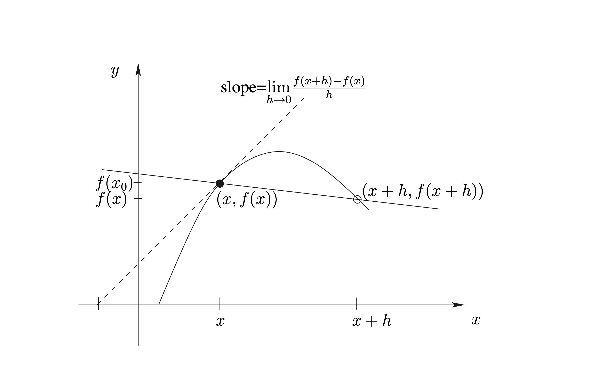
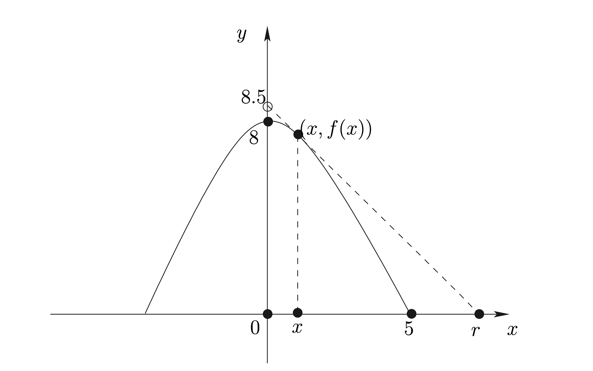
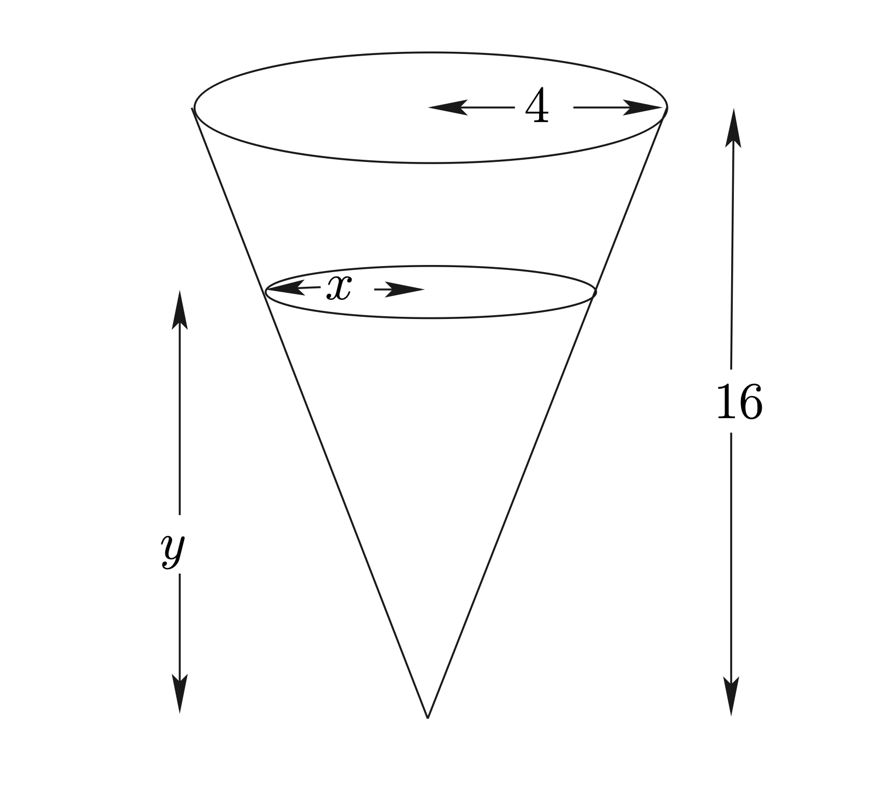
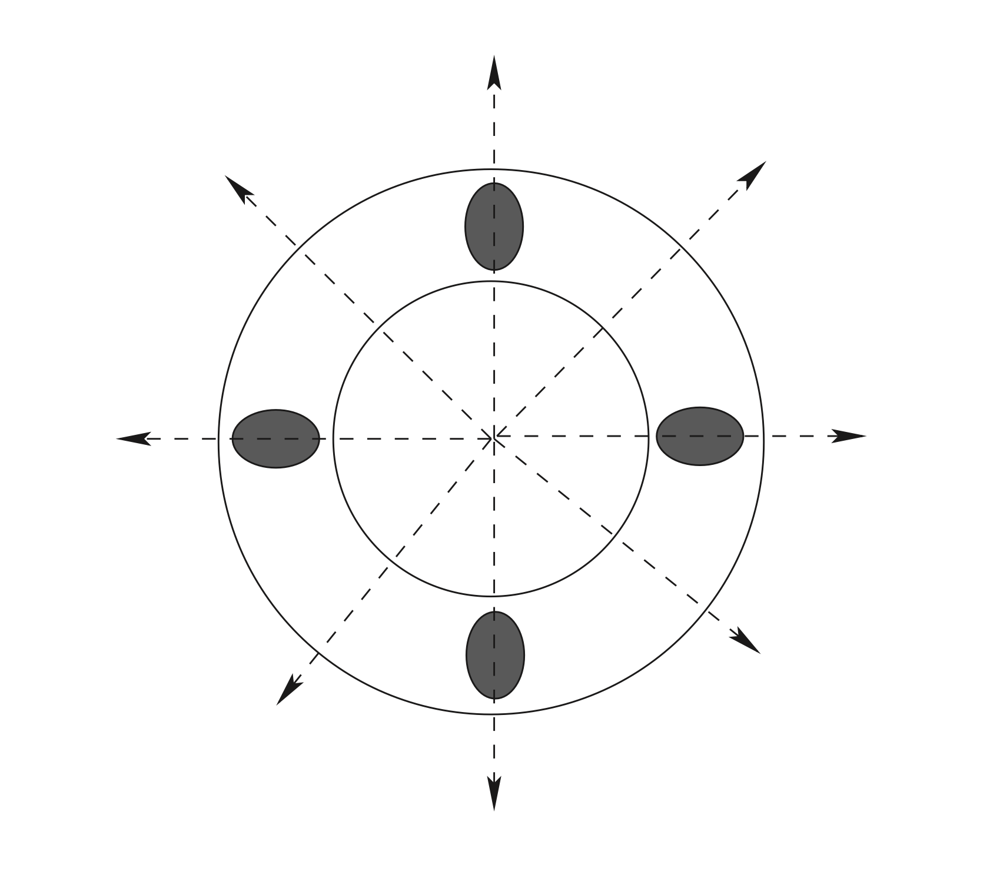

# อนุพันธ์ (Derivatives)

## อนุพันธ์ (Derivatives)

จากตัวอย่า 2.1 ในบทที่ 2 และเนื้อหาในเรื่อง limits เราจะเห็นว่า
ความชันของเส้นสัมผัสกราฟของฟังก์ชัน $y=f\left( x\right)$ ณ จุด
$\left( x_{0},f\left( x_{0}\right) \right)$ บนกราฟ ก็คือ
$\underset{x\rightarrow x_{0}}{\lim}\frac{f\left( x\right) -f\left( x_{0}\right) }{x-x_{0}}$
นั่นเอง (ถ้า limit หาค่าได้)

```{r fig-derivative-1, echo = FALSE, out.width="50%", fig.align="center",  fig.cap=""}

knitr::include_graphics("images/fig-derivative-1.png")
```

ปริมาณนี้มีความสำคัญ เพราะนำไปประยุกต์ใช้ได้มากมาย
เราจึงกำหนดสัญลักษณ์และมีชื่อเรียกดังต่อไปนี้

::: definition
ถ้า $f : D_f \rightarrow \mathbb{R}$ โดยที่ $D_f \subseteq \mathbb{R}$
และถ้า $\underset{x \rightarrow x_0}{\lim} \frac{f(x)-f(x_0)}{x- x_0}$
หาค่าได้แล้ว เรียกค่าของ limit นี้ว่า "อนุพันธ์ (derivative) ของ $f$ ที่ $x_0$\"
และแทนด้วยสัญลักษณ์ $f'(x_0)$
:::

เนื่องจากแต่ละ function $g$ และแต่ละ $x_0$ จะมี
$\underset{x \rightarrow x_0}{\lim}g(x)$ ได้ค่าเดียว ดังนั้น $f'$ จึงเป็น
function เรียกว่า "อนุพันธ์ (derivative)\" ของ $f$

ในการเขียนนิยามของ $f'(x)$ เพื่อใช้เป็นสูตรทั่วไปสำหรับ function $f'$
เราเปลี่ยนตัวแปรเสียใหม่ ดังแสดงในรูป

```{r fig-derivative-2, echo = FALSE, out.width="50%", fig.align="center",  fig.cap=""}


```

จะได้ว่า

::: example
จงหาสมการของเส้นสัมผัสกราฟ $y = -x^2 + 6x -2$ ณ จุด $P_0(2,6)$
:::

**วิธีทำ** ให้ $f(x) = -x^2 + 6x -2$ จะได้ค่าความชันของเส้นสัมผัส ณ จุด $(x,f(x))$
คือ $f'(x)$ ซึ่งเท่ากับ \begin{equation}   \begin{aligned}
    \underset{h \rightarrow 0}{\lim}\frac{f(x+h) - f(x)}{h}
        &= \underset{h \rightarrow 0}{\lim}\frac{\left[-(x+h)^2 + 6(x+h)-2 \right]-
        \left[ -x^2 + 6x -2 \right] }{h} \\
        &=\underset{h \rightarrow 0}{\lim}\frac{-2xh-h^2+6h}{h} \\
        &=\underset{h \rightarrow 0}{\lim}(-2x-h+6)
        \leftarrow \boxed{\mbox{ อย่าเขียน $\underset{h \rightarrow 0}{\lim}-2x-h+6$}}\\
        &=-2x+6
  \end{aligned} \end{equation} ดังนั้น ความชันของเส้นสัมผัส ณ จุด $(2,6)$ คือ
$f'(2) = -2 \cdot 2 + 6 =2$ เส้นสัมผัสจึงมีสมการเป็น $y - 6 = 2(x-2)$

อัตราส่วน $\displaystyle\frac{f(x+h) - f(x)}{h}$ คือ อัตราส่วนของค่า function
ที่เปลี่ยนไป (จาก $f(x_0)$ กลายเป็น $f(x)$) ต่อค่าตัวแปรต้นที่เปลี่ยนไป (จาก $x_0$
กลายเป็น $x$) เรียกคำนี้ว่า "อัตราการเปลี่ยนแปลงเฉลี่ย (average rate of change)
ของ $f(x)$ เทียบกับ $x$\" คำว่าเฉลี่ยน แสดงถึงการคิดการเปลี่ยนแปลงบน 'ช่วง'\
แต่
$\displaystyle\underset{x \rightarrow x_0}{\lim}\frac{f(x) - f(x_0)}{x-x_0}$
เป็นการหา "แนวโน้ม\" ของอัตราการเปลี่ยนแปลงเฉลี่ย เมื่อ $x$ กับ $x_0$ อยู่ใกล้กันมากๆ
จนแทบจะเป็นจุดเดียวกัน เราจึงเรียกค่านี้ว่า "อัตราการเปลี่ยนแปลงขณะหนึ่ง (instantaneous
rate of change) ของ $f(x)$ เทียบกับ $x$\"

สัญลักษณ์อื่นๆ สำหรับ derivatives ได้แก่

ถ้า $f'(x_0)$ หาค่าได้ เรากล่าวว่า function $f$ "หาอนุพันธ์ได้ (differentiable) ที่
$x_0$\" ถ้า $f'(x_0)$ หาค่าได้สำหรับทุกๆ $x$ ในเซต $S$ เรากล่าวว่า function $f$
"หาอนุพันธ์บน $S$ (differentiable on $S$)\" ถ้า $f'(x_0)$ หาค่าได้สำหรับทุกๆ
จำนวนจริง $x$ เรากล่าวว่า function $f$ "หาอนุพันธ์ได้ (differentiable)\"

## การคำนวณหาอนุพันธ์

::: example
จงหา derivative ต่อไปนี้

(1) $f'(x)$ เมื่อ $f(x) = x^2$

(2) $f'(2)$ เมื่อ $f(x) = \sqrt{x}$

(3) $\frac{ds(t)}{dt}|_{t=t_0}$ เมื่อ $s(t) = \frac{1}{t}$
:::

**วิธีทำ** ใช้นิยามข้างต้นหา derivative ได้ดังนี้

(1) เมื่อ $f(x) = x^2$ จะได้ \begin{equation}   \begin{aligned}
                f'(x) &= \underset{h \rightarrow 0}{\lim}\frac{f(x+h) - f(x)}{h} \\
                    &= \underset{h \rightarrow 0}{\lim}\frac{(x+h)^2-x^2}{h} \\
                    &= \underset{h \rightarrow 0}{\lim}\frac{(x^2+2xh+h^2)-x^2}{h} \\
                    &= \underset{h \rightarrow 0}{\lim}\frac{2xh+h^2}{h} \\
                    &= \underset{h \rightarrow 0}{\lim}2x + h \\
                    &= 2x
      \end{aligned} \end{equation}

(2) เมื่อ $f(x) = \sqrt{x}$ จะได้ \begin{equation}   \begin{aligned}
                f'(2) &= \underset{h \rightarrow 0}{\lim}\frac{f(2+h) - f(2)}{h} \\
                    &= \underset{h \rightarrow 0}{\lim}\frac{\sqrt{2+h} - \sqrt{2}}{h} \\
                    &= \underset{h \rightarrow 0}{\lim}\frac{(\sqrt{2+h} - \sqrt{2}) \cdot
                    (\sqrt{2+h} + \sqrt{2})}{h \cdot (\sqrt{2+h} + \sqrt{2})} \\
                    &= \underset{h \rightarrow 0}{\lim}\frac{(2+h)-2}{h\cdot (\sqrt{2+h} + \sqrt{2})} \\
                    &= \underset{h \rightarrow 0}{\lim}\frac{1}{(\sqrt{2+h} + \sqrt{2})} \\
                    &= \frac{1}{2\sqrt{2}}
      \end{aligned} \end{equation}

(3) เมื่อ $s(x) = \frac{1}{t}$ จะได้ \begin{equation}   \begin{aligned}
                s'(t)|_{t=t_0} &= \underset{h \rightarrow 0}{\lim}\frac{s(t_0+h) - s(t_0)}{h} \\
                    &= \underset{h \rightarrow 0}{\lim}\frac{\frac{1}{t_0+h}-\frac{1}{t_0}}{h} \\
                    &= \underset{h \rightarrow 0}{\lim}\frac{t_0-(t_0+h)}{t_0(t_0+h)h} \\
                    &= \underset{h \rightarrow 0}{\lim}\frac{-h}{t_0(t_0+h)h} \\
                    &= \underset{h \rightarrow 0}{\lim}\frac{-1}{t_0(t_0+h)} \\
                    &= \frac{-1}{t_0^2}
      \end{aligned} \end{equation}

::: example
จงหาเซต $S$ ที่ใหญ่ที่สุดที่ทำให้ function $f(x) = \sqrt{x}$ หาอนุพันธ์ได้บน $S$
:::

**วิธีทำ** พิจารณาจำนวนจริง $x$ ที่ทำให้ $f'(x)$ หาค่าได้ เนื่องจาก
$$f'(x) = \frac{1}{2\sqrt{x}}  \text{ ถ้า } x>0$$ ในกรณีที่ $x \le 0$ จะได้ว่า
$f(x)$ ไม่นิยาม จึงหาอนุพันธ์ที่ $x$ ไม่ได้ และในกรณีที่ $x=0$ จะได้ว่า
\begin{equation}   \begin{aligned}
    \underset{h \rightarrow 0}{\lim}\frac{1}{\sqrt{x+h}+\sqrt{x}}
    &=\underset{h \rightarrow 0}{\lim}\frac{1}{\sqrt{0+h}+\sqrt{0}} \\
    &=\underset{h \rightarrow 0}{\lim}\frac{1}{\sqrt{h}}
  \end{aligned} \end{equation} ซึ่งหาค่าไม่ได้ ดังนั้นจึงได้ว่า เซตที่ใหญ่ที่สุดที่ทำให้ function
$f(x) = \sqrt{x}$ หาอนุพันธ์ได้บน $S$ คือ ช่วงเปิด $(0,\infty)$

## สูตรสำหรับหาอนุพันธ์

::: theorem
ถ้า $c$ เป็นจำนวนจริง (real number) และ $n$ เป็นจำนวนจริงใดๆ แล้ว function
$f(x) = c$ เป็น function ที่ differentiable และ function $g(x) = x^n$ เป็น
function ที่ differentiable บนช่วงเปิดในโดเมนของมัน และ

1.  $\frac{dc}{dx} = 0$

2.  $\frac{dx^n}{dx} = n x^{n-1}$
:::

::: theorem
ถ้า $f$ และ $g$ เป็น function ซึ่ง differentiable ที่ $x_0$ และ $c$
เป็นค่าคงที่จริง แล้ว

1.  $(f+g)'(x_0) = f'(x_0) + g'(x_0)$

2.  $(cf)'(x_0) = cf'(x_0)$

3.  $(f-g)'(x_0) = f'(x_0) - g'(x_0)$

4.  $(f \cdot g)'(x_0) = f'(x_0) \cdot g(x_0) + f(x_0)\cdot g'(x_0)$

5.  $(\frac{f}{g})'(x_0) = \frac{f'(x_0) \cdot g(x_0) - f(x_0)\cdot g'(x_0)}{(g(x_0))^2}$
:::

::: example
จงหา derivative ของแต่ละ function ต่อไปนี้ เทียบกับตัวแปรต้นของมัน

(1) $f(x) = 5x^4$

(2) $f(x) = 6x^{11} + 9$

(3) $s(t) = 3t^8 - 2t^5 + 6t + 1$

(4) $g(x) = \left( x^2 - 1 + \frac{1}{2x} \right) \left(2x - 1 + \frac{1}{x^2} \right)$

(5) $h(x) = \frac{x^2 -1}{x^4 + 1}$
:::

**วิธีทำ** ใช้สูตรในทฤษฎีบทข้างต้นหา derivative ได้ดังนี้

(1) \begin{equation}   \begin{aligned}
                f(x) &= 5x^4 \\
                f'(x) &= \frac{d}{dx}(5 \cdot x^4) \\
                    &= 5 \frac{d}{dx}( x^4) = 5 \cdot 4x^3 = 20x^3
      \end{aligned} \end{equation}

(2) \begin{equation}   \begin{aligned}
                f(x) &= 6x^{11} + 9 \\
                f'(x) &= \frac{d}{dx}(6x^{11} + 9) \\
                    &= 5 \frac{d}{dx}(6x^{11}) + \frac{d}{dx}9\\
                    &= 66x^{10}
      \end{aligned} \end{equation}

(3) \begin{equation}   \begin{aligned}
                s(t) &= 3t^8 - 2t^5 + 6t + 1 \\
                s'(t) &= \frac{d}{dt}(3t^8 - 2t^5 + 6t + 1) \\
                    &= 24t^7 - 10t^4 + 6
      \end{aligned} \end{equation}

(4) \begin{equation}   \begin{aligned}
                g(x) &= \left( x^2 - 1 + \frac{1}{2x} \right) \left(2x - 1 + \frac{1}{x^2} \right) \\
                g'(x) &= \frac{d}{dx}\left( x^2 - 1 + \frac{1}{2x} \right)\left(2x - 1 + \frac{1}{x^2} \right)
                +  \left( x^2 - 1 + \frac{1}{2x} \right) \frac{d}{dx} \left(2x - 1 + \frac{1}{x^2} \right)\\
                    &= \left(2x - \frac{1}{2}x^{-1} \right)\left(2x - 1 + \frac{1}{x^2} \right)
                +  \left( x^2 - 1 + \frac{1}{2x} \right) \left(2x -2x^{-3} \right)
      \end{aligned} \end{equation}

(5) \begin{equation}   \begin{aligned}
     h(x) &= \frac{x^2 -1}{x^4 + 1} \\
            h'(x) &= \frac{(x^4 + 1) \frac{d}{dx}(x^2 -1) - (x^2 -1)\frac{d}{dx}(x^4 + 1)   }{(x^4 + 1)^2}\\
            &= \frac{(x^4 + 1) (2x) - (x^2 -1)(4x^3)   }{(x^4 + 1)^2}
      \end{aligned} \end{equation}

::: example
จงหา $f'(0)$ เมื่อ $f(x) = (x^6 - x^5-x^4-x^3)(x^5-x^4-x^3-x^2)$
:::

**วิธีทำ** จาก $f(x) = (x^6 - x^5-x^4-x^3)(x^5-x^4-x^3-x^2)$ จะได้
$$f'(x) = (x^6 - x^5-x^4-x^3)(5x^4-4x^3-3x^2-2x) +
    (x^5-x^4-x^3-x^2)(6x^5 - 5x^4-4x^3-3x^2)$$ ดังนั้น $f'(0) = 0$

## อนุพันธ์อันดับสูง (High Order Derivatives)

ถ้า $f$ เป็น function ที่หา derivative ได้ และ $f'$ ก็เป็น function ที่หา
derivative ได้อีก เราเรียก $(f')'$ ว่า "อนุพันธ์อันดับสอง (second derivative) ของ
$f$\" เขียนแทนด้วย $f''$ ในทำนองเดียวกัน เราจะมี "อนุพันธ์อันดับสาม (third
derivative) ของ $f$\" เขียนแทนด้วย $f'''$ ฯลฯ สำหรับอนุพันธ์อันดับ $n$ ($n$th
derivative) ของ $f$ โดยที่ $n \ge 4$ เราเขียนแทนด้วย $f^{(n)}$
นอกจากนี้เราใช้สัญลักษณ์ $\frac{d^nf(x)}{dx}$ แทน $n$th derivative ของ $f$ และ
$\frac{d^nf(x)}{dx}|_{x=x_0}$ แทน $n$th derivative ของ $f$ ที่ $x_0$ (ซึ่งคือ
$f^{(n)}(x_0)$ นั่นเอง)

ถ้าให้ $y= f(x)$ เราสามารถใช้สัญลักษณ์
$y', y'', y''', y^{(4)}, \ldots, y^{(n)}$ หรือ
$\frac{dy}{dx}, \frac{d^2y}{dx^2}, \frac{d^3y}{dx^3}, \frac{d^4y}{dx^4}, \ldots,
\frac{d^ny}{dx^n}$ แทนอนุพันธ์อันดับที่ $1,2,3,4,\ldots,n$ ตามลำดับ
และแทนค่าอนุพันธ์ที่ $x_0$ ด้วย $\frac{d^ny}{dx^n}|_{x=x_0}$

ด้วยหลักการเดียวกัน "อนุพันธ์อันดับหนึ่ง (first derivative) ของ $f$\" ก็คือ อนุพันธ์ของ
$f$ นั่นเอง

::: example
จงหาอนุพันธ์ทั้งหมดของ $f(x) = x^n$ เมื่อ $n > 1$
:::

**วิธีทำ** จาก $f(x) = x^n$ จะได้ \begin{equation}   \begin{aligned}
        f'(x) &= n x^{n-1} \\
        f''(x) &= n(n-1) x^{n-2} \\
        f'''(x) &= n(n-1)(n-2) x^{n-3} \\
        f^{(4)}(x) &= n(n-1)(n-2)(n-3) x^{n-4} \\
          &\vdots \\
        f^{(n)}(x) &= n! \\
        f^{(k)}(x) &= 0 \text{ เมื่อ } k \ge n
  \end{aligned} \end{equation}

## การตีความอนุพันธ์ (Interpretation of Derivatives)

### อนุพันธ์ในเชิงความชัน (Derivatives as Slopes)

ในกรณีที่เราลงจุดกราฟ (plot graph) ของฟังก์ชัน เราได้ทราบมาแล้วว่า อนุพันธ์ของฟังก์ชัน
$f$ ที่จุด $x$ ใดๆ ก็คือความชันของเส้นสัมผัสกราฟ (เรียกว่าความชันของกราฟ) ของฟังก์ชัน
$f$ ที่จุด $(x,f(x))$ นั่นเอง
ความจริงข้อนี้สามารถนำไปใช้แก้ปัญหาเกี่ยวกับกราฟของฟังก์ชันได้

::: example
จงพิจารณาว่ามีเส้นสัมผัสกราฟของฟังก์ชัน $\displaystyle f(x)=\frac{x}{x+1}$
ที่ตั้งฉากกันหรือไม่
:::

**วิธีทำ** เราทราบว่าเส้นตรงสองเส้นตั้งฉากกันก็ต่อเมื่อ
ผลคูณของความชันของเส้นตรงทั้งสองเท่ากับ $-1$ พิจารณาความชันของเส้นสัมผัสกราฟของฟังก์ชัน
$\displaystyle f(x)=\frac{x}{x+1}$ ที่จุด $(x,f(x))$ ใดๆ จะได้ว่า
ความชันดังกล่าวมีค่าเท่ากับ
$\displaystyle f'(x)=\frac{d}{dx}\left(\frac{x}{x+1}\right)=\frac{1}{(x+1)^2}$
ฉะนั้น ความชันของเส้นสัมผัสกราฟนี้ที่จุดใดๆ จึงมีค่าเป็นบวกเสมอ จึงสรุปได้ว่า
กราฟของฟังก์ชันนี้ไม่มีเส้นสัมผัสคู่ใดตั้งฉากกัน
เพราะผลคูณของความชันของเส้นสัมผัสเป็นจำนวนจริงบวกเสมอ ไม่สามารถเป็น $-1$ ได้

::: example
[]{#exa-mountain label="exa-mountain"} ภูเขาจำลองในพิพิธภัณฑ์วิทยาศาสตร์แห่งหนึ่ง
เกิดจากการหมุนของพาราโบลาคว่ำรอบแกนสมมาตรของมัน
โดยที่ฐานของภูเขาจำลองเป็นรูปวงกลมรัศมี 5 เมตร และยอดเขาอยู่สูงจากฐานเป็นระยะทาง 8
เมตร บนยอดเขาติดตั้งโคมไฟ ณ ตำแหน่งสูงจากยอดเขาขึ้นไปอีก 0.5 เมตร เมื่อเปิดโคมไฟ
แสงไฟจากโคมจะทำให้พื้นบริเวณรอบๆ ภูเขาจำลองที่ไม่ถูกภูเขาจำลองบัง สว่างขึ้น
จงหาว่าบริเวณที่สว่างดังกล่าว เป็นบริเวณบนพื้นภายนอกวงกลมรัศมีเท่าใด
:::

จากโจทย์จำลองรูปได้ดังภาพ [1.3](#fig-mountain){reference-type="ref"
reference="fig-mountain"} ในที่นี้สมมุติว่าแหล่งกำเนิดแสงเป็นจุด จะเห็นว่า
แนวแบ่งส่วนมืดและส่วนสว่างจะผ่านจุดกำเนิดแสง และอยู่ในแนวเส้นสัมผัสผิวของพาราโบลาด้วย
ให้จุดกึ่งกลางฐานของภูเขาจำลองเป็นจุดกำเนิด และสมมุติให้ $f(x)=a-kx^2$
เป็นสมการของรูปพาราโบลา จากเงื่อนไขความกว้างและความสูงของภูเขาจำลอง จะได้ว่า
$f(0)=8$ และ $f(5)=0$ ซึ่งทำให้ $a=8$ และ $k=8/25$ ดังนั้น $f(x)=8-8x^2/25$ ให้
$(x,f(x))$ เป็นจุดที่แนวแบ่งส่วนมืดและส่วนสว่างสัมผัสกับพาราโบลา จะได้ว่า
ความชันของเส้นสัมผัสกราฟที่จุดดังกล่าวเท่ากับ $f'(x)=-16x/25$
แต่เส้นสัมผัสนี้ผ่านจุดกำเนิดแสง $(0,8.5)$ และจุด $(x,f(x))=(x,8-8x^2/25)$ จึงได้ว่า
มีความชันเป็น $\displaystyle\frac{8-8x^2/25-8.5}{x-0}$ นั่นคือ
$\displaystyle\frac{8-8x^2/25-8.5}{x-0}=-16x/25$ หรือ $x=5/4$
ดังนั้นความชันของเส้นสัมผัสเท่ากับ $-16\times(5/4)/25=-4/5$ ถ้าบริเวณบนพื้นที่สว่าง
เป็นบริเวณภายนอกวงกลมรัศมี $r$ จะได้ว่า เส้นสัมผัสข้างต้น ต้องผ่านจุด $(r,0)$ ด้วย
นั่นคือความชันจะเท่ากับ $\displaystyle\frac{0-8.5}{r-0}$ ซึ่งทำให้
$\displaystyle\frac{0-8.5}{r-0}=-4/5$ หรือ $r=10.625$ นั่นคือ บริเวณที่สว่าง
เป็นบริเวณบนพื้นภายนอกวงกลมรัศมี 10.625 เมตร

```{r fig-derivative-3, echo = FALSE, out.width="50%", fig.align="center",  fig.cap="รูปภาพสำหรับตัวอย่างข้างต้น"}


```


### อนุพันธ์ในเชิงอัตราเร็ว (Derivatives as Speeds)

ถ้าพิจารณาการเคลื่อนที่ของวัตถุ โดยให้ $f(t)$ เป็นระยะทางที่วัตถุเคลื่อนที่ได้ ณ เวลา $t$
เราจะได้ว่า $f'(t)$ ก็คืออัตราเร็ว ณ เวลา $t$ ซึ่งเรียกว่า อัตราเร็วชั่วขณะ
(instantaneous speed) ในขณะที่ปริมาณ $\displaystyle \frac{f(s)-f(t)}{s-t}$
เรียกว่า อัตราเร็วเฉลี่ยของวัตถุ ในช่วงเวลา ตั้งแต่ $s$ ถึง $t$

::: example
วัตถุเคลื่อนที่เป็นเวลานาน 1 นาที ตามสมการ $s=0.5t+0.1t^2$ เมื่อ $t$ คือเวลาเป็นวินาที
และ $s$ คือระยะทางที่เคลื่อนที่ได้เป็นเมตร จงหา

(1) อัตราเร็วเฉลี่ยของวัตถุในช่วง 10 วินาทีแรก และในช่วง 10 วินาทีถัดไป

(2) อัตราเร็วของวัตถุ ณ วินาทีที่ 10 และ ณ วินาทีที่ 20
:::

**วิธีทำ**\
(1) อัตราเร็วเฉลี่ยของวัตถุในช่วง 10 วินาทีแรก เท่ากับ\
$\displaystyle\frac{s(10)-s(0)}{10-0}
       =\frac{(0.5\times10+0.1\times10^2)-(0.5\times0+0.1\times0^2)}{10-0}=1.5$
เมตรต่อวินาที\
อัตราเร็วเฉลี่ยของวัตถุในช่วง 10 วินาทีถัดไป เท่ากับ\
$\displaystyle\frac{s(20)-s(10)}{20-10}
       =\frac{(0.5\times20+0.1\times20^2)-(0.5\times10+0.1\times10^2)}{20-10}=3.5$
เมตรต่อวินาที\
(2) เนื่องจาก
$\displaystyle\frac{d}{dt}\left(0.5t+0.1t^2\right)=0.5+0.2t$\
ดังนั้น อัตราเร็วของวัตถุ ณ วินาทีที่ 10 เท่ากับ\
$\displaystyle\left.\frac{ds}{dt}\right|_{t=10}
       =\left.\frac{d}{dt}\left(0.5t+0.1t^2\right)\right|_{t=10}=0.5+0.2\times10=2.5$
เมตรต่อวินาที\
และ อัตราเร็วของวัตถุ ณ วินาทีที่ 20 เท่ากับ\
$\displaystyle\left.\frac{ds}{dt}\right|_{t=20}
       =\left.\frac{d}{dt}\left(0.5t+0.1t^2\right)\right|_{t=20}=0.5+0.2\times20=4.5$
เมตรต่อวินาที

### อนุพันธ์ในเชิงอัตราการเปลี่ยนแปลง (Derivatives as Rates of Change)

เราจะเห็นได้ชัดจากนิยามของอนุพันธ์ว่า ในกรณีของฟังก์ชันทั่วๆ ไป อนุพันธ์ของฟังก์ชัน
ก็คืออัตราการเปลี่ยนแปลงของค่าฟังก์ชัน เทียบกับตัวแปรต้นของมันนั่นเอง

::: example
เมื่อใช้เครื่องสูบลม สูบลมเข้าไปในลูกโป่ง เราอาจประมาณได้ว่า ณ ขณะเวลาใดๆ
ลูกโป่งมีรูปร่างเป็นรูปทรงกลม จงหาอัตราการเพิ่มขึ้นของปริมาตรของลูกโป่ง
ต่อหนึ่งหน่วยรัศมีที่เพิ่มขึ้นของลูกโป่ง ขณะที่ลูกโป่งมีรัศมี 10 เซนติเมตร
:::

**วิธีทำ** ให้ $r$ เป็นรัศมีของลูกโป่ง และ $V$ เป็นปริมาตรของลูกโป่ง
จากข้อสมมุติว่าลูกโป่งเป็นทรงกลม จะได้ว่า $V=4\pi r^3/3$ ดังนั้น
อัตราการเปลี่ยนแปลงของปริมาตรของลูกโป่งเทียบกับรัศมีเท่ากับ
$\displaystyle\frac{dV}{dr}=12\pi r^2/3=4\pi r^2$ ลูกบาศก์หน่วยต่อหน่วย นั่นคือ
ขณะที่ลูกโป่งมีรัศมี 10 เซนติเมตร มันจะมีปริมาตรเพิ่มขึ้นในอัตรา
$4\times\pi\times10^2\approx1256$ ลูกบาศก์เซนติเมตรต่อเซนติเมตร หรือประมาณ
$1.256$ ลิตรต่อรัศมีที่เพิ่มขึ้น 1 เซนติเมตร

### แบบฝึกหัด (Exercises)

1.  จงหาอนุพันธ์ต่อไปนี้ ถ้าอนุพันธ์ดังกล่าวหาค่าได้ ในกรณีที่หาค่าไม่ได้ ให้ระบุว่าหาค่าไม่ได้

    1.  $\displaystyle f'(x)$ เมื่อ $f(x)=g(x)h(x)k(x)$

    2.  $\displaystyle f^{(n)}(0)$ เมื่อ
        $\displaystyle f(x)=\sum_{i=1}^k x^i$ โดยที่ $k$ และ $n$
        เป็นจำนวนนับ

    3.  $\displaystyle\frac{d}{dt}\frac1{1-t}$ และ
        $\displaystyle\frac{d^2}{dt^2}\frac1{1-t}$

    4.  $\displaystyle\frac{d}{dt}\frac{f(t)}t$ เมื่อ $f$ เป็นฟังก์ชันซึ่ง
        $\displaystyle\frac{d}{dt}f(t)=\frac{f(t)}t$ สำหรับทุกๆ $t\neq0$

    5.  $f'(-1)$, $f'(-\frac23)$, $f'(0)$, $f'(1)$ เมื่อ
        $f(x)=x\sqrt{1+x}$

    6.  $\displaystyle\left.\frac d{dx}\,\frac x{\sqrt{1+x}-\sqrt{1-x}}\right|_{x=0}$

    7.  $\displaystyle\frac {dy}{dx}\;$,
        $\displaystyle\left.\frac {dy}{dx}\,\right|_{x=0}$,
        $\displaystyle\left.\frac {dy}{dx}\,\right|_{x=0.25}$,
        $\displaystyle\left.\frac {dy}{dx}\,\right|_{x=1}$ เมื่อ
        $\displaystyle y=\frac{1-\sqrt x}{\sqrt{1-x}}$

    8.  $\displaystyle\frac d{dx}\,\left(x^2\sqrt{1+x}\right)$

    9.  $\displaystyle\frac {d^2y}{dx^2}$ เมื่อ $y=(1+x^2)\sqrt{1-2x}$ (
        หาอนุพันธ์ของ $\sqrt{1-2x}$ และ $1/\sqrt{1-2x}$ ก่อน)

    10. $\displaystyle\frac {d^{10}y}{dx^{10}}$ เมื่อ
        $y=\left(x^5-x^4-x^3-x^2-x-1\right)\left(x^5+2x^4+2x^3+2x^2+2x+2\right)$

2.  จงตอบคำถามต่อไปนี้

    1.  จงหาความชันของกราฟของสมการ $y=x^3-3x$ ณ ตำแหน่งซึ่ง $x=2$

    2.  จงหาจุดบนกราฟ $y=x^3-3x$ ซึ่งมีเส้นสัมผัสกราฟที่ขนานกับเส้นสัมผัส ณ จุดซึ่ง
        $x=a$ เมื่อ $a$ เป็นจำนวนจริงใดๆ

    3.  จงหาจุดบนกราฟ $y=x^3-3x$ ซึ่งมีเส้นสัมผัสกราฟที่ตั้งฉากกับเส้นสัมผัส ณ จุดซึ่ง
        $x=a$ เมื่อ $a$ เป็นจำนวนจริงใดๆ

##  กฎลูกโซ่ (The Chain Rule)

การทราบข้อมูลของ derivative ของฟังก์ชัน $f$ และฟังก์ชัน $g$ ทำให้เราสามารถหา
derivative ของผลบวก $f+g$ ผลคูณ $fg$ และผลหาร $f/g$ ของฟังก์ชัน ทั้งสองได้
ข้อมูลนี้ยังใช้หา derivative ของฟังก์ชันประกอบ $f\circ g$ ภายใต้เงื่อนไขที่เหมาะสมได้
เราเรียกวิธีการหา derivative ของฟังก์ชัน ประกอบว่า chain rule โดยมีแนวคิดสำคัญคือ
การสร้างตัวแปรใหม่ขึ้นมาช่วย ในการคำนวณ ดังรายละเอียดในทฤษฏีบทต่อไปนี้

::: theorem
ถ้าฟังก์ชัน $g$ หา derivative ได้ที่จุด $x$ และฟังก์ชัน $f$ หา derivative ได้ที่จุด
$g(x)$ แล้ว ฟังก์ชันประกอบ $f \circ g$ หา derivative ได้ที่จุด $x$ ยิ่งกว่านั้น ถ้า
$$y = f(g(x)) \quad \text{และ} \quad u = g(x)$$ แล้ว $y=f(u)$ และ
$$\label{E:chain1}
\boxed{
    \frac{dy}{dx} = \frac{dy}{du} \cdot \frac{du}{dx}
}$$
:::

ตัวอย่างต่อไปนี้แสดงให้เห็นถึงการใช้ chain rule หา derivative ของฟังก์ชัน

::: example
พิจารณาฟังก์ชัน $y = \frac{1}{x^2+1}$ กำหนดให้ $u = x^2+1$ จงหา
$\frac{dy}{dx}$
:::

**วิธีทำ** ในที่นี้ $y = \frac{1}{u}$ เราใช้ chain rule ได้ว่า \begin{equation}   \begin{aligned}
    \frac{dy}{dx}
    &= \frac{dy}{du} \cdot \frac{du}{dx} \\
    &= \frac{d}{du}\left[\frac{1}{u}\right] \cdot \frac{d}{dx}[x^2+1] \\
    &= \left(-\frac{1}{u^2}\right) \cdot (2x) \\
    &= -\frac{1}{(x^2+1)^2} \cdot (2x) \\
    &= -\frac{2x}{(x^2+1)^2}
  \end{aligned} \end{equation} นั่นคือ
$\displaystyle \frac{dy}{dx} = -\frac{2x}{(x^2+1)^2}$

::: example
กำหนดให้ $y = u^{100}$ และ $u = x^3 + x^2 + x + 1$ จงหา $\frac{dy}{dx}$
:::

**วิธีทำ** ใช้ chain rule ได้ว่า \begin{equation}   \begin{aligned}
    \frac{dy}{dx}
    &= \frac{dy}{du} \cdot \frac{du}{dx} \\
    &= \frac{d}{du}[u^{100}] \cdot \frac{d}{dx}[x^3+x^2+x+1] \\
    &= (100u^{99}) \cdot (3x^2+2x+1) \\
    &= 100(x^3+x^2+x+1)^{99}(3x^2+2x+1)
  \end{aligned} \end{equation} นั่นคือ
$\displaystyle \frac{dy}{dx} = 100(x^3+x^2+x+1)^{99}(3x^2+2x+1)$

สูตร [\[E:chain1\]](#E:chain1){reference-type="eqref"
reference="E:chain1"} สามารถเขียนได้ในอีกรูป ซึ่งสะดวกในการนำไปใช้ สังเกตว่า
$y = f(u)$ ดังนั้น
$$\frac{dy}{dx} = \frac{d}{dx}[f(u)] \quad \text{และ} \quad
    \frac{dy}{du} = f'(u)$$ สูตรของ chain rule จึงเขียนได้ว่า
$$\label{E:chain2}
\boxed{
    \frac{d}{dx}[f(u)] = f'(u)\frac{du}{dx}
}$$ ซึ่งเขียนได้อีกรูปคือ $$\frac{d}{dx} f(g(x)) = f'(g(x))\cdot g'(x)$$

::: example
จงหา derivative ของฟังก์ชัน $y = \sqrt{\frac{1}{2}x^2+x+1}$
:::

**วิธีทำ** เราแนะนำตัวแปร $u = \frac{1}{2}x^2+x+1$ และใช้สูตร chain
rule [\[E:chain2\]](#E:chain2){reference-type="eqref"
reference="E:chain2"} ได้ว่า \begin{equation}   \begin{aligned}
    \frac{d}{dx} \left[\sqrt{\frac{1}{2}x^2+x+1} \right]
    &= \frac{d}{dx}[\sqrt{u}] \\
    &= \frac{d}{du}\sqrt{u} \cdot \frac{du}{dx} \\
    &= \frac{1}{2\sqrt{u}} \frac{du}{dx} \\
    &= \frac{1}{2\sqrt{\frac{1}{2}x^2+x+1}} \frac{d}{dx}
\left[\frac{1}{2}x^2+x+1\right] \\
    &= \frac{1}{2\sqrt{\frac{1}{2}x^2+x+1}} \cdot (x+1) \\
    &= \frac{x+1}{2\sqrt{\frac{1}{2}x^2+x+1}}
  \end{aligned} \end{equation} นั่นคือ
$\displaystyle \frac{dy}{dx} = \frac{x+1}{2\sqrt{\frac{1}{2}x^2+x+1}}$

::: example
จงหาค่าของ $f'(x^3+x)$ เมื่อกำหนดให้ $$\frac{d}{dx}[f(x^3+x)] = (3x^2+1)^2$$
:::

**วิธีทำ** เราใช้ chain rule ได้ว่า \begin{equation}   \begin{aligned}
    \frac{d}{dx}[f(x^3+x)]
    &= f'(x^3+x) \frac{d}{dx} [x^3+x] \\
    &= f'(x^3+x) \cdot (3x^2+1)
  \end{aligned} \end{equation} ดังนั้น $$(3x^2+1)^2 = f'(x^3+x)\cdot(3x^2+1)$$ หรือ
$$f'(x^3+x) = 3x^2+1$$ สังเกตความแตกต่างระหว่าง
$\displaystyle \frac{d}{dx} f(x^3+x)$ และ $f'(x^3+x)$

::: example
กำหนดให้ $f(x) = |x|$ จงหา derivative ของฟังก์ชัน $f$ ที่ $x \ne 0$
:::

**วิธีทำ** ฟังก์ชัน $f$ เขียนได้ว่า $$f(x) = |x| = \sqrt{x^2}$$ ถ้า $x\ne 0$ แล้ว
\begin{equation}   \begin{aligned}
    f'(x) &= \frac{d}{dx} \sqrt{x^2} \\
          &= \frac{d}{du} [\sqrt{u}] \cdot \frac{d}{dx} [x^2] \\
          &= \frac{1}{2\sqrt{u}} \cdot (2x) \\
          &= \frac{1}{\sqrt{x^2}} \cdot x \\
          &= \frac{x}{|x|}
  \end{aligned} \end{equation} นั่นคือ เมื่อ $x\ne 0$ แล้ว
$\displaystyle f'(x) = \frac{x}{|x|}$

### แบบฝึกหัด

1.  จงหา derivative ของฟังก์ชันต่อไปนี้

    1.  $\displaystyle f(x) = \sqrt{1-x+x^2}$

    2.  $\displaystyle f(x) = \frac{1}{1+x+x^2}$

    3.  $\displaystyle f(x) = (2x+5)^3(3x-7)^5$

    4.  $\displaystyle f(x) = \frac{x^2+1}{x^3+x^2+1}$

2.  จงหา derivative ของฟังก์ชัน
    $$y = \sqrt{x + \sqrt[3]{3x + \sqrt[4]{4x}}}$$

3.  กำหนดให้ $f$ เป็นฟังก์ชันหา derivative ได้ และ $g = f \circ f$ ถ้า
    $f(1) = 1$, $f(2) = 4$ และ $f'(4) = 8$ จงหาค่าของ $g'(1)$

4.  พิจารณาตารางค่าของฟังก์ชัน $f, f'$, $g, g'$ และ $h, h'$ โดยที่ $h=f\circ g$

    ::: center
       $x$   $f(x)$   $g(x)$   $h(x)$   $f'(x)$   $g'(x)$   $h'(x)$
      ----- -------- -------- -------- --------- --------- ---------
       -1      0        1        2         2         0         2
        0      3        -1       ?         1         1         ?
        1      ?        0        0         ?         ?         3
    :::

    จงหาค่าของ $h(0)$, $f(1)$, $h'(0)$, $f'(1)$ และ $g'(1)$

5.  จาก chain rule [\[E:chain1\]](#E:chain1){reference-type="eqref"
    reference="E:chain1"},
    $\frac{dy}{dx} = \frac{dy}{du} \cdot \frac{du}{dx}$, จงหาสูตร ของ
    $\displaystyle \frac{d^2y}{dx^2}$

## อนุพันธ์ของฟังก์ชันอินเวอร์ส (Derivatives of Inverse Functions)

::: definition
ถ้าฟังก์ชัน $f$ และ $g$ สอดคล้องสมบัติ

1.  $g(f(x)) = x$ สำหรับ $x$ ที่เป็นสมาชิกของโดเมนของ $f$

2.  $f(g(y)) = y$ สำหรับ $y$ ที่เป็นสมาชิกของโดเมนของ $g$

เรากล่าวว่า $f$ และ $g$ เป็นฟังก์ชันอินเวอร์ส โดยที่ $f$ เป็น ฟังก์ชันอินเวอร์สของ $g$
และ $g$ เป็นฟังก์ชันอินเวอร์ส ของ $f$
:::

ถ้าเขียน $f^{-1}$ แทน $g$ และใช้สัญกรณ์ $x$ แทนสมาชิกทั้งในโดเมนของ $f$ และ
$f^{-1}$ สมมติว่าทั้งสองฟังก์ชันหา derivative ได้ ให้ $$y = f^{-1}(x)$$
เราสามารถเขียนใหม่ได้ว่า $$x = f(y)$$ หา derivative เทียบกับ $x$
\begin{equation}   \begin{aligned}
    \frac{d}{dx}[x]
    &= \frac{d}{dx}[f(y)] \\
    &= f'(y) \cdot \frac{dy}{dx}
  \end{aligned} \end{equation} นั่นคือ $$1 = f'(y) \cdot \frac{dy}{dx}$$ หรือ
$$\frac{dy}{dx} = \frac{1}{f'(y)}$$ เขียนใหม่ได้ว่า $$\label{E:inverse}
\boxed{
    \frac{d}{dx}[f^{-1}(x)] = \frac{1}{f'(f^{-1}(x))}
}$$

::: example
กำหนดให้ $f(x) = x^3$ มี $f^{-1}(x) = x^{1/3}$ จงหา
$\frac{d}{dx} [f^{-1}(x)]$
:::

**วิธีทำ** คำนวณหา derivative ได้ว่า $f'(x) = 3x^2$ และ \begin{equation}   \begin{aligned}
    \frac{d}{dx} [x^{1/3}]  = \frac{d}{dx} [f^{-1}(x)]
    &= \frac{1}{3[f^{-1}(x)]^2} \\
    &= \frac{1}{3[x^{1/3}]^2} \\
    &= \frac{1}{3x^{2/3}}
  \end{aligned} \end{equation}

ในการหา derivative ของฟังก์ชันอินเวอร์ส เราอาจจะไม่ใช้สูตรโดยตรง แต่ จะคำนวณหา
derivative ตามขั้นตอนที่ได้แสดงข้างต้น ดังตัวอย่าง

::: example
พิจารณาฟังก์ชัน $f(x) = x^3+x+2$ จงหา derivative ของ $f^{-1}(x)$
:::

**วิธีทำ** เราเขียน $x = f(y) = y^3+y+2$ แล้วหา derivative เทียบกับ $x$
\begin{equation}   \begin{aligned}
    \frac{d}{dx}[x]  &= \frac{d}{dx}[y^3+y+2] \\
    1 &= (3y^2+1)\frac{dy}{dx}
  \end{aligned} \end{equation} ดังนั้น $\displaystyle \frac{dy}{dx} = \frac{1}{3y^2+1}$

::: example
กำหนดให้ $f$ เป็นฟังก์ชันซึ่งมีอิสเวอร์ส ถ้า $f(1) = 2$ และ $f'(1) = 3$ แล้ว
จงหาค่าของ $(f^{-1})'(2)$
:::

**วิธีทำ** เนื่องจาก $f(1) = 2$ แล้ว $f^{-1}(2) = 1$ และจากสูตร
 [\[E:inverse\]](#E:inverse){reference-type="eqref"
reference="E:inverse"} \begin{equation}   \begin{aligned}
    (f^{-1})'(2)
    &= \frac{1}{f'(f^{-1}(2))} \\
    &= \frac{1}{f'(1)} \\
    &= \frac{1}{3}
  \end{aligned} \end{equation} นั่นคือ $\displaystyle (f^{-1})'(2) = 1/3$

### แบบฝึกหัด

1.  จงหา $(f^{-1})'(x)$ เมื่อกำหนด

    1.  $\displaystyle f(x) =  2x^3-1$

    2.  $\displaystyle f(x) = \frac{x+1}{x-1}$

    3.  $\displaystyle f(x) = \frac{x^3+1}{x^2+1}$

    4.  $\displaystyle f(x) = \sqrt{x^3+x^2+x+1}$

## Differentials, Implicit Differentiation and Related Rates

### Differentials

ที่ผ่านมา เราให้ความหมายของ $dy/dx$ ว่าเป็น derivative ของ $y$ เทียบกับ $x$
ในความหมายของตัวดำเนินการ $\frac{d}{dx}$ ที่กระทำ กับฟังก์ชัน $y$ หัวข้อนี้เราจะนิยาม
$dy$ และ $dx$ แยกจากกัน และให้ความหมาย $dy/dx$ ว่าเป็นเศษส่วน\
\
ผลต่างระหว่างค่าสองค่าของตัวแปร เราเรียกว่า increment เช่นในตัวแปร $x$
ผลต่างระหว่างค่า $x=x_0$ และ $x=x_1$ เราเขียน increment ใน $x$ นี้ ว่า
$\Delta x = x_1-x_0$\
\
ให้ $y=f(x)$ และให้ $x$ มีการเปลี่ยนค่าจาก $x=x_0$ ไปยัง $x=x_1$ ก็จะมี
การเปลี่ยนค่าใน $y$ จาก $y_0 = f(x_0)$ ไปยัง $y_1= f(x_1)$ นั่นหมายความ ว่า
increment $\Delta x$ ทำให้เกิด increment $\Delta y = y_1-y_0$ โดยที่
$$\Delta y = y_1-y_0 = f(x_1) - f(x_0)$$ หรือ
$$\Delta y = f(x_0+\Delta x) - f(x_0)$$ ดังนั้น สำหรับค่า $x$ ทั่วไปแล้ว
เราอาจเขียน $$\Delta y = f(x+ \Delta x) - f(x)$$ และนิยามของ derivative
ก็เขียนได้อีกรูปว่า
$$\frac{dy}{dx} = \lim_{\Delta x \to 0} \frac{\Delta y}{\Delta x} \\
    = \lim_{\Delta x \to 0} \frac{f(x+\Delta x) - f(x)}{\Delta x}$$

เมื่อเราเห็นการเขียนสัญกรณ์ $\displaystyle \frac{dy}{dx}$ มีแนวโน้มที่จะ
ทำให้เราคิดถึงผลหารของ $dy$ ด้วย $dx$ ซึ่งในขณะนี้ ทั้งสองปริมาณยังไม่มี ความหมายใด ๆ
สังเกตว่าในสูตรของ chain rule ที่ว่า
$\displaystyle \frac{dy}{dx} = \frac{dy}{du} \cdot \frac{du}{dx}$ ก็ให้
ความรู้สึกแรกว่าน่าจะเป็นผลหารเช่นกัน ดังนั้นลำดับถัดไปเราจะให้ความหมายของ พจน์ $dx$,
$dy$ และการตีความหมายในรูปเศษส่วน\
\
เริ่มด้วยการตรึงค่า $x$ และนิยาม $dx$ ว่าเป็นตัวแปรต้น กำหนดให้ $y = f(x)$ และ $f$
เป็นฟังก์ชัน หา derivative ได้ เรานิยาม $dy$ ว่าเป็นตัวแปรตามดังนี้ $$\boxed{
    dy = f'(x)\,dx
}$$ ถ้า $dx \ne 0$ เราเขียนใหม่ได้ว่า $$\frac{dy}{dx} = f'(x)$$ เราเรียก $dy$
ว่า differential ของ $y$ และ $dx$ ว่า differential ของ $x$\
\
มีความแตกต่างระหว่าง ความหมายของ differential $dy$ และ increment
$\Delta y = y_1-y_0$ ถ้าเรากำหนดให้ differential $dx$ และ increment
$\Delta x$ มีค่า เดียวกัน นั่นคือ $dx = \Delta x$ จะเห็นว่า $\Delta y$ แทนถึง
ค่าผลต่างใน $y$ ของจุดเริ่มต้น $x$ และจุดปลาย $x+\Delta x$ ตามเส้นโค้ง $y = f(x)$
นั่นคือ $\Delta y = f(x+\Delta x) - f(x)$ ในขณะที่ $dy$ แทนถึงค่าผลต่างใน $y$
ของจุดเริ่มต้น $x$ และจุดปลาย $x+\Delta
x$ ตามเส้นสัมผัสของเส้นโค้ง $y=f(x)$ ที่ผ่านจุด $(x,f(x))$ และ มีความชันเท่ากับ
$f'(x)$

::: example
ถ้า $y = f(x) = x^2+1$ แล้ว $f'(x) = 2x$ กำหนดให้ $x=3$ จงหาค่าของ $dy$ และ
$\Delta y$ เมื่อ $dx = \Delta x = 0.1$
:::

**วิธีทำ** ค่าของ $dy$ คือ $$dy = f'(x) \,dx = 2x\,dx$$ กรณีตรึง $x=3$ ได้ว่า
$$dy = 6\,dx$$ ถ้าให้ $dx=0.1$ ค่าของ $dy = 0.6$ ถ้าเราพิจารณาค่า
$dx = \Delta x= 0.1$ เราก็จะได้
$$\Delta y = f(3+\Delta x) - f(3) = (3.1)^2+1 - 3^2-1 = 0.61$$ สังเกตว่า
$dy = 0.6$ ในขณะที่ $\Delta y = 0.61$

มีข้อสังเกตว่า ถ้า $f$ เป็นฟังก์ชันหา derivative ได้ที่ค่า $x_0$ แล้วเส้นสัมผัส กับเส้นโค้ง
$y= f(x)$ ที่จุด $(x_0,f(x_0))$ จะใกล้เคียงกับกราฟของ $f$ สำหรับค่า $x$ ใกล้ ๆ
กับค่า $x_0$ สมการเส้นสัมผัสกับเส้นโค้งนี้ที่ผ่านจุด $(x_0,f(x_0))$ มี ความชัน $f'(x_0)$
คือ $$y = f(x_0) + f'(x_0)(x-x_0)$$ เมื่อเรากล่าวว่า เส้นโค้ง $y=f(x)$
และเส้นสัมผัสกับเส้นใกล้เคียงกันหมายถึงถ้าเรา ให้ $x$ เข้าใกล้ $x_0$ ค่าของ
$f(x_0)+f'(x_0)(x-x_0)$ ก็จะใกล้เคียงค่า $f(x)$ $$\label{E:approx}
    f(x) \approx  f(x_0) + f'(x_0)(x-x_0)$$
เราเรียกสมการ [\[E:approx\]](#E:approx){reference-type="eqref"
reference="E:approx"} ว่า local linear approximation ของ $f$ ที่ $x_0$ เรา
อาจเขียนในอีกรูปว่า $$f(x_0 + \Delta x) \approx f(x_0) + f'(x_0)\Delta x$$

::: example
จงหา local linear approximation ของฟังก์ชัน $f(x) = x^{1/3}$ ที่ $x_0 = 1$
:::

**วิธีทำ** เรามี $f(x) = x^{1/3}$ และคำนวณหา derivative
$$f'(x) = \frac{1}{3}x^{-2/3}$$ local linear approximation ของ $f$ ที่
$x_0 = 1$ จึงเป็น
$$x^{1/3} \approx 1 + \frac{1}{3}(x-1) = \frac{1}{3}x+\frac{2}{3}$$
ถ้าเราต้องการประมาณค่าของ $(1.1)^{1/3}$ เราใช้ local linear approximation
ของ $f$ ในการประมาณ โดยได้ค่าประมาณคือ $1+\frac{1}{3}(1.1-1) = 1.03$

### Implicit Differentiation

บางครั้งเราต้องการหา derivative ของฟังก์ชัน ซึ่งไม่สามารถเขียนได้ ในรูปฟอร์ม
$y = f(x)$ เช่นในความสัมพันธ์ $$x^2+y^3 - xy = 0$$ การหา derivative ของ $y$
เทียบกับ $x$ เราไม่จำเป็นต้องเขียนความสัมพันธ์ ให้อยู่ในรูป $y = f(x)$ ก่อน
หลักการสำคัญก็คือ เราคิดให้ $y$ เป็น ฟังก์ชันของ $x$ เช่นในตัวอย่างที่ยกมา ถ้าเราหา
derivative ทั้งสองข้าง ของสมการเทียบกับ $x$ \begin{equation}   \begin{aligned}
    \frac{d}{dx}[x^2+y^3-xy] &= \frac{d}{dx}[0] \\
    \frac{d}{dx}[x^2] + \frac{d}{dx}[y^3] - \frac{d}{dx}[xy] &= 0 \\
    2x + 3y^2 \frac{dy}{dx} - x\frac{dy}{dx} -y &= 0
  \end{aligned} \end{equation} เขียนใหม่ได้ว่า $$\frac{dy}{dx} = \frac{2x-y}{x-3y^2}$$

::: example
กำหนดให้ $y^2 = x^3(2-x)$ สังเกตว่า $(x,y) = (1,1)$ อยู่บน กราฟของความสัมพันธ์
จงหาว่าความชันของกราฟนี้ที่จุด $(1,1)$
:::

**วิธีทำ** หา derivative เทียบกับ $x$ ทั้งสองข้าง ของสมการ \begin{equation}   \begin{aligned}
    \frac{d}{dx}[y^2] &= \frac{d}{dx}[x^3(2-x)] \\
    \frac{d}{dy}[y^2] \cdot \frac{dy}{dx} &= x^3\frac{d}{dx}[2-x] + (2-x)\frac{d}{dx}[x^3] \\
    (2y) \cdot \frac{dy}{dx} &= -x^3 + (2-x)(3x^2) \\
    \frac{dy}{dx} &= \frac{(2-x)(3x^2)}{2y}
  \end{aligned} \end{equation} ดังนั้นที่จุด $(x,y) = (1,1)$ เราจะได้ derivative ของ $y$ เทียบ
กับ $x$ เป็น $\displaystyle \frac{dy}{dx} = \frac{3}{2}$

::: example
จงหาสมการเส้นสัมผัสกับเส้นโค้งของสมการ $$xy^2 = 1$$ ที่จุด $(1,-1)$
:::

**วิธีทำ** เริ่มด้วยการหาความชันของเส้นสัมผัสที่จุด $(1,-1)$ เราหา derivative
ของสมการเทียบกับ $x$ ได้ว่า \begin{equation}   \begin{aligned}
    \frac{d}{dx}[xy^2] &= \frac{d}{dx}[1] \\
    x\frac{d}{dx}[y^2] + y^2\frac{d}{dx}[x] &= 0 \\
    x(2y)\frac{dy}{dx} + y^2 &= 0 \\
    \frac{dy}{dx} &= -\frac{y}{2x}
  \end{aligned} \end{equation} ดังนั้นความชันของเส้นสัมผัสที่จุด $(1,-1)$ มีค่าเท่ากับ $1/2$ สมการเส้น
สัมผัสของเส้นโค้งที่จุด $(1,-1)$ จึงเป็น \begin{equation}   \begin{aligned}
    \frac{y-(-1)}{x-1} &= \frac{1}{2} \\
    y+1 &= \frac{1}{2}x -\frac{1}{2}
  \end{aligned} \end{equation} นั่นคือ $\displaystyle y=\frac{x-3}{2}$

::: example
พิจารณาสมการ $$\frac{1}{3}x^3+y^3-xy^2 = 5$$
จงหาว่าที่จุดใดบนเส้นโค้งที่เส้นสัมผัสขนานแกน $x$
:::

**วิธีทำ** เราเริ่มด้วยการหา derivative ของสมการ \begin{equation}   \begin{aligned}
    \frac{d}{dx} [\frac{1}{3}x^3 + y^3 -xy^2] &= \frac{d}{dx}[5] \\
    \frac{d}{dx}[\frac{1}{3}x^3] + \frac{d}{dx}[y^3] - \frac{d}{dx}[xy^2] &= 0 \\
    x^2 + 3y^2\frac{dy}{dx} - x\frac{d}{dx}[y^2] - y^2 &= 0 \\
    x^2 + 3y^2\frac{dy}{dx} - x(2y)\frac{dy}{dx} - y^2 &= 0 \\
    \frac{dy}{dx} &= \frac{y^2-x^2}{3y^2-2xy}
  \end{aligned} \end{equation} สังเกตว่าเส้นสัมผัสที่ขนานแกน $x$ จะมีความชันเป็น 0 ดังนั้นที่จุดบน
เส้นโค้งซึ่งมีเส้นสัมผัสขนานแกน $x$ สอดคล้องกับสมการ \begin{equation}   \begin{aligned}
    y^2-x^2 &= 0 \quad \text{และ}\\
    \frac{1}{3}x^3+y^3-xy^2 &= 5
  \end{aligned} \end{equation} เนื่องจาก $y^2-x^2 = (y-x)(y+x) = 0$

1.  เมื่อ $y=x$ เราได้ว่า $x^3 = 15$ หรือ $x = y = \sqrt[3]{15}$

2.  เมื่อ $y=-x$ เราได้ว่า $x^3 = -3$ หรือ $x= -y = \sqrt[3]{-3}$

เพราะฉะนั้นที่จุด $(\sqrt[3]{15},\sqrt[3]{15})$ และ $(\sqrt[3]{-3},
-\sqrt[3]{-3})$ บนเส้นโค้ง เส้นสัมผัสมีความชันเป็น 0

### Related Rates

เราศึกษาปัญหา related rates เราต้องการหาอัตราการเปลี่ยนแปลงของ
ปริมาณหนึ่งซึ่งมีความสัมพันธ์กับอัตราการเปลี่ยนแปลงของปริมาณอื่น ซึ่งเราทราบค่าแล้ว
วิธีการทำได้ดังนี้

1.  กำหนดปริมาณต่าง ๆ ด้วยตัวแปร

2.  ระบุอัตราการเปลี่ยนของปริมาณที่รู้ค่า และอัตราการเปลี่ยนแปลง ของปริมาณที่ต้องการหาค่า

3.  หาสมการซึ่งแสดงความสัมพันธ์ของอัตราการเปลี่ยนแปลงของปริมาณในข้อสอง

4.  หา derivative ทั้งสองข้างของสมการเทียบกับเวลา แก้สมการหาค่าของ
    อัตราการเปลี่ยนของปริมาณที่ไม่รู้ค่า

5.  หาค่าอัตราการเปลี่ยนแปลงที่จุดกำหนด

::: example
สมมติว่าเนื้องอกมีรูปร่างคล้ายทรงกลม ซึ่งสูตรการหาปริมาตรของทรงกลม คือ
$\displaystyle V=\frac{4}{3}\pi r^3$ เมื่อ $r$ เป็นรัศมีของทรงกลม
เนื่องจากเนื้องอกมีการขยายตัว ทำให้ $r$ มีขนาดยาวขึ้นด้วยอัตราคงที่ 1.25 มิลลิเมตรต่อเดือน
อยากทราบว่าปริมาตรของเนื้องอกจะเพิ่มขึ้นมากน้อยเพียงใด เมื่อ $r=10$ mm
:::

กำหนดให้ $V$ เป็นปริมาตรของเนื้องอก (หน่วยคือ $mm^3$) $r$ เป็นรัศมีของเนื้องอก
(หน่วยคือ mm) จากโจทย์ จะเห็นว่า เมื่อเวลาผ่านไป เนื้องอกมีการขยายตัวทำให้ $r$
มีขนาดยาวขึ้น และ $V$ เพิ่มขึ้นด้วย ดังนั้น $V$, $r$ ล้วนเป็นตัวแปรตาม ในขณะที่ $t$
เป็นตัวแปรต้น นอกจากนี้ โจทย์ยังบอกอีกด้วยว่า $r$ มีขนาดยาวขึ้นด้วยอัตรา 1.25
มิลลิเมตรต่อเดือน ดังนั้น $\displaystyle\frac{dr}{dt}=1.25$ สิ่งที่โจทย์ถามก็คือ
อัตราการเปลี่ยนแปลงปริมาตรของเนื้องอก นั่นคือ $\displaystyle\frac{dV}{dt}$
จากความสัมพันธ์ $\displaystyle V=\frac{4}{3}\pi r^3$ หาอนุพันธ์เทียบ $t$ ทั้ง 2
ข้าง $\displaystyle\frac{dV}{dt}=4\pi r^2 \frac{dr}{dt}$ เมื่อ $r=10$ mm
$$\frac{dV}{dt}=4\pi(10)^2 (1.25)=500\pi>0$$ ดังนั้น
ปริมาตรของเนื้องอกจะเพิ่มขึ้นด้วยอัตรา $500\pi$ ลูกบาศก์มิลลิเมตรต่อเดือน

::: example
วิธีการอย่างง่าย ในการกำจัดตะกอนที่แขวนลอยอยู่ในน้ำ เทน้ำลงในกรวยที่มี filter ไว้
สมมติว่ากรวยสูง 16 นิ้ว และมีรัศมีที่ฐานเท่ากับ 4 นิ้ว ถ้าน้ำไหลออกจากกรวยด้วยอัตราเร็ว 2
ลูกบาศก์นิ้วต่อนาที เมื่อระดับน้ำสูง 8 นิ้ว ความลึกของน้ำจะลดลงมากน้อยเพียงไร
:::


```{r fig-derivative-4, echo = FALSE, out.width="50%", fig.align="center",  fig.cap="การไหลเวียนของอากาศในหลอดลม"}


```


กำหนดให้ $t$ เป็นเวลานับจากการเริ่มต้นการสังเกต (min) $V$ เป็นปริมาตรของน้ำในกรวย
ณ เวลา $t$ (in$^3$) $y$ เป็นความลึกของน้ำในกรวย ณ เวลา $t$ (in) $x$
เป็นรัศมีของพื้นที่ผิวของน้ำ ณ เวลา $t$ (in) อัตราการเปลี่ยนแปลงปริมาตรของน้ำ คือ
$\displaystyle \frac{dV}{dt}$ และ อัตราการเปลี่ยนแปลงความลึกของน้ำ คือ
$\displaystyle  \frac{dy}{dt}$ โจทย์กล่าวว่าน้ำไหลออกจากกรวยด้วยอัตราเร็ว 2
in$^3$/min เมื่อระดับน้ำสูง 8 in แสดงว่า น้ำในกรวยมีปริมาตรลดลง
$$\frac{dV}{dt}\bigg{|}_{y=8} = -2$$ การระบุอัตราการเปลี่ยนแปลงแบบนี้
แสดงให้เห็นว่า ณ ความลึกของน้ำต่างกัน อัตราการเปลี่ยนแปลงปริมาตรของน้ำก็จะแตกต่างกันไป
ไม่ได้เปลี่ยนแปลงด้วยอัตราที่คงที่เหมือนตัวอย่างก่อนหน้านี้
โจทย์ต้องการทราบว่าอัตราการเปลี่ยนแปลงความลึกของน้ำ เมื่อระดับน้ำสูง 8 นิ้ว นั่นคือ
$\displaystyle  \frac{dy}{dt}\bigg{|}_{y=8}$

จากสูตรการหาปริมาตรของกรวย $$V=\frac{1}{3}\pi x^2 y$$
และจากคุณสมบัติของสามเหลี่ยมคล้าย $\displaystyle \frac{x}{y}=\frac{4}{16}$ หรือ
$\displaystyle x=\frac{y}{4}$ ทำให้ได้
$\displaystyle V=\frac{\pi}{48} y^3$ หาอนุพันธ์เทียบ $t$ ทั้ง 2 ข้าง จะได้
$\displaystyle \frac{dV}{dt}=\frac{\pi}{48} (3y^2 \frac{dy}{dt})$ หรือ
$\displaystyle \frac{dy}{dt}=\frac{16}{\pi y^2} \frac{dV}{dt}$ ดังนั้น
$$\displaystyle \frac{dy}{dt}\bigg{|}_{y=8} = \frac{16(-2)}{\pi(8)^2} = \frac{-1}{2\pi} \text{ (in/min)}$$
สรุปว่า เมื่อระดับน้ำสูง 8 นิ้ว ความลึกของน้ำจะลดลงด้วยอัตรา
$\displaystyle \frac{1}{2\pi}$ นิ้วต่อวินาที

::: example
เมื่อโยนก้อนหินลงในสระน้ำ จะเกิดคลื่นซึ่งรัศมีเพิ่มขึ้นด้วย อัตรา 0.9 เมตร/วินาที
พื้นที่ที่ล้อมรอบไปด้วยคลื่นหลังจาก ผ่านไป 10 วินาทีเพิ่มขึ้นด้วยอัตราเท่าใด?
:::

**วิธีทำ** กำหนดให้

1.  $t$ แทนเวลา (วินาที)

2.  $r$ แทนรัศมีของคลื่น (เมตร)

3.  $A$ แทนพื้นที่ที่ล้อมรอบไปด้วยคลื่น (ตารางเมตร)

พื้นที่ที่ล้อมรอบไปด้วยคลื่นเป็นไปตามสูตร $$A = \pi r^2$$ เราหา derivative
เทียบกับเวลา ได้ว่า $$\frac{dA}{dt} = 2\pi r\frac{dr}{dt}$$ เรามีข้อมูลว่า
$\frac{dr}{dt} = 0.9$ เมตร ในขณะที่วินาที ที่ $10$ รัศมีของคลื่นจึงมีค่าเท่ากับ
$0.9\cdot 10 = 9$ เมตร และดังนั้นพื้นที่ที่ล้อมรอบไปด้วยคลื่นจึงเพิ่มขึ้นด้วยอัตรา
$$\frac{dA}{dt} = (2\pi)(9)(0.9) = 50.89$$ ตารางเมตรต่อวินาที

::: example
เครื่องเททราย เททรายเป็นรูปกรวย ซึ่งความสูงของกองทรายมีค่าเท่ากับ
เส้นผ่านศูนย์กลางที่ฐานของกองทรายเสมอ ถ้าความสูงเพิ่มขึ้นด้วยอัตราคงที่ 1.5 เมตร ต่อนาที
จงหาว่าเครื่องเททรายเททรายด้วยอัตราเท่าใดเมื่อกองทรายมีความ สูงเท่ากับ 3 เมตร
:::

**วิธีทำ** กำหนดให้

1.  $t$ แทนเวลา (นาที)

2.  $V$ แทนปริมาตรของกองทราย ณ เวลา $t$ (ลูกบาศก์เมตร)

3.  $h$ แทนความสูงของกองทราย ณ เวลา $t$ (เมตร)

4.  $r$ แทนรัศมีของพื้นกองทราย ณ เวลา $t$ (เมตร)

ในแต่ละเวลา $t$ อัตราการเปลี่ยนแปลงของปริมาตรทรายคือ $dV/dt$
และอัตราการเปลี่ยนแปลงของความสูงของกองทรายคือ $dh/dt$ จากข้อมูล ที่ให้มา เรารู้ว่า
$$\frac{dh}{dt} = 1.5$$ เนื่องจากกองทรายมีลักษณะเป็นรูปกรวย ซึ่งมีสูตรว่า
$$V = \frac{1}{3}\pi r^2h$$ เรายังทราบอีกว่า ที่แต่ละเวลา $t$ ความสูงของกองทราย
มีค่าเท่ากับรัศมีของพื้นกองทราย $r=h$ เพราะฉะนั้น $$V = \frac{1}{3}\pi h^3$$ หา
derivative เทียบกับ $t$ ได้ว่า $$\frac{dV}{dt} = \pi h^2\frac{dh}{dt}$$ ดังนั้น
$$\frac{dV}{dt} = 1.5\pi h^2$$ เมื่อกองทรายสูง 3 เมตร
อัตราการเปลี่ยนแปลงของปริมาตรกองทรายจึงเป็น
$$\frac{dV}{dt} = 13.5\pi = 42.41$$ ลูกบาศก์เมตรต่อนาที

::: example
จุด P เคลื่อนที่ไปตามเส้นโค้งตามสมการ $$y = \sqrt{x^2+16}$$ เมื่อ $P = (3,5)$ แล้ว
$y$ มีค่าเพิ่มขึ้นด้วยอัตรา 2 หน่วย/วินาที ค่า $x$ มีการเปลี่ยนแปลงด้วยอัตราเท่าใด
:::

**วิธีทำ** กำหนดให้

1.  $t$ แทนเวลา (วินาที)

เราหา derivative ของสมการที่กำหนดเทียบกับเวลา $t$ พบว่า $$\label{E:example}
    \frac{dy}{dt} = \frac{x}{\sqrt{x^2+16}}\frac{dx}{dt}$$ เรารู้ว่าที่จุด
$P = (3,5)$ $$\frac{dy}{dt} = 2$$
แทนค่าทั้งสองในสมการ [\[E:example\]](#E:example){reference-type="eqref"
reference="E:example"} เราจะได้ว่า
$$2 = \frac{2}{\sqrt{9+16}}\frac{dx}{dt}$$ นั่นคือ $$\frac{dx}{dt} = 5$$
นั่นคือ $x$ มีการเปลี่ยนแปลงด้วยอัตรา 5 หน่วยต่อวินาที

::: example
ท่าเรือหนึ่ง มีแท่งแขวนลูกรอกผูกเรืออยู่เหนือท่า มีเชือกผูกไว้กับ
หัวเรือซึ่งอยู่ต่ำกว่าตัวรอกของแท่งแขวน 3 เมตร ถ้าเราดึงเชือกด้วยอัตราเร็ว 6 เมตร/นาที
เรือถูกดึงเข้าหาท่าด้วยอัตราเร็วเท่าใดเมื่อเชือก จากหัวเรือถึงลูกรอกมีความยาว 40 เมตร
:::

**วิธีทำ** กำหนดให้

1.  $t$ แทนเวลา (นาที)

2.  $x$ ระยะทางในแนวนอน (เมตร)

3.  $y$ ระยะทางในแนวดิ่ง (เมตร)

จากข้อมูลของปัญหา เราสรูปได้ว่า อัตราการดึงเชือกแทนด้วยพจน์ $$\frac{dy}{dt} = 6$$
คำถามให้ $\frac{dx}{dt}$ เมื่อเชือกยาว 40 เมตรนับจากหัวเรือถึงลูกรอก
โดยการใช้พิทาโกรัส เราจึงได้ความสัมพันธ์ $$x^2+y^2 = 40^2$$ เราหา derivative
เทียบกับ $t$ ทั้งสองข้างของสมการ \begin{equation}   \begin{aligned}
    2x \frac{dx}{dt} + 2y\frac{dy}{dt} &= 0 \\
    x \frac{dx}{dt} + y\frac{dy}{dt} &= 0
  \end{aligned} \end{equation} เนื่องจากลูกรอกอยู่สูงกว่าหัวเรือ 3 เมตร หรือ $y=3$ ในขณะที่
การดึงเชือกด้วยอัตราเร็ว 6 เมตร หรือ $\frac{dy}{dt} = 6$ เพราะฉะนั้น เมื่อเชือกยาว
40 เมตร เรืออยู่ห่างออกไปเป็นระยะทาง $$x^2 + 3^2 = 40^2$$ หรือ
$x = \sqrt{1591}$ ดังนั้น \begin{equation}   \begin{aligned}
    \sqrt{1591}\frac{dx}{dt} + 4(6) &= 0 \\
    \frac{dx}{dt} &= -\frac{24}{\sqrt{1591}} = -0.60
  \end{aligned} \end{equation} ซึ่งหมายถึงเรือถูกดึงเข้าหาท่าด้วยอัตราเร็ว 0.6 เมตรต่อนาที

1.  วาดภาพและกำหนดตัวแปรต่างๆ เช่น $x$, $y$ เป็นต้น

2.  ระบุอัตราการเปลี่ยนแปลงของตัวแปรทุกตัวที่โจทย์กำหนดให้ และที่โจทย์ต้องการให้หา เช่น
    $\displaystyle\frac{dx}{dt}$, $\displaystyle\frac{dy}{dt}$ เป็นต้น

3.  หาสมการสมการหนึ่งที่แสดงให้เห็นถึงความสัมพันธ์ระหว่างตัวแปรที่กำหนดขึ้นในขั้นตอนที่ 1
    และเมื่อหาอนุพันธ์ของสมการนี้ จะมีเทอมที่เกี่ยวข้องกับอนุพันธ์ในขั้นตอนที่ 2

4.  หาอนุพันธ์ทั้ง 2 ข้างของสมการในขั้นตอนที่ 3
    เทียบกับเวลาและนำค่าของอนุพันธ์ที่ทราบลงไปในสมการ

5.  หาค่าของอนุพันธ์ที่โจทย์ต้องการด้วยวิธีทางพีชคณิต

### แบบฝึกหัด

1.  กำหนดให้ $y= \ln x$ จงหา $dy$ และ $\Delta y$ ที่ $x=1$ โดย ที่
    $dx = \Delta x = 0.5$

2.  พิจารณาฟังก์ชันต่อไปนี้ แล้วหาสูตร $dy$ และ $\Delta y$

    1.  $\displaystyle y = x\sqrt{x-1}$

    2.  $\displaystyle y = xe^x$

    3.  $\displaystyle y = x\sin  x$

    4.  $\displaystyle y = \tan (x^2)$

3.  จงหา local linear approximation ของเส้นโค้งจากสมการ $xe^y = y$ ที่จุด
    $(0,0)$ และใช้สมการที่ได้ประมาณค่าของ $y$ เมื่อ $x=0.1$

4.  จงหา $\frac{dy}{dx}$ สำหรับความสัมพันธ์ต่อไปนี้

    1.  $x^2+ y^2 = 25$

    2.  $\frac{1}{x} + \frac{1}{y} = 1$

    3.  $x\sin y + y\sin x = 1$

    4.  $e^{xy} + xy = 1$

5.  หญิงคนหนึ่งสูง 1.55 เมตร เดินเข้าเสาไฟด้วยอัตราเร็ว 0.75 เมตร/วินาที
    เสาไฟติดดวงไฟสูง 5 เมตร

    1.  เงาของหญิงคนนี้เปลี่ยนแปลงด้วยอัตราเท่าใด

    2.  ปลายเงาของด้านศรีษะหญิงคนนี้เคลื่อนที่ด้วยอัตราเร็วเท่าใด

6.  อนุภาคหนึ่งเคลื่อนที่ไปตามเส้นโค้งอธิบายตามสมการ
    $$\frac{x^2y}{1+y^2} = \frac{2}{5}$$ กำหนดให้พิกัดแกน $x$
    ของอนุภาคเพิ่มขึ้นด้วยอัตรา 4 หน่วย/วินาที เมื่ออนุภาคอยู่ที่ตำแหน่ง $(1,2)$

    1.  พิกัดแกน $y$ ของอนุภาคเปลี่ยนแปลงด้วยอัตราเท่าใด เมื่ออนุภาคอยู่ที่ตำแหน่ง
        $(1,2)$

    2.  ณ ตำแหน่ง $(1,2)$ อนุภาคกำลังเคลื่อนสูงขึ้นหรือลดลงในพิกัด $xy$

7.  ความเข้มของแสงที่ผ่านเข้าตาขึ้นอยู่กับรัศมีของ pupil ถ้า pupil มีขนาดมากขึ้น
    ปริมาณของแสงก็จะเข้าตามากขึ้น ดังสมการ $I=kr^2$ เมื่อ $I$ เป็นความเข้มของแสง
    $r$ เป็นรัศมีของ pupil และ $k$ เป็นค่าคงตัว ในช่วงเวลา 6 โมงเช้าถึงเที่ยง
    รัศมีของ pupil จะขยายตัวด้วยอัตราเร็วคงที่ 0.1 mm/min จงหาว่าในช่วงเวลาดังกล่าว
    ความเข้มของแสงที่ผ่านเข้าตา จะมีการเปลี่ยนแปลงอย่างไร เมื่อ $r=0.5$ cm

8.  การแพร่ระบาดของแมลงวันทอง เริ่มที่ใจกลางของหมู่บ้านเล็กๆ แห่งหนึ่งนอกเมือง
    พื้นที่การแพร่ระบาดมีลักษณะคล้ายวงกลมดังแสดงในรูป
    [1.5](#fig-fly){reference-type="ref" reference="fig-fly"}
    รัศมีของพื้นที่การแพร่ระบาดขยายเพิ่มขึ้นด้วยอัตรา 1.5 ไมล์ต่อปี
    จงหาอัตราการเปลี่ยนแปลงของพื้นที่การแพร่ระบาด เมื่อรัศมีของพื้นที่การแพร่บาดมีค่าเท่ากับ    4 ไมล์

```{r fig-derivative-5, echo = FALSE, out.width="50%", fig.align="center",  fig.cap="การแพร่ระบาดของแมลงวันทอง โดยที่วงรีสีเทาแทนแมลงวัน"}


```

## อนุพันธ์ของฟังก์ชันตรีโกณมิติและอินเวอร์สของฟังก์ชันตรีโกณมิติ

### อนุพันธ์ของฟังก์ชันตรีโกณมิติ

เราจะใช้ความรู้เกี่ยวกับเอกลักษณ์ตรีโกณมิติและลิมิตของฟังก์ชันตรีโกณ
ช่วยในการหาอนุพันธ์ของฟังก์ชันตรีโกณมิติโดยนิยามดังนี้\
\begin{equation}   \begin{aligned}
 \lim_{x\rightarrow 0} \frac{\sin x}{x}    &= 1  \quad \text{ เมื่อ x มีหน่วยเป็นเรเดียน }\\
 \lim_{x\rightarrow 0} \frac{\cos x -1}{x} &= 1  \\
    \sin A- \sin B                         &=2 \cos \frac{A+B}{2}\sin \frac{A-B}{2}
  \end{aligned} \end{equation}

::: theorem
ถ้า $f(x)=\sin x$ แล้ว $\displaystyle \frac{d}{dx}\sin x =\cos x$
:::

\begin{equation}   \begin{aligned}
\displaystyle \frac{d}{dx}\sin x&=\lim_{h\rightarrow 0}(\frac{\sin
(x+h)-\sin x}{h})\\
\displaystyle  &=\lim_{h\rightarrow0} \frac{2\cos
(x+\frac{h}{2})\sin \frac{h}{2}}{h}\\
\displaystyle &=2\lim_{h\rightarrow 0}\cos
(x+\frac{h}{2}).\lim_{h\rightarrow 0} \frac{\sin \frac{h}{2}}{h}\\
\displaystyle &=2\cos x\lim_{\frac{h}{2} \rightarrow 0}\frac{\frac{1}{2}\sin
\frac{h}{2}}{\frac{h}{2}}\\
\displaystyle &=2(\cos x)\frac{1}{2}\\
&=\cos x
  \end{aligned} \end{equation}

เนื่องจาก \begin{equation}   \begin{aligned}
 \sin (x+h)- \sin x &=2\cos \frac{x+h+x}{2}\sin \frac{h}{2}\\
                        &=2\cos (x+\frac{h}{2})\sin \frac{h}{2}
  \end{aligned} \end{equation}

\
สำหรับการหาอนุพันธ์ของ cosine ก็ทำได้ในทำนองเดียวกันกับ sine ส่วนฟังก์ชันตรีโกณมิติอื่นๆ
หาได้โดยแปลงในรูป cosine หรือ sine เช่น

$$\tan x= \frac{\sin x}{\cos x}, \quad \cot x=\frac{\cos x}{\sin
x}, \quad \sec x=\frac{1}{\cos x} \text{ และ } \displaystyle \csc x=\frac{1}{\sin x}$$

::: theorem
1.  $\displaystyle\frac{d}{dx}\cos x=-\sin x$

2.  $\displaystyle\frac{d}{dx}\tan x=\sec^{2} x$

3.  $\displaystyle\frac{d}{dx}\cot x=-\csc^{2} x$

4.  $\displaystyle\frac{d}{dx}\sec x=\sec x \tan x$

5.  $\displaystyle\frac{d}{dx}\csc x=-\csc x\cot x$
:::

\begin{equation}   \begin{aligned}
\displaystyle \frac{d}{dx}\sec x&=\frac{d}{dx}.\frac{1}{\cos x}\\
&=\frac{d}{dx}(\cos x)^{-1}\\
&=(-1)(\cos x)^{-2}\displaystyle \frac{d}{dx}\cos x\\
&=\displaystyle \frac{-1}{\cos^{2} x}(-\sin x)\\
&=\displaystyle \frac{1}{\cos x}.\frac{\sin x}{\cos x}\\
&=\sec x\tan x
  \end{aligned} \end{equation}

::: example
กำหนดให้ $y=x^{2}\tan 3x$ จงหา $\displaystyle
\frac{dy}{dx}$
:::

**วิธีทำ** \begin{equation}   \begin{aligned}
\displaystyle \frac{dy}{dx}&=\frac{d}{dx}(x^{3}\tan 3x)\\
&=x^{2}\displaystyle \frac{d}{dx}\tan 3x+\tan 3x\frac{d}{dx}x^{2}\\
&=x^{2}(\sec^{2}3x)(3)+(\tan 3x)(2x)\\
&=3x^{2}\sec^{2}3x+2x\tan 3x
  \end{aligned} \end{equation}

::: example
กำหนดให้ $\displaystyle y=\frac{\sin x}{1+\cos x}$ จงหา
$\displaystyle \frac{dy}{dx}$
:::

**วิธีทำ** \begin{equation}   \begin{aligned}
\displaystyle \frac{dy}{dx}&=\frac{d}{dx}(\frac{\sin x}{1+\cos x})\\
&=\frac{(1+\cos x)\displaystyle \frac{d}{dx}\sin x -\sin x\displaystyle
\frac{d}{dx}(1+\cos x)}{(1+\cos x)^{2}}\\
&=\frac{(1+\cos x)\cos x-(\sin x)(-\sin x)}{(1+\cos x)^{2}}\\
&=\frac{\cos x+\cos^{2}x+\sin^{2}x }{(1+\cos x)^{2}}\\
&=\frac{\cos x+1}{(1+\cos x)^{2}}\\
&=\frac{1}{1+\cos x}
  \end{aligned} \end{equation}

::: example
กำหนดให้ $y=\sec^{2}(3x-1)$ จงหา $\displaystyle
\frac{dy}{dx}$
:::

**วิธีทำ** \begin{equation}   \begin{aligned}
\displaystyle \frac{dy}{dx}&=\frac{d}{dx}\sec^{2}(3x-1)\\
&=2\sec(3x-1)\displaystyle \frac{d}{dx}\sec(3x-1)\\
&=2\sec(3x-1)\sec(3x-1)\tan(3x-1)\displaystyle \frac{d}{dx}(3x-1)\\
&=3.2\sec^{2}(3x-1)\tan(3x-1)\\
&=6\sec^{2}(3x-1)\tan(3x-1)
  \end{aligned} \end{equation}

::: example
ถ้า $x\cos y+y\cos x=1$ จงหา $\displaystyle \frac{dy}{dx}$
:::

**วิธีทำ** ใช้ implicit differentiation \begin{equation}   \begin{aligned}
\displaystyle \frac{d}{dx}(x\cos y +y\cos x)&=\frac{d}{dx}1\\
\displaystyle \frac{d}{dx}(x\cos y)+\frac{d}{dx}(y\cos x)&=0\\
\displaystyle x\frac{d}{dx}\cos y+\cos y \frac{dx}{dy}+y\frac{d}{dx}\cos
x+\cos x\frac{dy}{dx}&=0\\
\displaystyle x(-\sin y)\frac{dy}{dx}+\cos y + y(-\sin x)+\cos
x\frac{dy}{dx}&=0\\
\displaystyle (-x\sin y+\cos x)\frac{dy}{dx}&=y\sin x -\cos y\\
\displaystyle \frac{dy}{dx}&=\frac{y\sin x-\cos y}{\cos x-x\sin y}
  \end{aligned} \end{equation}

::: example
จงหา $\displaystyle \frac{d^{2}y}{dx^{2}}$ ของฟังก์ชัน $y=
x\cos x$
:::

**วิธีทำ** \begin{equation}   \begin{aligned}
y&= x\cos x\\
\displaystyle y'&=\frac{d}{dx}(x\cos x)\\
&=\displaystyle \frac{d}{dx}\cos x +\cos x\frac{dx}{dx}\\
&=-x\sin x + \cos x\\
\displaystyle y''&=-(x\frac{d}{dx}\sin x + \sin x\frac{dx}{dx}) +
\frac{d}{dx}\cos x \\
&=-(x\cos x + \sin x)-\sin x\\
&=-x\cos x - 2\sin x
  \end{aligned} \end{equation}

### อนุพันธ์ของฟังก์ชันอินเวอร์สของฟังก์ชันตรีโกณมิติ

จะเห็นว่าฟังก์ชันตรีโกณมิติทั้งหมดคือ sine, cosine, tangent, cotangent, secant และ
cosecant เป็นฟังก์ชันคาบซึ่งสมาชิกในโดเมน จะให้ค่าซ้ำกัน ดังนั้น ฟังก์ชันตรีโกณมิติจึงไม่เป็น
1-1 ฟังก์ชัน แต่เราสามารถจำกัดโดเมนของฟังก์ชันตรีโกณมิติเพื่อทำให้ฟังก์ชันเหล่านี้ เป็น 1-1
ฟังก์ชัน ก็จะทำให้อินเวอร์สของฟังก์ชันเหล่านั้นเป้นฟังก์ชันด้วย เช่น
$$F=\{(x,y)|y=\sin x\} \text{ มีโดเมน }=\Re \text { และเรนจ์ }=[-1,1]$$
ไม่เป็น1-1ฟังก์ชัน แต่
$$F=\{(x,y)|y=\sin x , x\in \displaystyle [-\frac{\pi}{2},\frac{\pi}{2}]\}$$
เป็น 1-1 ฟังก์ชัน ดังนั้น
$$F^{-1}=\{(x,y)|x=\sin y , y\in \displaystyle [-\frac{\pi}{2},\frac{\pi}{2}],
x\in [-1,1]\}$$ เป็น อินเวอร์สฟังก์ชันของ$F$เรียกว่า inverse sine function
ใช้สัญลักษณ์ $\sin^{-1} x$ หรือ $\arcsin x$

ในทำนองเดียวกัน

::: theorem
1.  $\displaystyle\frac{d}{dx} \arcsin x=\frac{1}{\sqrt{1-x^{2}}}., |x|<1$

2.  $\displaystyle\frac{d}{dx} \arccos x=\frac{-1}{\sqrt{1-x^{2}}}., |x|<1$

3.  $\displaystyle\frac{d}{dx} arccot x=\frac{-1}{1+x^{2}}.$

4.  $\displaystyle\frac{d}{dx} arcsec x=\frac{1}{|x|\sqrt{x^{2}-1}}, |x|>1$

5.  $\displaystyle\frac{d}{dx} arccosec x=\frac{-1}{|x|\sqrt{x^{2}-1}}, |x|>1$

6.  $\displaystyle\frac{d}{dx} \arctan x=\frac{1}{1+x^{2}}$
:::

ให้ $y=\arcsin x , |x|<1$\
\begin{equation}   \begin{aligned}
x&=\sin y, \displaystyle \frac{-\pi}{2}\leq y \leq \frac{\pi}{2}\\
\displaystyle \frac{dx}{dx}&=\frac{d}{dx}\sin y\\
1&=\cos y \displaystyle \frac{dy}{dx}\\
\displaystyle \frac{dy}{dx}&=\frac{1}{\cos y} , |x|<1\\
&=\displaystyle \frac{1}{\sqrt{1-\sin^{2} y}}\\
&=\displaystyle \frac{1}{\sqrt{1-x^{2}}}
  \end{aligned} \end{equation}

::: example
จงหา $\displaystyle \frac{dy}{dx}$ เมื่อ $y=\sin^{-1}(2x)$
:::

**วิธีทำ** \begin{equation}   \begin{aligned}
 \displaystyle
\frac{dy}{dx}&=\frac{1}{\sqrt{1-(2x)^{2}}}.\frac{d}{dx}(2x)\\
&=\frac{2}{\sqrt{1-4x^{2}}}
  \end{aligned} \end{equation}

::: example
จงหา $y'$ เมื่อ $y=arcsec x^{2}$
:::

**วิธีทำ** \begin{equation}   \begin{aligned}
 \displaystyle y'&=\frac{d}{dx}arcsec
x^{2}\\
&=\displaystyle \frac{1}{|x|^{2}\sqrt{x^{4}-1}}.\frac{d}{dx}(x)^{2}\\
&=\displaystyle \frac{2x}{x^{2}\sqrt{x^{4}-1}}\\
&=\displaystyle \frac{2}{x\sqrt{x^{4}-1}}
  \end{aligned} \end{equation}

::: example
จงหา $y'$ เมื่อ $y=cot^{-1}\displaystyle(\frac{1}{x})-\tan^{-1}x$
:::

**วิธีทำ** \begin{equation}   \begin{aligned}
\displaystyle y&=\cot^{-1}(\frac{1}{x})-\tan^{-1}\\
\displaystyle y'&=\frac{d}{dx}(\cot^{-1}(\frac{1}{x})-\tan^{-1})\\
\displaystyle &=\frac{d}{dx}\cot^{-1}(\displaystyle
\frac{1}{x})-\frac{d}{dx}\tan^{-1}x\\
\displaystyle &=\frac{-1}{1-\displaystyle
\frac{1}{x^{2}}}(-\frac{1}{x^{2}})-\frac{1}{1+x^{2}}\\
\displaystyle &=\frac{1}{x^{2}-1}-\frac{1}{1+x^{2}}\\
\displaystyle &=\frac{2}{x^{4}-1}
  \end{aligned} \end{equation}

# การประยุกต์ของอนุพันธ์ (Applications of Differentiation)

## Applications of derivatives related to students discipline

จากบทเรียนก่อนหน้านี้ เราทราบว่าถ้าตัวแปร $y$ สามารถเขียนอธิบายได้ด้วยฟังก์ชันๆ หนึ่ง
ที่ขึ้นกับตัวแปร $x$ นั่นคือ $f(x)$ เราจะสามารถวาดกราฟของ $y$ หรือฟังก์ชัน $f(x)$ ได้
และถ้าเราทราบว่า จุด $P(x_0,y_0)$ และจุด $Q(x_1,y_1)$ ต่างอยู่บนกราฟของ $y$
แสดงว่า $y_0=f(x_0)$ และ $y_1=f(x_1)$ นั่นเอง ความชันของเส้นตรงที่ลากผ่านจุด $P$
และจุด $Q$ มักใช้ $m$ เป็นสัญลักษณ์ มีสูตรการหาดังนี้
$$m=\frac{\triangle y}{\triangle x}=\frac{y_1-y_0}{ x_1-x_0}=\frac{f(x_1)-f(x_0)}{ x_1-x_0}=\frac{y_0-y_1}{ x_0-x_1}$$
ความชันของเส้นตรงที่กล่าวมาแล้วนี้ มีชื่อเรียกอีกชื่อหนึ่งว่า อัตราการเปลี่ยนแปลงเฉลี่ยของ
$f(x)$ ตั้งแต่ $x=x_0$ จนถึง $x=x_1$ และ
$$\lim_{x_1 \rightarrow x_0} \frac{f(x_1)-f(x_0)}{ x_1-x_0} =f'(x_0)$$
คืออัตราการเปลี่ยนแปลงของ $f(x)$ ณ $x=x_0$ หรือการหาอนุพันธ์ของฟังก์ชัน $f(x)$
เทียบกับตัวแปร $x$ เมื่อ $x$ มีค่าเท่ากับ $x_0$ นั่นเอง

หลักการหาอนุพันธ์สามารถนำไปประยุกต์ใช้ได้ในหลากหลายสาขาวิชาชีพ ไม่ว่าจะเป็นธุรกิจ
เศรษฐศาสตร์ วิศวกรรมศาสตร์ ฟิสิกส์ เคมี หรือแม้กระทั่งชีววิทยา สำหรับบทนี้
ผู้เขียนจะขอกล่าวถึง การนำแนวคิดทางคณิตศาสตร์นี้ไปประยุกต์ใช้กับปัญหาทางวิทยาศาสตร์ชีวภาพ
เพื่อให้สอดคล้องกับความสนใจของผู้เรียน

::: example
AIDS ย่อมาจาก acquired immunodeficiency syndrome
เป็นโรคติดต่อทางเพศสัมพันธ์และการให้เลือด ซึ่งพบการแพร่ระบาดมาตั้งแต่ปี พ.ศ. 2523
โดยผู้ป่วยที่เป็นโรค AIDS จะพบเชื้อไวรัส HIV ใน antibodies ซึ่งไวรัส HIV
นี้มีระยะฟักตัวตั้งแต่ไม่กี่เดือน จนกระทั่งนานนับปี นักวิจัยคนหนึ่งนำเชื้อไวรัส HIV
มาเพาะเลี้ยงในจานเพาะเชื้อ พบว่า ขนาดของประชากรไวรัส ณ เวลา $t$ , $N(t)$
สอดคล้องกับสมการ $N(t)=1000+20t+t^2$ อยากทราบว่าไวรัสชุดนี้มีอัตราการเปลี่ยนแปลง ณ
$t$ ใดๆ เป็นอย่างไร
:::

กำหนดให้ $t$ แทน เวลา $N(t)$ แทน ขนาดของประชากรไวรัส ณ เวลา $t$
จากการทดลองพบว่า ขนาดของประชากรไวรัส ณ เวลา $t$ ใดๆ สอดคล้องกับสมการ
$$N(t)=1000+20t+t^2$$ ดังนั้น อัตราการเปลี่ยนแปลงของขนาดของประชากรไวรัส ณ เวลา
$t$ ใดๆ คือ $$\frac{dN}{dt}=20+2t$$

::: example
จากการสำรวจพบว่า จำนวนผู้ป่วยด้วยโรค AIDS, $P(t)$ มีความสัมพันธ์กับสมการ
$$P(t)=100t^2-2t^3$$ เมื่อ $t$ เป็นเวลาที่ผ่านไปนับจากวันนี้ มีหน่วยเป็นวัน
อยากทราบว่าเมื่อ 20 วันผ่านไป จะมีผู้ป่วยด้วยโรคนี้กี่คน
และมีอัตราการเพิ่มจำนวนผู้ป่วยเป็นเท่าไหร่
:::

กำหนดให้ $t$ แทน เวลา มีหน่วยเป็นวัน $P(t)$ แทน จำนวนผู้ป่วยด้วยโรค AIDS
มีหน่วยเป็นคน จากการสำรวจพบว่า $$P(t)=100t^2-2t^3$$ เมื่อ 20 วันผ่านไป แสดงว่า
$t=20$ จะได้ว่า $P(20)=100(20)^2-2(20)^3=24,000$ ดังนั้น เมื่อ 20 วันผ่านไป
จะมีผู้ป่วยโรค AIDS 24,000 คน อัตราการเพิ่มจำนวนผู้ป่วยโรค AIDS ณ เวลา $t$ ใดๆ
หาได้ดังนี้ $$\frac{dP}{dt}=200t-6t^2$$ ดังนั้น เมื่อ 20 วันผ่านไป
อัตราการเพิ่มจำนวนผู้ป่วยจะมีค่าเท่ากับ $200(20)-6(20)^2$ หรือ $1,600$ คนต่อวัน

::: example
จากการศึกษาทางสิ่งแวดล้อมระบุว่า $Q(t)$ ระดับ carbon monoxide (CO) เฉลี่ยในอากาศ
(หน่วยเป็น ppm) จะมีค่าเป็นเท่าไร $$Q(t)=0.05t^2+0.1t+3.4$$ เมื่อ $t$
เป็นเวลาที่นับจากนี้เป็นต้นไป มีหน่วยเป็นปี อยากทราบว่า ระดับ CO
เฉลี่ยในอากาศจะเปลี่ยนแปลงไปอย่างไร ในอีก 2 ปี ข้างหน้า
:::

กำหนดให้ $t$ เป็นเวลาที่นับจากวันนี้ มีหน่วยเป็นปี $Q(t)$ เป็นระดับ CO
เฉลี่ยในอากาศมีหน่วยเป็น ppm จากการศึกษาทางสิ่งแวดล้อมระบุว่า
$$Q(t)=0.05t^2+0.1t+3.4$$ อัตราการเปลี่ยนแปลงระดับ CO เฉลี่ยในอากาศ ณ $t$ ใดๆ
คือ $$\frac{dQ}{dt}=0.1t+0.1$$ ในอีก 2 ปีข้างหน้า $t=2$
$$\frac{dQ}{dt}=0.1(2)+0.1=0.3>0$$ ระดับ CO เฉลี่ยในอากาศจะเพิ่มขึ้น (เพราะ
$\displaystyle\frac{dQ}{dt}>0$) ด้วยอัตราเร็ว 0.3 ppm ต่อปี

::: example
Poiseuille's law กล่าวว่า ความเร็วของเลือด (หน่วย คือ เซนติเมตรต่อวินาที)
ที่อยู่ห่างจากจุดกึ่งกลางของหลอดเลือด $r$ เซนติเมตร มีสูตรดังนี้ $S(r)=C(R^2-r^2)$ เมื่อ
$C$ เป็นค่าบวกใดๆ และ $R$ เป็นรัศมีของหลอดเลือด อยากทราบว่า
ความเร็วของเลือดจะเปลี่ยนแปลงเป็นอย่างไร
เมื่อเลือดอยู่บริเวณกึ่งกลางระหว่างจุดกึ่งกลางและผนังของหลอดเลือด
:::

<figure>

</figure>

กำหนดให้ $r$ เป็นระยะห่างจากจุดกึ่งกลางของหลอดเลือด (หน่วยเป็นเซนติเมตร) $S(r)$
เป็นความเร็วของเลือด ณ $r$ ใดๆ (หน่วยเป็นเซนติเมตรต่อวินาที) จาก Poiseuille's law
$$S(r)=C(R^2-r^2)$$ อัตราการเปลี่ยนแปลงความเร็วของเลือด ณ $r$ ใดๆ คือ
$$\frac{dS}{dr}=-2Cr$$
เลือดที่อยู่บริเวณกึ่งกลางระหว่างจุดกึ่งกลางและผนังของหลอดเลือดหมายถึง $r=\frac{R}{2}$
ดังนั้น
$$\frac{ds}{dr}\bigg{|}_{r=R/2} =  - CR < 0 \text{ เพราะว่า } C>0, R>0$$
แสดงว่าความเร็วของเลือดจะลดลง (เพราะ $\displaystyle\frac{dS}{dr}<0$)
ด้วยอัตรา $CR$ (cm/s)/cm

### แบบฝึกหัด

1.  ผลการทดลองแสดงให้เห็นว่า ความเข้มข้นของปริมาณ adrenaline ที่ฉีดเข้าไปในร่างกาย,
    $x$, มีความสัมพันธ์กับการตอบสนองของกล้ามเนื้อ, $y$, ด้วยสมการ
    $y=\frac{x}{a+bx}$ เมื่อ $a$ และ $b$ เป็นค่าคงตัว
    จงหาอัตราการเปลี่ยนแปลงการตอบสนองของกล้ามเนื้อ เมื่อเทียบกับความเข้มข้นของปริมาณ
    adrenaline ที่ฉีดเข้าไปในร่างกาย

2.  กำหนดให้ $\displaystyle P(t)=\frac{1000t}{t+10}$
    แสดงถึงขนาดของประชากรแบคทีเรีย เมื่อ $t$ เป็นเวลา
    จงหาอัตราการเจริญเติบโตของประชากร

3.  Schuty - Borisoff laws กล่าวถึง ปริมาณ substrate, $y$,
    ที่ถูกเปลี่ยนรูปด้วยเอนไซม์ ในรูปของฟังก์ชันที่ขึ้นกับเวลา $t$ ดังนี้ $$y=k\sqrt{cat}$$
    เมื่อ $k$, $a$, $c$ เป็นค่าคงตัว จงหาอัตราการเปลี่ยนแปลงปริมาณ substrate
    ที่ถูกเปลี่ยนรูปด้วยเอนไซม์ ณ เวลา $t$ ใดๆ

## Sketching the graph of a function from the derivative {#sec-sketch}

ในหัวข้อนี้เราใช้ประโยชน์จากเรื่อง derivative ในการวาดกราฟของฟังก์ชัน
เมื่อนึกถึงกราฟของฟังก์ชัน เราสนใจลักษณะที่สำคัญ เช่นช่วงใดที่กราฟเพิ่ม ช่วงใดที่กราฟลด
ค่าสูงสุดและค่าต่ำสุดของกราฟอยู่ที่ใด กราฟมีลักษณะคว่ำในช่วงใด หรือมีลักษณะหงายในช่วงใด
เป็นต้น

แนวคิดแรกคือเรื่องของการเพิ่มและลดของฟังก์ชัน เรามารู้จักนิยามก่อน

::: definition
ให้ $f$ เป็นฟังก์ชันนิยามบนช่วง $I$ ให้ $x_1$ และ $x_2$ เป็น สมาชิกในช่วง $I$

-   $f$ เป็นฟังก์ชันเพิ่มบนช่วง $I$ ก็ต่อเมื่อ ถ้า $x_1 < x_2$ แล้ว $f(x_1) < f(x_2)$

-   $f$ เป็นฟังก์ชันลดบนช่วง $I$ ก็ต่อเมื่อ ถ้า $x_1 < x_2$ แล้ว $f(x_1) > f(x_2)$

-   $f$ เป็นฟังก์ชันคงตัวบนช่วง $I$ ก็ต่อเมื่อ สำหรับค่า $x_1$ และ $x_2$ ใด ๆ แล้ว
    $f(x_1) = f(x_2)$
:::

ประโยชน์ของ derivative ที่ใช้ในการตรวจสอบการเพิ่มและลดของฟังก์ชัน มาจาก ทฤษฏีบท :

::: theorem
ให้ $f$ เป็นฟังก์ชันต่อเนื่องบนช่วงปิด $[a,b]$ และหา derivative ได้ บนช่วงเปิด
$(a,b)$

1.  ถ้า $f'(x) > 0$ สำหรับทุก ๆ $x \in (a,b)$ แล้ว $f$ เป็น ฟังก์ชันเพิ่มบนช่วง
    $[a,b]$

2.  ถ้า $f'(x) < 0$ สำหรับทุก ๆ $x \in (a,b)$ แล้ว $f$ เป็น ฟังก์ชันลดบนช่วง
    $[a,b]$

3.  ถ้า $f'(x) = 0$ สำหรับทุก ๆ $x \in (a,b)$ แล้ว $f$ เป็น ฟังก์ชันคงตัวบนช่วง
    $[a,b]$
:::

ทฤษฏีบทนี้สามารถขยายผลจากช่วง $[a,b]$ ไปได้ถึงช่วงในรูป $[a,\infty)$,
$(-\infty,b]$ และ $(-\infty,\infty)$

::: example
พิจารณาฟังก์ชัน $$f(x) = x^2-3x+2$$ เราหา derivative ของฟังก์ชัน ได้ว่า
$f'(x) = 2x-3$ ซึ่งบอกเราว่า \begin{equation}   \begin{aligned}
    f'(x) &< 0 \text{ สำหรับ $x < 3/2$} \\
    f'(x) &> 0 \text{ สำหรับ $x > 3/2$}
  \end{aligned} \end{equation} เนื่องจาก $f$ เป็นฟังก์ชันต่อเนื่องที่ $x=3/2$ เราจึงบอกได้ว่า
\begin{equation}   \begin{aligned}
    \text{ $f$ เป็นฟังก์ชันลดบนช่วง $(-\infty,3/2]$} \\
    \text{ $f$ เป็นฟังก์ชันเพิ่มบนช่วง $[3/2,\infty)$}
  \end{aligned} \end{equation}
:::

แนวคิดต่อไป เป็นเรื่องของลักษณะหงายหรือคว่ำของกราฟของฟังก์ชัน
ถ้ากราฟของฟังก์ชันมีลักษณะหงาย เราเรียกว่าฟังก์ชัน concave up
ในขณะที่ถ้ากราฟของฟังก์ชันมีลักษณะคว่ำ เราเรียกว่า ฟังก์ชัน concave down นิยามที่ชัดเจนของ
concavity ของฟังก์ชันเป็นดังนี้

::: definition
ให้ $f$ เป็นฟังก์ชันซึ่งหา derivative ได้บนช่วงเปิด $I$

-   $f$ concave up บนช่วง $I$ ถ้า $f'$ เป็นฟังก์ชันเพิ่มบนช่วง $I$

-   $f$ concave down บนช่วง $I$ ถ้า $f'$ เป็นฟังก์ชันลดบนช่วง $I$
:::

ลักษณะ concavity ของฟังก์ชัน สามารถตรวจสอบโดยใช้ derivative ดังนี้

::: theorem
ให้ $f$ เป็นฟังก์ชันซึ่งหา derivative อันดับสองได้บนช่วง $I$

1.  ถ้า $f''(x) > 0$ บนช่วง $I$ แล้ว $f$ concave up บนช่วง $I$

2.  ถ้า $f''(x) < 0$ บนช่วง $I$ แล้ว $f$ concave down บนช่วง $I$
:::

::: example
พิจารณาฟังก์ชัน $f(x) = x^2-3x+2$ ถ้าเราคำนวณ derivative อับดับสอง $f''(x) = 2$
ซึ่งจากทฤษฏีบท เราบอกได้ว่า $f$ concave up บนช่วง $(-\infty,\infty)$
:::

การเปลี่ยนทิศทางของ concavity ของฟังก์ชัน ก็เป็นอีกที่หนึ่งของกราฟของ ฟังก์ชัน
ซึ่งมีลักษณะเด่น ที่จุดนี้กราฟอาจมีการเปลี่ยนจากลักษณะหงาย เป็นคว่ำ
หรือจากลักษณะคว่ำเป็นหงาย

::: definition
ถ้า $f$ เป็นฟังก์ชันต่อเนื่องบนช่วงเปิด $I$ ซึ่งมี $x_0$ เป็น สมาชิก และ $f$
เปลี่ยนทิศทางของ concavity ที่จุดนี้ แล้วเรากล่าว ว่า $f$ มี inflection point ที่
$x_0$ และเราเรียก $(x_0,f(x_0))$ ว่า inflection point ของ $f$
:::

::: example
ฟังก์ชัน $f(x) = x^3$ มี $$f'(x) = 3x^2, \quad f''(x) = 6x$$ สังเกตว่า

-   เมื่อ $x<0$, $f''(x) < 0$

-   เมื่อ $x>0$, $f''(x) >0$

ดังนั้น ที่จุด $x=0$, $f$ มีการเปลี่ยนทิศทางของ concavity จาก concave down เมื่อ
$x<0$ เป็น concave up เมื่อ $x>0$ เพราะฉะนั้น inflection point จึงเป็น $(0,0)$
สังเกตอีก ว่า $f$ เป็นฟังก์ชันเพิ่มตลอดช่วง $(-\infty,\infty)$
:::

ค่าสูงสุดและต่ำสุดในย่านหนึ่ง ๆ ของกราฟก็เป็นอีกลักษณะเด่น ที่เราสามารถ ตรวจสอบได้โดยใช้
derivative ของฟังก์ชัน

::: definition
1.  ฟังก์ชัน $f$ มี relative maximum ที่ $x_0$ ถ้ามีช่วงเปิดที่มี $x_0$ เป็นสมาชิก และ
    $f(x_0) \ge f(x)$ สำหรับทุก ๆ $x$ ที่เป็น สมาชิกในช่วงเปิดดังกล่าว

2.  ฟังก์ชัน $f$ มี relative minimum ที่ $x_0$ ถ้ามีช่วงเปิดที่มี $x_0$ เป็นสมาชิก และ
    $f(x_0) \le f(x)$ สำหรับทุก ๆ $x$ ที่เป็น สมาชิกในช่วงเปิดดังกล่าว

3.  ถ้า $f$ มี relative maximum หรือ relative minimum ที่ $x_0$ แล้ว เรากล่าวว่า
    $f$ มี relative extremum ที่ $x_0$
:::

ฟังก์ชันหนึ่ง ๆ อาจมี relative maximum, relative minimum หลายที่ อาจมีที่เดียว
หรืออาจไม่มีเลยก็ได้ ดังตัวอย่างต่อไปนี้

::: example
1.  ฟังก์ชัน $f(x) = (x-1)^2$ มี relative minimum ที่ $x=1$ แต่ไม่มี relative
    maximum

2.  ฟังก์ชัน $f(x) = x^3$ ไม่มี relative extremum

3.  ฟังก์ชัน $f(x) = \frac{1}{3}x^3 - \frac{1}{2}x^2$ มี relative maximum ที่
    $x=0$ และมี relative minimum ที่ $x=1$

4.  ฟังก์ชัน $f(x) = \sin x$ มี relative maxima ที่ $\pi/2 + 2n\pi$ และมี
    relative minima ที่ $3\pi/2 + 2n\pi$ สำหรับทุก ๆ จำนวนเต็ม $n$ ใด ๆ
:::

::: theorem
ถ้า $f$ มี relative extremum ที่จุด $x_0$ แล้ว $f'(x_0) = 0$ หรือ $f$ หา
derivative ไม่ได้ที่ $x_0$
:::

::: definition
เราเรียก $x_0$ ว่า critical point ของฟังก์ชัน $f$ ถ้า $f'(x_0) = 0$ หรือ $f$ หา
derivative ไม่ได้ที่ $x_0$
:::

::: example
ฟังก์ชัน $f(x) = |x^2-x|$ มี critical point ที่จุด $x=0,1$ และฟังก์ชัน $g(x) =
x^2-x$ ก็มี critical point ที่จุด $x=0,1$ เช่นกัน สังเกตว่า ฟังก์ชัน $f$ หา
derivative ไม่ได้ที่จุด $x=0,1$ ในขณะที่ฟังก์ชัน $g$ หา derivative ได้ ที่จุดดังกล่าว
:::

การตรวจสอบหา relative extremum โดยใช้ derivative เราใช้ทฤษฏีบทต่อไปนี้

::: theorem
ให้ $f$ เป็นฟังก์ชันต่อเนื่องที่ critical point $x_0$ และถ้า ค่าของ $f'$
เปลี่ยนเครื่องหมายที่ $x_0$ แล้ว $f$ มี relative minimum หรือ relative maximum ที่
$x_0$

1.  ถ้า $f'$ มีค่าเป็นลบสำหรับค่าทางซ้ายของ $x_0$ และมีค่า เป็นบวกสำหรับค่าทางขวาของ
    $x_0$ แล้ว $f$ มี relative minimum ที่ $x_0$

2.  ถ้า $f'$ มีค่าเป็นบวกสำหรับค่าทางซ้ายของ $x_0$ และมีค่า เป็นลบสำหรับค่าทางขวาของ
    $x_0$ แล้ว $f$ มี relative maximum ที่ $x_0$
:::

::: example
พิจารณาฟังก์ชัน $f(x) = |x^2-x|$ จงหาค่า $x$ ที่ทำให้ $f$ มี relative extrema
:::

**วิธีทำ** เรารู้ว่า $x=0,1$ เป็น critical point เขียนฟังก์ชัน $f$ ใหม่ว่า
$$f(x) = |x||x-1| = \begin{cases}
    x(x-1) & \text{ $x \le 0$}  \\
    -x(x-1) & \text{ $0< x \le 1$} \\
    x(x-1) & \text{ $x > 1$}
    \end{cases}$$ นั่นคือ $$f'(x) = \begin{cases}
    2x-1 & \text{ $x < 0$} \\
    -2x+1 & \text{ $0 < x < 1$} \\
    2x-1 & \text{ $x> 1$}
    \end{cases}$$ ดังนั้นที่จุด $x$ ใกล้ ๆ $0$ และ $x<0$ เราพบว่า $f'(x) < 0$
ในขณะที่ที่จุด $x$ ใกล้ ๆ $0$ และ $x>0$ เราพบว่า $f'(x) > 0$ เราจึงสรูปว่า $f$ มี
relative minimum ที่ $0$ ในทำนองเดียวกัน ที่จุด $x$ ใกล้ ๆ $1$ และ $x<1$ เราพบว่า
$f'(x) < 0$ ในขณะที่ที่จุด $x$ ใกล้ ๆ $1$ และ $x>1$ เราพบว่า $f'(x) > 0$
เราจึงสรูปได้เช่นกันว่า $f$ มี relative minimum ที่ $1$

เมื่อเราพิจารณาฟังก์ชัน แล้วต้องการวาดกราฟของฟังก์ชัน เราคงจำได้ว่า มีข้อมูล
บางประการที่เราสามารถตรวจสอบได้ก่อน เช่น $x$-intercepts $y$-intercepts ลักษณะ
ของกราฟเมื่อ $x$ เข้าใกล้ค่าอนันต์ เป็นต้น ตัวอย่างต่อไปนี้ เราจะใช้ความรู้เหล่านี้
ประกอบกับเรื่องของ derivative ในการวาดกราฟของฟังก์ชัน

::: example
จงวาดกราฟของฟังก์ชัน $$y = f(x) =  x^3-3x+2$$
:::

**วิธีทำ**

-   $x$-intercepts: ให้ $y=0$ ได้ว่า \begin{equation}   \begin{aligned}
        x^3-3x+2 &= 0 \\
        (x+2)(x^2-2x+1) &= 0 \\
        (x+2)(x-1)^2 &= 0
      \end{aligned} \end{equation} ดังนั้น $x=-2, 1$

-   $y$-intercepts: ให้ $x=0$ ได้ว่า $y=2$

-   ลักษณะกราฟเมื่อ $x \to \infty$ และ $x \to -\infty$: สังเกตว่า
    \begin{equation}   \begin{aligned}
        \lim_{x\to \infty} (x^3-2x+2) = \infty \\
        \lim_{x\to -\infty} (x^3-2x+2) = -\infty
      \end{aligned} \end{equation}

-   ช่วงการเพิ่มและการลดของฟังก์ชัน เราหา derivative ของ $f$ ได้ว่า
    $$\frac{dy}{dx} = 3x^2-3 = 3(x-1)(x+1)$$ ดังนั้น $f$ จึงเป็นฟังก์ชันเพิ่มเมื่อ
    $x < -1$ เป็นฟังก์ชันลดเมื่อ $-1 < x < 1$ และ เป็นฟังก์ชันเพิ่มอีกครั้งเมื่อ $x>1$

-   ช่วงการ concave up และ concave down ของฟังก์ชัน $f$ เราหา derivative
    อันดับ สองของฟังก์ชัน $f$ ได้ว่า $$\frac{d^2y}{dx^2} = 6x$$ ดังนั้น $f$ จึง
    concave up เมื่อ $x>0$ และ concave down เมื่อ $x<0$ ฟังก์ชัน $f$ มี
    inflection point ที่ $0$

จากข้อมูลทั้งหมด เราเขียนกราฟคร่าว ๆ
ดังรูปที่ [\[Fig:graph1\]](#Fig:graph1){reference-type="eqref"
reference="Fig:graph1"}

<figure id="Fig:graph1">

<figcaption>กราฟของฟังก์ชัน <span
class="math inline"><em>f</em>(<em>x</em>) = <em>x</em><sup>3</sup> − 3<em>x</em> + 2</span></figcaption>
</figure>

::: example
ถ้า $f$ เป็นฟังก์ชัน และเรามีข้อมูลที่เกี่ยวกับ $f'$ ดังนี้

1.  $f'(x) > 0$ และ $f'$ เป็นฟังก์ชันเพิ่มในช่วง $(-\infty, -1)$

2.  $f'(x) > 0$ และ $f'$ เป็นฟังก์ชันลดในช่วง $(-1,1)$

3.  $f'(1) = 0$

4.  $f'(x) < 0$ และ $f'$ เป็นฟังก์ชันลดในช่วง $(1,\infty)$

จงวาดกราฟที่เป็นไปได้ของฟังก์ชัน $f$
:::

**วิธีทำ** จากข้อมูลที่ได้มา เราสรูปว่า

1.  $f$ เป็นฟังก์ชันเพิ่ม และ concave up ในช่วง $(-\infty,-1)$

2.  $f$ เป็นฟังก์ชันเพิ่ม และ concave down ในช่วง $(-1,1)$

3.  $f$ มี relative maximum ที่ $x=1$

4.  $f$ เป็นฟังก์ชันลด และ concave down ในช่วง $(1,\infty)$

ตัวอย่างกราฟของฟังก์ชัน $f$
เช่นรูป [\[Fig:graph2\]](#Fig:graph2){reference-type="eqref"
reference="Fig:graph2"}

<figure id="Fig:graph2">

<figcaption>กราฟของฟังก์ชัน <span class="math inline"><em>f</em></span>
จากข้อมูลที่กำหนด</figcaption>
</figure>

::: example
พิจารณาฟังก์ชัน $$f(x) = \frac{x}{x^2+1}$$
:::

**วิธีทำ**

-   $x$-intercepts: ให้ $y=0$ ได้ว่า \begin{equation}   \begin{aligned}
        \frac{x}{x^2+1} &= 0 \\
        x &= 0
      \end{aligned} \end{equation}

-   $y$-intercepts: ให้ $x=0$ ได้ว่า $y=0$

-   ลักษณะกราฟเมื่อ $x \to \infty$ และ $x \to -\infty$: สังเกตว่า
    \begin{equation}   \begin{aligned}
        \lim_{x\to \infty} \frac{x}{x^2+1} = 0 \\
        \lim_{x\to -\infty} \frac{x}{x^2+1} = 0
      \end{aligned} \end{equation}

-   ช่วงการเพิ่มและการลดของฟังก์ชัน เราหา derivative ของ $f$ ได้ว่า
    $$\frac{dy}{dx} = \frac{1-x^2}{(x^2+1)^2}  =\frac{(1-x)(1+x)}{(x^2+1)^2}$$
    ดังนั้น $f$ จึงเป็นฟังก์ชันลดเมื่อ $x < -1$ เป็นฟังก์ชันเพิ่มเมื่อ $-1 < x < 1$ และ
    เป็นฟังก์ชันลดอีกครั้งเมื่อ $x>1$

-   ช่วงการ concave up และ concave down ของฟังก์ชัน $f$ เราหา derivative
    อันดับ สองของฟังก์ชัน $f$ ได้ว่า
    $$\frac{d^2y}{dx^2} = \frac{2x^3-6x}{(x^2+1)^3} = \frac{2x(x-\sqrt{3})(x+\sqrt{3})}{(x^2+1)^3}$$
    ดังนั้น $f$ จึง concave up เมื่อ $x>\sqrt{3}$ หรือเมื่อ $-\sqrt{3}<x<0$
    ในขณะที่ $f$ concave down เมื่อ $x<-\sqrt{3}$ หรือเมื่อ $0<x<\sqrt{3}$
    ฟังก์ชัน $f$ มี inflection point ที่ $0,\pm\sqrt{3}$

จากข้อมูลทั้งหมด เราเขียนกราฟคร่าว ๆ
ดังรูป [\[Fig:graph3\]](#Fig:graph3){reference-type="eqref"
reference="Fig:graph3"}

<figure id="Fig:graph3">

<figcaption>กราฟของฟังก์ชัน <span class="math inline">$f(x) =
\frac{x}{x^2+1}$</span></figcaption>
</figure>

::: example
พิจารณาฟังก์ชัน $$f(x) = \ln(x^3+1)$$ นิยามบนช่วง $(-1,\infty)$
จงวาดกราฟของฟังก์ชันนี้
:::

**วิธีทำ**

-   $x$-intercepts: ให้ $y=0$ พบว่า $x=0$

-   $y$-intercepts: ให้ $x=0$ พบว่า $y=0$

-   ลักษณะกราฟเมื่อ $x \to \infty$:
    $$\lim_{x\to\infty} \ln(x^3+1) = \infty$$

-   ลักษณะกราฟเมื่อ $x\to (-1)^+$:
    $$\lim_{x\to (-1)^+} \ln(x^3+1) = -\infty$$

-   ช่วงการเพิ่มและการลดของฟังก์ชัน เราหา derivative ของ $f$ ได้ว่า
    $$f'(x) = \frac{3x^2}{x^3+1} > 0$$ สำหรับ $x>-1$ ดังนั้น $f$
    เป็นฟังก์ชันเพิ่มตลอดโดเมน

-   ช่วงการ concave up และ concave down ของฟังก์ชัน $f$ เราหา derivative
    อันดับ สองของฟังก์ชัน $f$ ได้ว่า
    $$f''(x) = \frac{-3x^4+6x}{(x^3+1)^2} = \frac{-3x(x-\sqrt[3]{2})(x^2+\sqrt[3]{2}x+\sqrt[3]{4})}{(x^3+1)^2}$$
    ดังนั้น $f$ จึง concave up เมื่อ $0<x<\sqrt[3]{2}$ และ $f$ concave down
    เมื่อ $x<0$ หรือเมื่อ $x>\sqrt[3]{2}$ ฟังก์ชัน $f$ มี inflection point ที่
    $0,\sqrt[3]{2}$ ค่าของ $\sqrt[3]{2} \approx 1.26$

จากข้อมูลทั้งหมด เราเขียนกราฟคร่าว ๆ
ดังรูป [\[Fig:graph4\]](#Fig:graph4){reference-type="eqref"
reference="Fig:graph4"}

<figure id="Fig:graph4">

<figcaption>กราฟของฟังก์ชัน <span
class="math inline"><em>f</em>(<em>x</em>) = ln (<em>x</em><sup>3</sup>+1)</span>
บนช่วง <span class="math inline">(−1,∞)</span></figcaption>
</figure>

::: example
พิจารณาฟังก์ชัน $f$ ซึ่งนิยามบนช่วง $(-3,3)$ และหา derivative อันดับสองได้ ฟังก์ชัน\
$f$ มีกราฟดังรูป [\[Fig:graph5\]](#Fig:graph5){reference-type="eqref"
reference="Fig:graph5"}

<figure id="Fig:graph5">

<figcaption>กราฟของฟังก์ชัน <span class="math inline"><em>f</em></span>
บนช่วง <span class="math inline">(−3,3)</span></figcaption>
</figure>

ที่จุดใดที่ฟังก์ชัน $f'$ เปลี่ยนเครื่องหมาย และที่จุดใด $f'$ มี relative extrema
:::

**วิธีทำ** จากรูป ที่จุดซึ่ง $f'$ เปลี่ยนเครื่องหมายคือจุด $x$ ที่ $f'(x) = 0$ ซึ่ง คือ
$a, c, e$ และ $j$ ในขณะที่จุดซึ่ง $f'$ มี relative extrema เป็นจุดซึ่ง $f''$
เปลี่ยนเครื่องหมาย ในที่นี้คือจุดซึ่ง $f$ มี inflection point ซึ่งก็คือ $b, d, i$ และ $k$

### แบบฝึกหัด

1.  พิจารณาฟังก์ชันต่อไปนี้

    ::: multicols
    2

    1.  $\displaystyle f(x) = x^2-3x+2$

    2.  $\displaystyle f(x) = \frac{x^2}{x^2+1}$

    3.  $\displaystyle f(x) = x^{4/3} - x^{1/3}$

    4.  $\displaystyle f(x) = \ln(1+x^2)$
    :::

    ในแต่ละฟังก์ชัน จงหา

    ::: multicols
    2

    1.  $x$-intercepts และ $y$-intercepts

    2.  ช่วงเปิดซึ่ง $f$ เป็นฟังก์ชันเพิ่ม

    3.  ช่วงเปิดซึ่ง $f$ เป็นฟังก์ชันลด

    4.  ช่วงเปิดซึ่ง $f$ เป็นฟังก์ชัน concave up

    5.  ช่วงเปิดซึ่ง $f$ เป็นฟังก์ชัน concave down

    6.  ค่า $x$ ที่ทำให้ $f$ มี inflection point
    :::

2.  จงหา relative extrema ของฟังก์ชันต่อไปนี้

    ::: multicols
    2

    1.  $\displaystyle f(x) = x^3+5x-2$

    2.  $\displaystyle f(x) = x(x-2)^2$

    3.  $\displaystyle f(x) = \frac{x}{x-1}$

    4.  $\displaystyle f(x) = |x^2-1|$
    :::

3.  จงสเก็ตกราฟของฟังก์ชัน

    ::: multicols
    2

    1.  $f(x) = x^3-3x+3$

    2.  $f(x) = -(x+1)x^2(x-1)$

    3.  $f(x) = e^{1/x}$
    :::

4.  จงวาดกราฟของฟังก์ชัน $y=f(x)$ และ $a<b<c$ จากข้อมูลต่อไปนี้

    1.  $f'(a) = f'(b) = 0$

    2.  \begin{equation}   \begin{aligned}
            f'(x)  \begin{cases}
            > 0 &\text{สำหรับ $x<a$} \\
            > 0 &\text{สำหรับ $a<x<c$} \\
            < 0 &\text{สำหรับ $x>c$}
            \end{cases}
          \end{aligned} \end{equation}

    3.  $f''(a) = f"'(b) = 0$

    4.  \begin{equation}   \begin{aligned}
            f''(x) \begin{cases}
            < 0 &\text{สำหรับ $x<a$} \\
            > 0 &\text{สำหรับ $a<x<b$} \\
            < 0 &\text{สำหรับ $x>b$}
            \end{cases}
          \end{aligned} \end{equation}

5.  กำหนดให้ฟังก์ชัน $f'$
    เป็นดังรูป [\[Fig:graph6\]](#Fig:graph6){reference-type="eqref"
    reference="Fig:graph6"}

    <figure id="Fig:graph6">

    <figcaption>กราฟของฟังก์ชัน <span
    class="math inline"><em>f</em>′</span></figcaption>
    </figure>

    จงตอบคำถามต่อไปนี้

    1.  ช่วงใดที่ $f$ เป็นฟังก์ชันเพิ่ม

    2.  ฟังก์ชัน $f$ มี relative maximum ที่ใด

    3.  ช่วงใดที่ $f$ concave up

    4.  ฟังก์ชัน $f$ มี inflection point ที่ใด

## การประยุกต์ของ Monotonicity และ Concavity

จากที่ได้ศึกษามาแล้ว ถ้า $f$ เป็นฟังก์ชันนิยามบนช่วงเปิด $(a,b)$ และ $x_1$, $x_2$
เป็นจุดที่อยู่ภายในช่วงดังกล่าว แล้ว

(1) $f$ เป็นฟังก์ชันเพิ่ม ถ้า $f(x_1)<f(x_2)$ เมื่อ $x_1<x_2$ หรือ $f'(x)>0$
    สำหรับทุกค่า $x$ ที่อยู่ในช่วง $(a,b)$

(2) $f$ เป็นฟังก์ชันลด ถ้า $f(x_2)<f(x_1)$ เมื่อ $x_1<x_2$ หรือ $f'(x)<0$
    สำหรับทุกค่า $x$ ที่อยู่ในช่วง $(a,b)$ นอกจากนี้แล้ว

(3) $f$ มีลักษณะแบบ concave up ในช่วง $(c,d)$ ถ้า $f'$
    เป็นฟังก์ชันเพิ่มในช่วงดังกล่าว หรือ $f''(x)>0$ สำหรับทุกค่า $x$ ที่อยู่ในช่วง $(c,d)$

(4) $f$ มีลักษณะแบบ concave down ในช่วง $(c,d)$ ถ้า $f'$
    เป็นฟังก์ชันลดในช่วงดังกล่าว หรือ $f''(x)<0$ สำหรับทุกค่า $x$ ที่อยู่ในช่วง $(c,d)$

ซึ่งสามารถนำมาประยุกต์ใช้กับปัญหาทางวิทยาศาสตร์ชีวภาพ ดังตัวอย่างต่อไปนี้

::: example
อัตราการเจริญเติบโตของพืชขึ้นอยู่กับธาตุอาหารที่ได้รับซึ่ง Monod ได้อธิบายไว้ดังสมการ
$$f(R)=\frac{aR}{K+R}, \quad R \ge 0$$ โดยที่ $f(R)$ เป็นอัตราการเจริญเติบโต,
$R$ เป็นระดับธาตุอาหาร, $a$ และ $K$ เป็นค่าบวกใดๆ ขึ้นอยู่กับชนิดของพืช
อยากทราบว่าอัตราการเจริญเติบโตของพืชจะเพิ่มขึ้น หรือลดลงเมื่อไหร่
:::

กำหนดให้ $R$ เป็นระดับธาตุอาหาร $f(R)$ เป็นอัตราการเจริญเติบโต เนื่องจาก
$$f(R)=\frac{aR}{K+R},  \quad      R \ge 0$$ จะได้
$$f'(R)=\frac{aK}{(K+R)^2}>0$$ เพราะ $a>0$, $K>0$ ดังนั้น
อัตราการเจริญเติบโตของพืชจะเพิ่มขึ้นและจะไม่มีวันลดลง

::: example
จากตัวอย่างที่แล้ว เราทราบว่า อัตราการเจริญเติบโตของพืชเป็นฟังก์ชันเพิ่ม
อยากทราบว่าอัตราการเพิ่มของอัตราการเจริญเติบโตของพืชจะเป็นอย่างไร
:::

เนื่องจาก $\displaystyle f(R)=\frac{aR}{K+R}, \quad R \ge 0$ จะได้
$\displaystyle f'(R)=\frac{aK}{(K+R)^2}>0$ นั่นคือ
อัตราการเจริญเติบโตของพืชเป็นฟังก์ชันเพิ่ม
โจทย์อยากทราบว่าอัตราการเจริญเติบโตของพืชที่เพิ่มขึ้นนี้จะเพิ่มขึ้นด้วยอัตราเท่าไร
นั่นคือการหาอนุพันธ์ของ $f'(R)$ จะได้
$\displaystyle f''(R)=\frac{-2aK}{(K+R)^3}<0$
หมายความว่าอัตราการเจริญเติบโตของพืชนั้นเพิ่มขึ้น แต่อัตราการเพิ่มขึ้นนั้นจะลดลง ดังรูป
[2.7](#fig-monod){reference-type="ref" reference="fig-monod"}

<figure id="fig-monod">

<figcaption>กราฟของฟังก์ชัน <span
class="math inline">$f(R)=\frac{aR}{K+R}$</span></figcaption>
</figure>

::: example
อัตราการเจริญเติบโตของประชากรสามารถอธิบายได้ด้วยสมการ logistic
$$f(N)=rN(1- \frac{N}{K})$$ เมื่อ $N$ เป็นจำนวนประชากร, $r$ และ $K$
เป็นค่าบวก อยากทราบว่าอัตราการเจริญเติบโตของประชากรจะเพิ่มขึ้น หรือลดลงอย่างไร
:::

โจทย์ต้องการทราบว่า $f(N)$ จะเพิ่มขึ้นหรือลดลงอย่างไร นั่นคือ $f'(N)>0$ หรือ
$f'(N)<0$ เมื่อ $N$ อยู่ในช่วงใด เนื่องจากอนุพันธ์ใช้ศึกษาการเปลี่ยนแปลงแบบค่อยเป็นค่อยไป
ดังนั้น $f'(N)$ จะเปลี่ยนจากค่าลบเป็นค่าบวก ย่อมต้องผ่านค่าศูนย์ก่อน การหาค่า $N^*$
ที่ทำให้ $f(N^*)=0$ ย่อมเป็นหนทางหนึ่งที่สามารถใช้พิจารณาช่วงที่ทำให้ $f'(N)>0$ และ
$f'(N)<0$ ได้ จาก $\displaystyle f(N)=rN(1- \frac{N}{K})$ จะได้
$$f'(N)=r- \frac{2rN}{K}$$ ซึ่ง $f'(N)=0$ เมื่อ $N = \frac{K}{2}$

ถ้า $\displaystyle N> \frac{K}{2}$ $f'(N)<0$ และถ้า
$\displaystyle N< \frac{K}{2}$ $f'(N)>0$ ดังนั้น
อัตราการเจริญเติบโตของประชากรจะเพิ่มขึ้น เมื่อ $\displaystyle N< \frac{K}{2}$
และจะลดลง เมื่อ $\displaystyle N> \frac{K}{2}$ แสดงว่าประชากรยิ่งหนาแน่น
อัตราการเพิ่มของประชากรก็จะยิ่งลดลง

### แบบฝึกหัด

1.  จากตัวอย่างที่ 9 จงวาดกราฟของ $f(N)$ และระบุช่วงที่ทำให้ $f$ มีลักษณะแบบ
    concave up และแบบ concave down

2.  ค่า $pH$ ของสารละลายสัมพันธ์กับความเข้มข้นของไฮโดรเจนอิออน, $H^+$, ดังนี้
    $$pH=-log(H^+)$$ จงพิจารณาว่าค่า $pH$ ของสารละลายจะเพิ่มขึ้นหรือลดลงอย่างไร

## การหาค่าเหมาะที่สุด (Optimization)

การหาค่าเหมาะที่สุด คือปัญหาที่ต้องการทราบค่าสูงสุด (absolute maximum) และค่าต่ำสุด
(absolute minimum) ดังตัวอย่างต่อไปนี้

::: example
ผลผลิตของพืชผักสัมพันธ์กับปริมาณไนโตรเจนดังสมการ
$\displaystyle Y(N)= \frac{N}{1+N^2}$ เมื่อ $Y(N)$ เป็นผลผลิตของพืชผัก และ $N$
เป็นปริมาณไนโตรเจน $(N \ge 0)$ จงหาปริมาณไนโตรเจนที่ทำให้ได้ผลผลิตของพืชผักมากที่สุด
:::

กำหนดให้ $N$ เป็นปริมาณไนโตรเจน $Y(N)$ เป็นผลผลิตของพืชผัก จากความสัมพันธ์
$$Y(N)= \frac{N}{1+N^2}$$ หาอนุพันธ์ทั้ง 2 ข้างของสมการ
$$Y'(N)= \frac{(1+N^2)-N(2N)}{(1+N^2)^2}= \frac{1-N^2}{(1+N^2)^2}$$
กำหนดให้ $Y'(N)=0$ เพื่อหา relative extrema $Y'(N)=0$ เมื่อ $1-N^2=0$ ดังนั้น
$N= \pm 1$

เราจะพิจารณา $N$ ในช่วง $N \ge 0$ ดังนั้น $N=-1$ จึงอยู่นอกโดเมน
จุดที่สนใจจึงเหลือเพียง $N=1$ โดยพิจารณาเครื่องหมายของ $Y'(N)$ เราจะได้ว่า
$$Y'(N) > 0 \text{ เมื่อ }  -1< N <1  \quad  Y'(N) < 0 \text{ เมื่อ } N > 1$$
เนื่องจาก $Y(N)$ เปลี่ยนจากฟังก์ชันเพิ่ม เป็นฟังก์ชันลด ที่ $N=1$ ดังนั้น ที่ $N=1$
เกิดจากจุดสูงสุดสัมพัทธ์ (relative maximum) โดย $Y(1)= \frac{1}{2}$

เนื่องจากเราสนใจ absolute maximum จึงต้องตรวจสอบจุดปลายของโดเมน ($N \ge 0$
หรือ $N \in [0,\infty)$) นั่นคือ $N=0$ และ $N \rightarrow \infty$ ด้วย ว่าทำให้
$Y$ มีค่ามากกว่า $Y(1)= \frac{1}{2}$ หรือไม่
$$Y(0)=0,   \quad  \lim_{N \rightarrow \infty} Y(N) =\lim_{N \rightarrow \infty} \frac{N}{1+N^2} = 0$$
ดังนั้นที่ $N=1$ จะเกิดจุดสูงสุดสัมบูรณ์ (absolute maximum)
ซึ่งเป็นปริมาณไนโตรเจนที่ทำให้พืชผักมีผลผลิตมากที่สุด คือ $Y(1)= \frac{1}{2}$ (ดูกราฟ
[2.8](#fig-nitrogen){reference-type="ref" reference="fig-nitrogen"})

<!-- {#fig-nitrogen -->
<!-- width="60mm"} -->

::: example
เรือบรรทุกน้ำมันของบริษัทแห่งหนึ่งอับปางลงบริเวณอ่าวไทย ทำให้น้ำมันไหลรั่วซึมลงสู่ทะเล
กระทบต่อระดับออกซิเจนที่ละลายอยู่ในน้ำ และสิ่งมีชีวิตที่อาศัยอยู่ในบริเวณดังกล่าว
สมมติว่าระดับออกซิเจนที่ละลายอยู่ในน้ำ หลังเหตุการณ์เรือล่ม มีการเปลี่ยนแปลงดังสมการ
$$P(t)=500[1- \frac{4}{t+4} + \frac{16}{(t+4)^2}]$$ เมื่อ $P(t)$
เป็นระดับออกซิเจนที่ละลายอยู่ในน้ำ หลังเหตุการณ์เรือล่มผ่านพ้นไป $t$ เดือน
อยากทราบว่าเมื่อไหร่ออกซิเจนที่ละลายอยู่ในน้ำบริเวณดังกล่าวจะอยู่ในระดับที่ต่ำที่สุด
:::

กำหนดให้ $t$ เป็นเวลาหลังเหตุการณ์เรือล่ม $P(t)$ เป็นระดับออกซิเจนที่ละลายอยู่ในน้ำ
บริเวณที่เกิดเหตุ

จาก $P(t)=500[1- \frac{4}{t+4} + \frac{16}{(t+4)^2}]$ หาอนุพันธ์ทั้ง 2
ข้างของสมการ \begin{equation}   \begin{aligned}
    P'(t) &= \frac{2000}{(t+4)^2} - \frac{16000}{(t+4)^3} \\
          &=\frac{2000(t+4)-16000}{(t+4)^3} \\
          &=\frac{2000t-8000}{(t+4)^3}
  \end{aligned} \end{equation}

กำหนดให้ $\displaystyle P'(t)= \frac{2000t-8000}{(t+4)^3}=0$ จะได้ $t=4$
เครื่องหมายของ $P'(t) > 0$ เมื่อ $t > 4$ และ $P'(t) ฒ 0$ เมื่อ $t < 4$ ดังนั้น
$P(t)$ เปลี่ยนจากฟังก์ชันลดเป็นฟังก์ชันเพิ่มที่ $t=4$ ดังนั้น ที่ $t=4$ เกิดจุดต่ำสุดสัมพัทธ์
(relative minimum) โดย $P(4)=375$

เนื่องจากเราสนใจ absolute minimum จึงต้องตรวจสอบค่า $P(t)$ ที่จุดปลายของโดเมน
$t$ ด้วย นั่นคือ $t = 0$ และ $t \rightarrow \infty$ $P(0)=500$ และ
$\lim_{t \rightarrow \infty} P(t) = 500$ ดังนั้น ที่ $t=4$ เกิดจุดต่ำสุดสัมบูรณ์
(absolute minimum) ระดับออกซิเจนที่ละลายอยู่ในน้ำ บริเวณดังกล่าวต่ำสุด
หลังเหตุการณ์เรืออับปางผ่านพ้นไป 4 เดือน

::: example
นักชีววิทยาต้องการออกแบบพื้นที่ทดลองให้เป็นรูปสี่เหลี่ยมมุมฉาก เขามีรั้วยาว 1600 ฟุต
เขาจะใช้รั้วนี้อย่างไร จึงจะทำให้ได้พื้นที่ทดลองที่กว้างใหญ่ที่สุด
:::

กำหนดให้

$x$ เป็นความกว้างของพื้นที่ทดลอง\
$y$ เป็นความยาวของพื้นที่ทดลอง\
$A$ เป็นพื้นที่ของพื้นที่ทดลอง\
$P$ เป็นความยาวรอบรูปของพื้นที่ทดลอง

เนื่องจาก $A=xy$ และ $P=2x+2y$ จากโจทย์ $P=2x+2y=1600$ ดังนั้น $x+y=800$ หรือ
$y=800-x$ แทน $y$ ลงใน $A=xy$ จะได้ \begin{equation}   \begin{aligned}
    A(x)  &=x(800-x), \quad  0 \le x \le 800 \\
            &=800x-x^2
  \end{aligned} \end{equation} โจทย์ต้องการหาพื้นที่กว้างใหญ่ที่สุด เราจึงต้องหาอนุพันธ์ทั้ง 2 ข้าง
$$A'(x)=800-2x$$ กำหนดให้ $A'(x)=800-2x=0$ จะได้ $x=400$ และ $A(400)=1600$
ตามลำดับ ทดสอบโดยใช้อนุพันธ์อันดับสอง $A''(x)=-2<0$ พบว่า $x=400$
ทำให้เกิดจุดสูงสุดสัมบูรณ์ เพราะ $A(x)$ มีลักษณะแบบ concave down
ดังนั้นนักชีววิทยาควรกั้นรั้วเป็นรูปสี่เหลี่ยมจัตุรัสกว้าง 400 ฟุต จึงจะได้พื้นที่ทดลองที่กว้างใหญ่ที่สุด

1.  วาดภาพและกำหนดตัวแปรต่างๆ เช่น $x$, $y$ เป็นต้น

2.  หาสูตรหรือสมการของปริมาณที่ต้องการหาค่าสูงสุดหรือค่าต่ำสุด

3.  ใช้เงื่อนไขที่โจทย์ระบุให้ในการตัดทอนตัวแปร เพื่อทำให้สมการในขั้นตอนที่ 2
    อยู่ในรูปฟังก์ชันที่ขึ้นอยู่กับตัวแปรเพียงตัวเดียว

4.  หาช่วงที่เป็นไปได้ของตัวแปร โดยให้สอดคล้องกับความหมายของโจทย์

5.  ใช้เทคนิคการหาค่าสูงสุด/ต่ำสุดสัมพัทธ์ ไม่ว่าจะเป็นทดสอบด้วยอนุพันธ์อันดับหนึ่ง
    หรือทดสอบด้วยอนุพันธ์อันดับสอง

6.  ตรวจสอบจุดปลายของโดเมนของตัวแปร เพื่อยืนยันการเกิดค่าสูงสุด/ต่ำสุดสัมบูรณ์

### แบบฝึกหัด

1.  อัตราการเปลี่ยนแปลงของการสังเคราะห์แสงขึ้นกับความเข้มของแสง $x$,
    ซึ่งสอดคล้องกับสมการ $R(x)=270x-90x^2$ จงหาความเข้มของแสง
    ที่ทำให้อัตราการเปลี่ยนแปลงของการสังเคราะห์แสงมากที่สุด

2.  การตอบสนองต่อยาชนิดหนึ่งขึ้นกับปริมาณของยา, $x$, ดังสมการ $S=1000x-x^2$
    จงหาปริมาณยาที่ทำให้มีการตอบสนองต่อยาชนิดนี้มากที่สุด

3.  นักวิจัยพบว่าขณะไอ ปริมาณอากาศที่ไหลผ่านทางหลอดลมสัมพันธ์กับสมการ $F=SA$ เมื่อ $S$
    คือความเร็วของอากาศ และ $A$ คือพื้นที่ตัดขวางของหลอดลม ดังรูป
    [2.9](#fig-artery){reference-type="ref" reference="fig-artery"}
    ถ้าความเร็วของอากาศมีสูตรเป็น $S=c-r$ โดย $r$ คือรัศมีของหลอดลมขณะไอ และ $c$
    คือรัศมีของหลอดลมในสภาวะปกติ จงหารัศมีที่ทำให้ปริมาณอากาศที่ไหลผ่านหลอดลมมีมากที่สุด
    ขณะที่ไอ

4.  เภสัชกรต้องการสร้างกล่องไร้ฝาอย่างง่ายเพื่อขนย้ายยา เขามีกระดาษแข็งกว้าง 16 นิ้ว
    ยาว 30 นิ้ว เขาตั้งใจจะตัดมุมของกระดาษแข็งทั้ง 4 ออก ตามรูป
    [2.10](#fig-box-area){reference-type="ref" reference="fig-box-area"}
    แล้วทำการพับตามรอยปะและเชื่อมรอยต่อด้วยเทปกาว จงหาความยาว $x$ ที่ตัดตามมุม
    เพื่อให้ได้กล่องที่มีปริมาตรมากที่สุด

5.  คราวนี้นักชีววิทยาคนเดิม ต้องการพื้นที่ทดลองแบบสี่เหลี่ยมมุมฉากขนาด 320 ตารางเมตร
    ด้านที่ขนานกันคู่หนึ่งใช้รั้วราคา 100 บาทต่อเมตร ส่วนด้านคู่ที่เหลือใช้รั้วราคา 200
    บาทต่อเมตร จงหาความกว้างและความยาวของพื้นที่ทดลองแห่งนี้ เมื่อใช้งบประมาณน้อยที่สุด

<figure id="fig-artery">

<figcaption>การไหลเวียนของอากาศในหลอดลม</figcaption>
</figure>

<figure id="fig-box-area">

<figcaption>กล่องไร้ฝาสำหรับขนย้ายยา</figcaption>
</figure>
