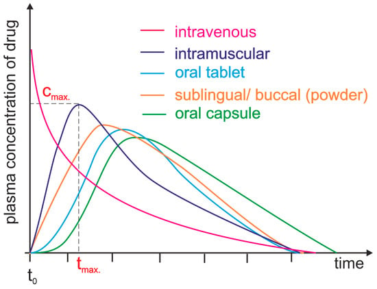

# หลักการและความสำคัญของแคลคูลัสและระบบสมการเชิงอนุพันธ์สามัญ

แคลคูลัสมีส่วนประกอบหลักที่สำคัญอยู่ 2 องค์ประกอบ คือ

1.  การหาอนุพันธ์ (differentiation) และ

2.  การหาปริพันธ์ (Integration)

การประยุกต์เรื่องการหาอนุพันธ์ในการแก้ปัญหาเบื้องต้นที่สำคัญในทางชีววิทยา หรือทางการแพทย์ ประกอบด้วย การหาอัตราการเปลี่ยนแปลงของปริมาณของตัวแปรที่เราสนใจ และการใช้แคลคูลัสในการแก้ปัญหาการหาค่าสูงสุดและค่าต่ำสุดของปัญหาหรือฟังก์ชันที่แสดงความสัมพันธ์ของตัวแปรที่เราสนใจ

ตัวอย่างการเปลี่ยนแปลงของปริมาณที่สนใจ เช่น ขนาดของประชากร จำนวนของผู้ติดเชื้อจากโรคทางเดินหายใจ ระดับนำ้ตาลในกระแสเลือด ปริมาณของยาที่มีอยู่ในกระแสเลือกหรือส่วนหนึ่งของร่างกาย โดยที่การเปลี่ยนแปลงดังกล่าวสามารถเปรียบเทียบได้กับเวลา ดังต่อไปนี้

-   ประชากรในประเทศไทยปี พ.ศ. 2566 มีจำนวน 66.05 ล้านคน (ข้อมูลอ้างอิงจาก [สำนักงานคณะกรรมการส่งเสริมการลงทุน](https://www.boi.go.th/index.php?page=demographic){.uri})

-   ข้อมูลจำนวนผู้รักษาตัวในโรงพยาบาลจากศูนย์ข้อมูล COVID-19 ระหว่างวันที่ 28 กรกฎาคม ถึงวันที่ 3 สิงหาคม พ.ศ. 2567 (ข้อมูลอ้างอิงจาก [ศูนย์ข้อมูล Covid-19](https://www.facebook.com/informationcovid19?locale=th_TH){.uri})

```{r fig-covid-19, echo = FALSE,  fig.cap="ข้อมูลจำนวนผู้รักษาตัวในโรงพยาบาลจากศูนย์ข้อมูล COVID-19", out.width="100%"}


```

-   การเปลี่ยนแปลงของระดับนำ้ตาลในเลือดระหว่างมืออาหารสามมือในหนึ่งวัน (รูปภาพอ้างอิงจาก [Wikipedia: Blood Sugar Level](https://en.wikipedia.org/wiki/Blood_sugar_level){.uri})

```{r fig-blood-glucose, echo = FALSE, fig.cap="ความผันผวนของระดับน้ำตาลในเลือด (สีแดง) และฮอร์โมนอินซูลิน (สีน้ำเงิน) ในมนุษย์ระหว่างมื้ออาหารสามมื้อ", out.width="100%"}

knitr::include_graphics("images/fig-blood-glucose.png")
```

-   การเปลี่ยนแปลงของปริมาณยาในกระแสเลือดที่เวลาต่างๆ สำหรับการให้ยาโดยวิธีต่างๆ (รูปภาพอ้างอิงจาก [บทความทางวิชาการในฐานข้อมูล MDPI](https://www.mdpi.com/1420-3049/28/24/8038){.uri})

```{r fig-drug-absorption, echo = FALSE, fig.cap="ความเข็มข้นของยาในกระแสเลือดที่เวลาต่างๆ ", out.width="100%"}


```

ในการทำความเข้าใจการเปลี่ยนแปลงของปริมาณข้างต้นเทียบกับเวลา เราสามารถประยุกต์ใช้การสร้างแบบจำลองทางคณิตศาสตร์เพื่อมาใช้อธิบายการเปลี่ยนแปลงของปริมาณต่างๆ ที่เกี่ยวข้อง

> **การสร้างแบบจำลองทางคณิตศาสตร์** เป็นกระบวนการอธิบายปัญหาหรือ ปรากฎการต่างๆ ที่เกิดขึ้นในธรรมชาติ โดยปกติแล้วจะอยู่ในรูปของสมการทางคณิตศาสตร์ ซึ่งแบบจำลองทางคณิตศาสตร์นี้จะช่วยให้อธิบายสิ่งต่างๆ ที่เกิดขึ้นในปัญหาหรือปรากฏที่สนใจ

ตัวอย่างต่อไปนี้จะแสดงถึงแนวคิดในการประยุกต์ของแคลคูลัสที่เกี่ยวข้องกับอัตราการเปลี่ยนแปลงของ

::: {#exm1 .example}
ในการทดลองหนึ่ง นักวิจัยต้องการศึกษาการขยายพันธ์ของแบคทีเรียที่มีการการแบ่งตัวที่เรียกว่า binary fission (การแบ่งตัวแบบทวิภาค) ซึ่งแบคทีเรียจะมีการแบ่งจากหนึ่งเป็นสองเซลเท่าๆ กัน และได้ผลการทำลองดังต่อไปนี้
:::

```{r fig-binary-fission, echo = FALSE,  fig.cap="กระบวนการแบ่งตัวแบบทวิภาคของแบคทีเรีย", out.width="100%"}


```

(รูปอ้างอิงจาก [BYJU's Learning Website](https://byjus.com/biology/binary-fission/) )

```{r bacteria-table, echo=FALSE}
# Load the knitr package
library(knitr)

# Create the data
time <- c(0, 1, 2, 3, 4, 5, 6)
population_size <- c(1, 2, 4, 8, 16, 32, 64)

# Combine into a data frame
data <- data.frame("Time" = time, "Size" = population_size)

# Transpose the data frame
data_t <- t(data)

# Create a new data frame with the transposed data and appropriate row names
data_t_df <- data.frame(data_t)
colnames(data_t_df) <- paste0("V", 1:ncol(data_t_df))
rownames(data_t_df) <- c("เวลา (10 นาที)", "จำนวนแบคทีเรีย")

# Create the table with a label
kable(data_t_df, caption = "จำนวนของแบคทีเรียที่เวลา t ใดๆ", col.names = NULL)

```

ตาราง \@ref(tab:bacteria-table) และรูปที่ \@ref(fig:population-plot) แสดงการเปลี่ยนแปลงของจำนวนแบคทีเรียที่เวลาใดๆ ในตัวอย่างนี้การเปลี่ยนแปลงของจำนวนของแบคทีเรียที่เวลา $t$ สามารถเขียนในรูปฟังก์ชัน $N(t)$ ถ้าให้ $N_0$ แทนจำนวนของแบคทีเรียตอนเริ่มการทดลอง แล้วแบบจำลองทางคณิตศาสตร์สำหรับการเพิ่มของจำนวนแบคทีเรียจะสามารถเขียนในรูปของสมการ

```{=tex}
\begin{equation}
N(t) = N_0 \cdot 2 ^t, \quad t = 0,1,2, \ldots
(\#eq:population-growth)
\end{equation}
```
ในแบบจำลองทางคณิตศาสตร์นี้การเปลี่ยนแปลงของจำนวนแบคทีเรียที่เวลา $t$ ใดๆ เพิ่มขึ้นในลักษณะที่เรียกว่า เอกซ์โพเนนเชียล (Exponential Population Growth)

```{r population-plot, echo = FALSE, fig.cap="Population Size Over Time"}
library(ggplot2)

ggplot(data, aes(x = Time, y = Size)) +
  geom_point(color = "#AEC6CF") +       # Points on the plot
  geom_line(color = "#AEC6CF") +       # Line plot
  labs(title = "Population Size Over Time",
       x = "Time (10 min)",
       y = "Population Size") + 
  theme_minimal()                    # Minimal theme for a clean look
```

::: {#exm2 .example}
ในการสร้างแบบจำลองทางคณิตศาสตร์ ในตัวอย่างของการขยายพันธ์แบคทีเรีย หรือในปัญหาอื่นๆ แทนที่เราจะพยายามหาความสัมพันธ์ หรือฟังก์ชัน $N(t)$ ในรูปของเวลา $t$ โดยตรง ถ้าเราทราบกระบวนการที่เกี่ยวข้องกับการอัตราการเปลี่ยนแปลงของตัวแปร $N(t)$ นั้น เราสามารถนำมาใช้ในการสร้างแบบจำลองทางคณิตศาสตร์ ได้ดังต่อนี้ กระบวนการที่เกี่ยวข้องกับการเปลี่ยนแปลงของจำนวนแบคทีเรีย (การเพิ่มหรือลดลงของแบคทีเรีย) ที่เกิดขึ้นในระหว่างเวลา $t$ และเวลา $t + h$ เกิดจากจำนวนแบคทีเรียที่เพิ่มขึ้น (เกิดขึ้นมาใหม่) ในช่วงเวลาดังกล่าว และลดลงจากจำนวนแบคทีเรียที่ลดลง (ตายไป) ในช่วงเวลาดังกล่าวเช่นกัน ซึ่งเราสามารถเขียนในรูปของสมการได้ดังต่อไปนี้
:::

```{=tex}
\begin{align}
N(t + h) &= N(t) \\
&\quad + \text{จำนวนแบคทีเรียที่เกิดขึ้นใหม่ระหว่าง } t \text{ และ } t+h \\
&\quad - \text{จำนวนแบคทีเรียที่ตายไประหว่าง } t \text{ และ } t+h
(\#eq:population-growth-2)
\end{align}
```
ในที่นี้ "**การเกิด**" เราหมายถึงการเพิ่มจำนวนของแบคทีเรียจากหนึ่งเป็นสอง และเราจะกำหนดให้ $h$ เป็นช่วงเวลาสั้นๆ (ซึ่งเราสามารถใช้ความรู้แคลคูลัสในการสร้างแบบจำลองทางคณิตศาสตร์ในรูปของสมการเชิงอนุพันธ์ (differential equation)) ในสมการ \@ref(eq:population-growth-2) ถ้าเราสมมติว่า การเพิ่มของแบคทีเรียเป็นสัดส่วนกับจำนวนแบคทีเรียที่มีอยู่ในขณะนั้น หรือเขียนในรูปของสมการได้ดังนี้

$$
\text{จำนวนแบคทีเรียที่เกิดใหม่ระหว่าง } t \text{ และ } t + h \approx b \cdot N \cdot h
$$

$$
\text{จำนวนแบคทีเรียที่ตายไประหว่าง } t \text{ และ } t + h \approx m \cdot N \cdot h
$$

โดยที่ค่าคงตัว $b$ และ $m$ ในสมการข้างต้น คือ อัตราการเกิด (birth rate) และอัตราการตาย (mortality rate)

เมื่อแทนจำนวนแบคทีเรียที่เกิดใหม่ และตายไประหว่างช่วงเวลาที่กำหนดลงในสมการ \@ref(eq:population-growth-2) จะได้สมการ

```{=tex}
\begin{equation}
N(t + h) - N(t) = b\cdot N(t) \cdot h - m\cdot N(t) \cdot h
(\#eq:population-growth-3)
\end{equation}
```
เราสามารถจัดรูปสมการ \@ref(eq:population-growth-3) ได้ไหมในรูปของ**อัตราการเปลี่ยนแปลงเฉลี่ย**ของจำนวนแบคทีเรียในช่วงเวลาดังกล่าว ดังนี้

```{=tex}
\begin{align}
\frac{N(t + h) - N(t)}{h} &= b\cdot N(t)  - m\cdot N(t)\\
(\#eq:population-growth-4)
\end{align}
```
ดังนั้น ถ้าเราให้ $h$ เข้าใกล้ 0 ผ่านการหาค่าลิมิต เราจะได้อัตราการเปลี่ยนแปลงขณะหนึ่ง (instantaneous rate of change) และเขียนได้ในรูปของสมการเชิงอนุพันธ์ ดังนี้

```{=tex}
\begin{align}
\frac{dN}{dt} = \lim_{h \rightarrow 0}\frac{N(t + h) - N(t)}{h} &= b\cdot N(t)  - m\cdot N(t)\\
(\#eq:population-growth-5)
\end{align}
```
ทั้งนี้ในการแก้สมการเชิงอนุพันธ์ \@ref(eq:population-growth-5) เพื่อให้ได้คำตอบที่แสดงจำนวนแบคทีเรีย $N(t)$ ในรูปของฟังก์ชันของ $t$ เราจะต้องกำหนดเงื่อนไขเพิ่มเติมที่เกี่ยวข้องกับจำนวนแบคทีเรีย $N(t)$ ที่เวลา $t$ หนึ่ง โดยทั่วไปเราจะกำหนดค่าเริ่มต้นของจำนวนแบคทีเรียที่ $t = 0$ ดังนั้น ถ้าเรากำหนดเงื่อนไขเริ่มต้น (initial condition)

```{=tex}
\begin{equation}
N(0) = N_0
(\#eq:population-growth-6)
\end{equation}
```
เราสามารถหาคำตอบของสมการเชิงอนุพันธ์ที่มีเงื่อนไขเริ่มต้นโดยวิธีการหาปริพันธ์ (Integration) ได้คำตอบของสมการดังนี้

```{=tex}
\begin{equation}
N(t) = N_0 e^{(b-m)t}
(\#eq:population-growth-7)
\end{equation}
```
::: {#exm3 .example}
ในการทดลองเลี้ยงยีสต์ในขวดทดลองที่มีอาหารเลี้ยงยีสต์ในปริมาณที่เหมาะสม ผู้ทำการทดลองสนใจที่จะประมาณค่าของยีสต์โดยอาศัยแบบจำลองการเปลี่ยนแปลงของประชากรที่อธิบายด้วยสมการ \@ref(eq:population-growth-7) กำหนดให้

-   ภายใต้สภาวะของการทดลองที่เหมาะสม ยีสต์จะแบ่งตัวทุกๆ 90 นาที

-   ยีสต์มีครึ่งชีวิตเท่ากับ 1 สัปดาห์

จากข้อมูลดังกล่าว จงแสดงวิธีทำเพื่อหาคำตอบจากคำถามต่อไปนี้

1.  จงประมาณค่าของอัตราการเกิด $b$ (1/ชั่วโมง) และอัตราการตาย $m$ (1/ชั่วโมง)

2.  เขียนแบบจำลองทางคณิตศาสตร์โดยใช้ค่า $b$ และ $m$ ที่ประมาณค่าได้ (สมการ \@ref(eq:population-growth-7))

3.  ใช้เครื่องมือที่นักศึกษามีอยู่ในการวาดกราฟแสดงความสัมพันธ์ของจำนวนยีสต์ที่เวลาต่างๆ

4.  เปรียบเทียบผลลัพธ์ที่ได้กับรูปภาพแสดงการเปลี่ยนแปลงของยีสต์จากการทดลองในห้องปฏิการ ตามรูปที่ \@ref(fig:fig-yeast-cells) (รูปภาพอ้างอิงจาก [https://homework.study.com/](https://homework.study.com/explanation/a-graph-of-a-population-of-yeast-cells-in-a-new-laboratory-culture-as-a-function-of-time-is-shown-a-describe-how-the-rate-of-population-increase-varies-b-when-is-this-rate-highest-c-on-what-intervals-is-the-population-function-concave-upward-or-d.html){.uri})
:::

```{r fig-yeast-cells, echo = FALSE,  fig.cap="กราฟการเจริญเติบโตของเซลล์ยีสต์", out.width="50%"}

knitr::include_graphics("images/fig-yeast-cells.png")
```

::: {#exm4 .example}
จงใช้อินเทอร์เน็ตเพื่อค้นหาตัวอย่างแบบจำลองทางคณิตศาสตร์ที่อธิบายโดยสมการเชิงอนุพันธ์หรือระบบสมการเชิงอนุพันธ์ ข้อมูลที่ต้องการประกอบด้วย

1.  ค้นหาหน้าเว็บที่ให้ข้อมูลเกี่ยวกับแบบจำลองทางคณิตศาสตร์ในปัญหาที่นักศึกษาสนใจ

2.  จดบันทึก URL ของหน้าเว็บ

3.  เขียนสรุปสั้นๆ ว่าโมเดลนี้ใช้เพื่ออะไร
:::

โดยสรุป แคลคูลัสและสมการเชิงอนุพันธ์เป็นเครื่องมือสำคัญในการทำความเข้าใจว่าสิ่งต่างๆ เปลี่ยนแปลงไปอย่างไรและ แคลคูลัสช่วยให้เราวิเคราะห์อัตราการเปลี่ยนแปลงและพื้นที่ใต้เส้นโค้ง ในขณะที่สมการเชิงอนุพันธ์ช่วยให้เราสร้างแบบจำลองระบบที่ซับซ้อนในสาขาต่างๆ เช่น ฟิสิกส์ วิศวกรรม เศรษฐศาสตร์ และชีววิทยา แนวคิดทางคณิตศาสตร์เหล่านี้มีความสำคัญต่อการแก้ปัญหาในโลกแห่งความเป็นจริง เมื่อโลกของเราก้าวหน้ามากขึ้น ความสำคัญของแคลคูลัสและสมการเชิงอนุพันธ์ก็จะเพิ่มขึ้นอย่างต่อเนื่อง ซึ่งสนับสนุนความก้าวหน้าทางวิทยาศาสตร์และเทคโนโลยี
